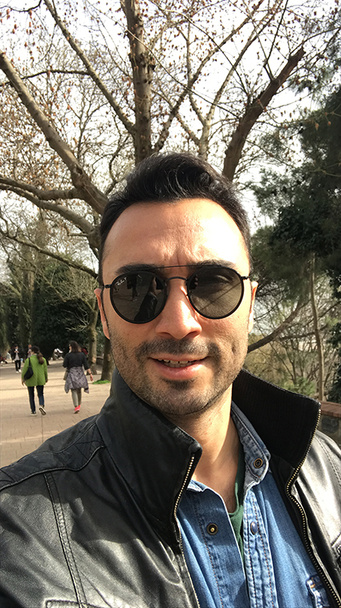

# About

Caglar Alkan.

**My Alternative Presents**

“Participative Design Processes” that include digital fabrication tools and combine them with traditional production techniques encourage makers to be more productive in urban spaces and support them in integrating technology into their workspaces in the age of the post-industrial revolution. In other words, makers gain confidence in using new technologies in their work and seamlessly blend traditional techniques with digital fabrication tools to enhance productivity both individually and within their communities, with the aid of “Participative Design Processes”.

Personally, I am keen on further developing Participative Design Processes by organizing more events, collaborating with different maker spaces, and engaging with other networks. Consulting on participative design processes will lead me down different paths and enable me to gain deeper insights into the design and production processes. Furthermore, documenting and publishing these processes can create more opportunities to establish new connections and networks. In summary, harnessing the potential of collective making, thinking, and designing is crucial in promoting participative design processes.

**Collective Instagram Account:**

https://www.instagram.com/mkr_spc/?igshid=MzRlODBiNWFlZA%3D%3D
