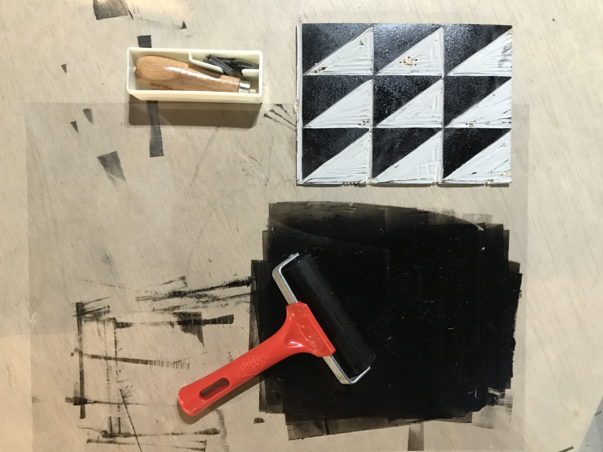

---
hide:
    - toc
---
## **Vision and Goals**

It's not easy to be totally aware that what kind of abilities, skills or knowledge we have. But, resulted from our experiences we have some practices.

## **Methods of Prototyping and Experimentation in RtD**

**role 1**: The prototype as an experimental component;                                        It’s a very helpful method to develop a product that already exists. In industrial design we can call it **redesign**. It’s also so common in **usability labs** for testing different user approaches , it’s not only to test interfaces but also to develop some user friendly forms and attachments.

I practiced this method on many design project for instance;  a portable X-RAY machine. We tried various designs for interface and most importantly we tried alternatives by dividing the machine into parts to make it easy to use but mostly in order to make it less harmful for the operators, as they are exposed to x-rays a lot.

**role 4**: The process of prototyping as a vehicle for inquiry;
I think this method is more efficient to test **new concepts**.

More or less I also experienced this method to generate a new concept for alcohol meter design. It was a station-kiosk which designed to be used by self decision to inform the driver to warn before start the engine. It was quite helpful to use first digital based prototype to see if the idea works second physical prototypes to test the usability and interactions.

**role 3**: The prototype as a research archetype;
This method would lead some ideas and projects to creative solutions, the examples on the presentation looked really breathtaking. On the other hand, the main idea has to be taken into consideration carefully.

I prefer to use “The process of prototyping as a vehicle for inquiry” and “The prototype as an experimental component” in order to generate a new concept and to develop it carefully. And during the design process as a way of drifting, serial method looks more interesting to me because I am still not so determined about my final project and I am open for new encounters and discoveries on the path that I want to walk.

## **Communication Methods and Mediums**

Urban productivity practices

Urban farming/ Urban growing/ Maker spaces/ Productive domestic spaces/ Productive community places/ Productive public places(meeting points

It isn’t easy to name or specify it, but all the productive practices above needs a kind of knowledge in any case. On the other hand, the amount of knowledge or the way of sharing the necessary info to do productive practices effects the creativity and possible developments in a negative way.

So, communication methods and mediums should be determined so carefully in order to have a sustainable productivity and creativity.

Stop motion videos,
Video journaling,
Icons or drawings to make it easy to understand the topics presented,
Photographing,
and Infographics, would be some ways to document, to show, to explain and give ideas/inspirations/motivations/support the people that I am planning to collaborate. But communication methods and mediums can change according to the locations and number of people that I want to reach. For example;

*If I start to do sth at my terrace and collaborate with the people just in my building or just with the MDEF people, a single WhatsApp group and some quick posters and short videos would help to built and support the community.

*If I start with a community garden and collaborate with in a neighbourhood, then a Facebook group or an Instagram page would help me to communicate better in terms of communication and support me to reach more people. Additionally, instagram stories and posts will be better to see the progress and the documentation of my project.

As the scale of the project change communication mediums and methods need to be considered and redesigned according to take more benefit.

##First interventions (Experiments, Pilots and first collective intervention):##

##Description and results;

Since the industrial revolution most of the people believe that production processes are so difficult and hard to deal with. The approach of most of the manufacturers is to make the consumers completely depended on them. Basically, we can see the example of this approach by the smartphone companies. Apple is almost about to become a monopoly in the smartphone industry and it doesn’t want us to open the phone to see what is inside. We’ve become so lazy and unconfident because black boxes made us to think they are so complicated. We become like machines just to consume, buy anything without thinking if we need them with the help of ads on everywhere. But small communities which try to collapse that bias of producing things is impossible by DIY projects nowadays. And so far from my experiences the main idea is to provide spaces for individuals in those communities. Mostly people want to feel that they have spaces in somewhere, in other words the need to feel belonging somewhere some place, some people without being judged and feel confident.

##Production Party Interventions:

As a first collective intervention I collaborated with Ahmed and Korbi. They have completely different backgrounds; Ahmed is a architect and Korbi is coming from philosophy and international relationship fields. So as an industrial designer it was not easy to design a common project to work on without patronizing my teammates.

Our common view point was the desire and need of personal and communal productivity and hacking the supply chain that imposed on us since the industrial revolution.  That’s why we decided to name our interventions “production party”.

Firstly, we used to have different ideas individually about a potential intervention due to test the productivity in the urban spaces. I had the desire to work on something related to urban farming because I already contacted with three different community gardens in Barcelona. Ahmed wanted to work on fabrics and experience sawing and Korbi wanted to built a nomad furniture in order to test the recipe that he found on web. The main struggle about having different ideas and projects resulted from the comfort zone trouble. Each of us felt safer in our own comfort zone.

We ended up with the idea of building a vase out of clay that we had designed on Rhinoceros by layers (which can be produced through 3D printer) and to do so, firstly Ahmed and me shared our knowledge of Rhinoceros and 3D modeling with Korbi. It was an efficient warm up exercise for us to get use to each other. None of us had the knowledge or experience on clay as a material. So, it was completely a discovery for three of us.

Secondly, we decided to design an intervention by including our MDEF community. We discussed a lot on different ideas. At the end we planned to built two different items out of cardboards with two different instructions and within two groups. (We chose cardboard scraps as a main material, because it’s a material quite accessible and according to me cardboard has incredible potential) It was an efficient method for me to see the difference between two recipes, processes and outcomes. As I had some knowledge on working with cardboard, I preferred to work with printed patterns of a rocking horse, while the second group tried to built a chair by drawing and following the instructions. The first two question appeared in minds while cutting the pieces were the direction and the thickness of the cardboards that needed to built the item.

The process of “the production party intervention” showed us how important is that to have appropriate, good and enough instructions to built something by your own especially when you don’t have enough knowledge and experience on the subject. Additionally, I am quite familiar with this subject from the years that I worked in IKEA. As a retailer of self assembled furnitures, manual designs are very important topic for the company. Manuals, instructions or recipe book, however we called them would be a potential project that we can work on in order to support the concept of some DIY projects.

Lastly, our last intervention happened within a workshop which was organized by CdEF -Caixa d’Eines i Feines- a “sharing chain”. It was more than a sawing workshop; they are sharing knowledge, machines, tools, materials, space, energy and care with participants-guests. We were able to share a lot in a single evening. As  I have some experience and knowledge in sawing, ı tried to encourage my teammates -Ahmed and Korbi- in order to use the sawing machine. It was the first time that Ahmed experienced to saw with machine. We patched some items and we were able to built a fabric shopping bag that we had tried to saw by hand before. We were able to see the difference between the processes when we gain some experience and have better instructions.

As a team we also tried to encourage other participants, who came there for the first time and has few knowledge and experience on the topic like us, to involve in the process. It was another efficient experience for me. I figured out personal productivity needs some motivation and support especially when you have little knowledge and experience on the topic. At this point I think it’s really necessary to provide space for individuals to feel confident within the communities like this. Experiencing or trying together by sharing knowledge rather than teaching directly, and encouraging even ends up with fail. And finally, two basic questions appeared in my mind;

What discourages you to start your own DIY project?

What can motivate you to start your own DIY project?

