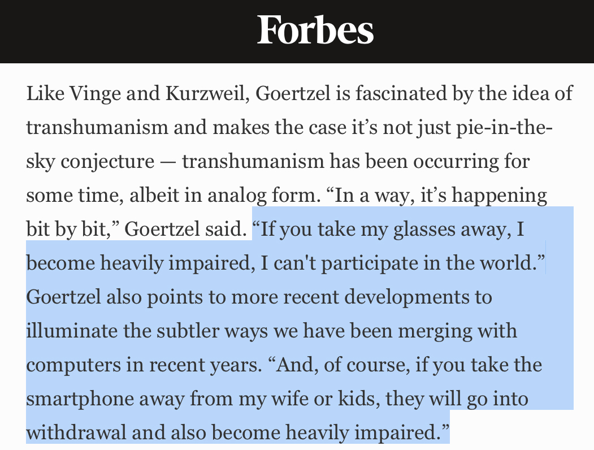

---
hide:
    - toc
---

# Bio and Agri

**Human 2.0**

**Upgrading the human body, with gadgets, bio-tech prosthesis, surgeries and genome imperfection.**

Since my childhood I like to watch documentaries. The concept Human 2.0 is one of my favorite subject and I like to read, listen and watch about that. I share below some articles and documentaries and TedX Talks about the subject and also a bit of my view point and some of my questions.

**https://www.kepach.it/film/man-20/**

As humans we are quite fragile physically, we have limited capabilities. We couldn’t synthesized most of the amino acids and vitamins even Vitamin C. We need to get them from the nature.

But we are creative and since the beginning of the time we are inventing tools to compensate our physical disadvantages. Tools for hunting, foraging, constructing and etc. We also invented some tools to overcome some of our physical disabilities; glasses, contact lenses, laser machines for eye surgery. We invented hi-tech prosthesis for people who lost some body parts, but so long ago we started to produce shoes to protect our feet and continued to run faster. Since twenty years there are so many projects developed on outer skeleton to improve our physical endurance.  

**https://www.forbes.com/sites/cognitiveworld/2018/10/01/human-2-0-is-coming-faster-than-you-think-will-you-evolve-with-the-times/?sh=3ad5ea1d4284**

And soon it will be possible to use genome sequence and gene therapy (intervention) to get rid of most of the diseases and disabilities that we have related to our genomes. We will be able to to reach **the perfect and healthiest and long lasting bodies** which will accompany us during our lifetime.

Will we be able to modify our eyes with the help of genetic engineering and other biotechnologies to see the outer space?

Can we use gene therapy to have stronger, longer muscle legs than Usain Bolt without training?
