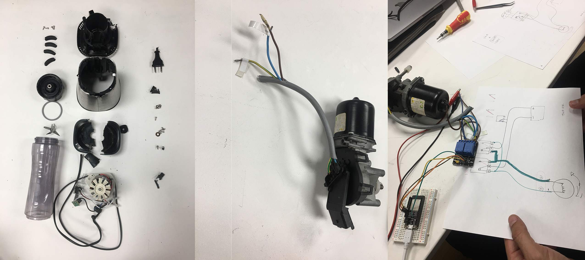
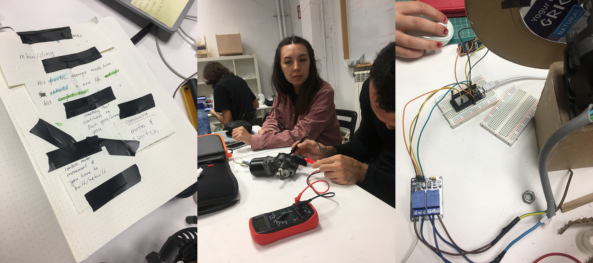
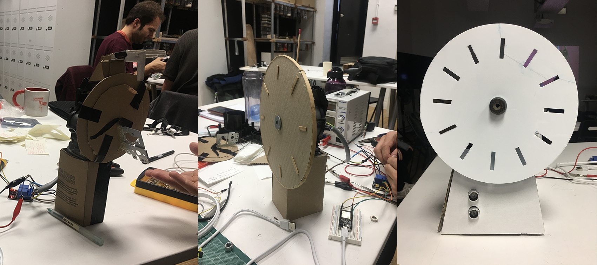

---
hide:
    - toc
---

# Tech Beyond the Myth

Two weeks of experience;

**Tinkering and fight with the fear of black box;**

Disassembling;

As a group we tried to disassemble a personal fitness blender. It was hard and we completely destroyed the blender because it wasn’t design in order to be get repaired in any disfunction. Probably this results from the consumption culture and related consumer behaviours. But, it was a nice example to discover the producers tricks to make you buy a new one while it doesn’t function anymore.  

On the other hand, as an industrial designer I am quite familiar with disassembling electronics but three of my teammates were new on this field and it was fun for me to watch them to try to disassemble a product that wasn’t designed for that. As a result of that experience we had nothing in our hand to reuse or rebuild accept of the electric cables.

**Forensic Report;**
https://hackmd.io/s/HJBEvhPBo

**Checking what we have our hands to rebuilt something;**

A DC Motor, an Arduino, a Relay, an Ultrasonic sensor, a Button

Thinking on reusing and rebuilding;

**Building "The Distracted Timer"**

Firstly, we checked the DC motor’s cables and connected that to the power supply to be sure if it works. Then, we discovered how to make it work in both directions with the help of the Relay by alternative cable connections and we caused almost a short circuit by a mistake and ended up with overheated power supply.

The next step was learning how to connect the Arduino and Ultrasonic sensor to the design and making some research in order to learn a bit the coding language.

**Improvisation;**

Adding the jumping reaction of the DC motor to our design after we discovered that by changing the turning direction of the DC motor quickly.

**Presantation of the team project;**
https://www.canva.com/design/DAFSGssYzEA/FqJPNQMS33QH5i-fKP5DVg/view?utm_content=DAFSGssYzEA&utm_campaign=designshare&utm_medium=link&utm_source=publishsharelink

Beside the process of a quick building a project, this two weeks of course helped me to discover and develop some skills about these topics;

**Teamwork**, learning the skills of teammates and assigning some roles. Providing some space for each teammate but also the necessity of putting some limits in order to reduce the stress and anxiety.

**Coding language**, it is completely new language for me but at least I had the opportunity to discover a bit.

**Quick research** for learning how to connect some electronic devices like Relay or Sensor. It was interesting to see how much info provided on web to learn about Arduino and related electronics.

<iframe width="560" height="315" src="https://www.youtube.com/embed/o3Lg-85AYJA" title="YouTube video player" frameborder="0" allow="accelerometer; autoplay; clipboard-write; encrypted-media; gyroscope; picture-in-picture" allowfullscreen></iframe>
