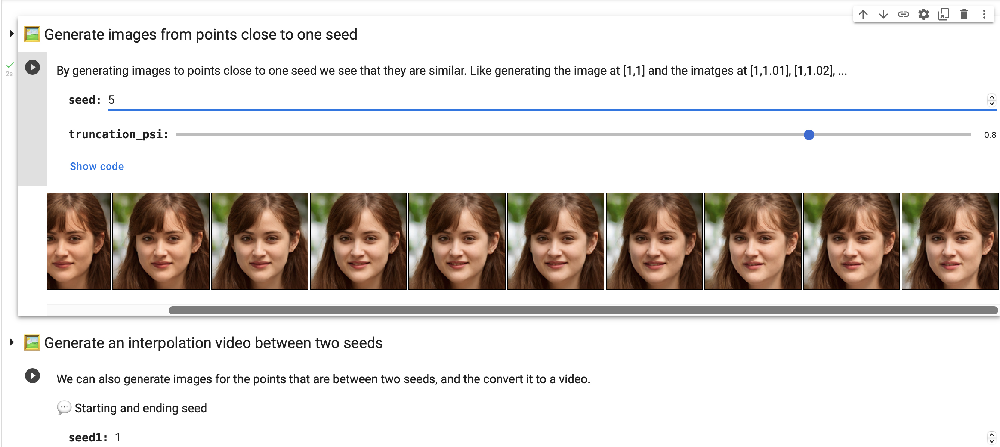
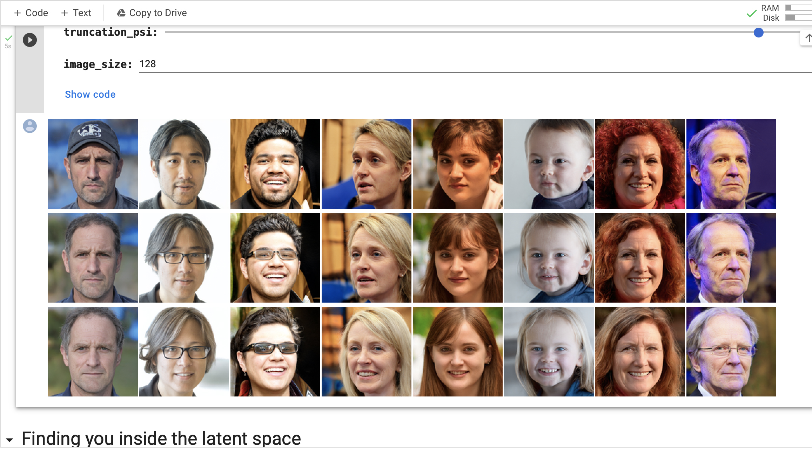
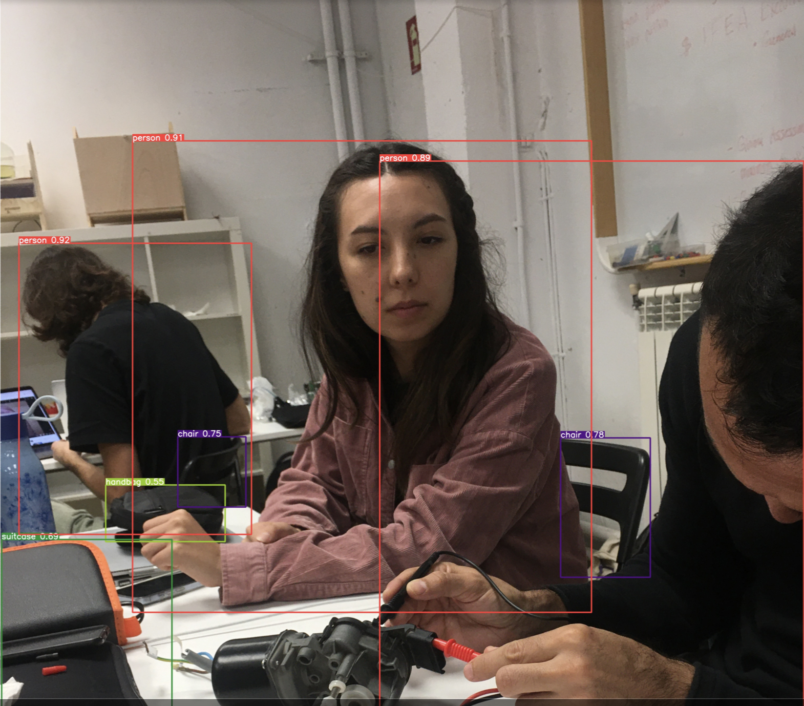
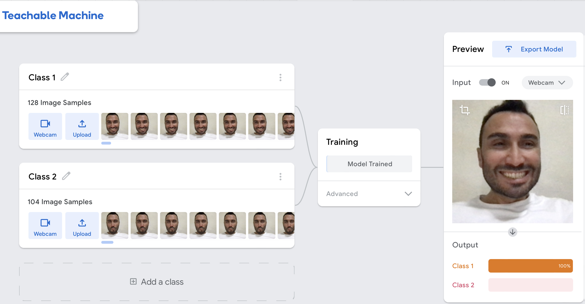
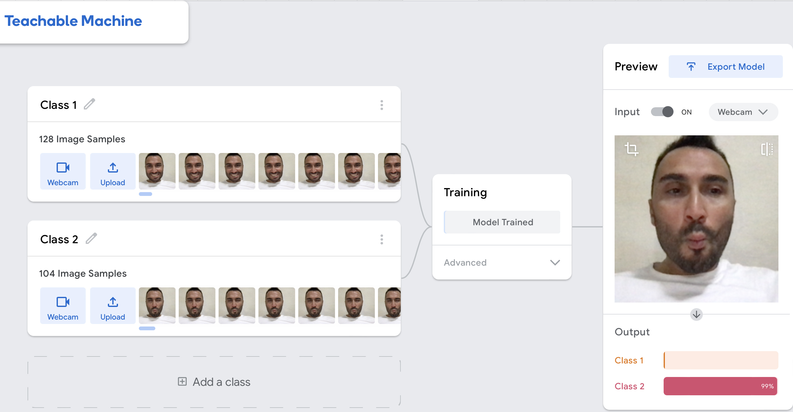
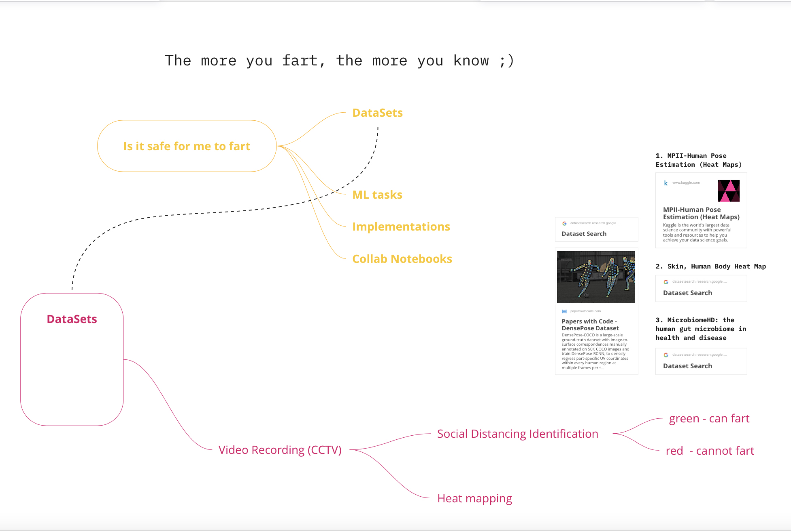
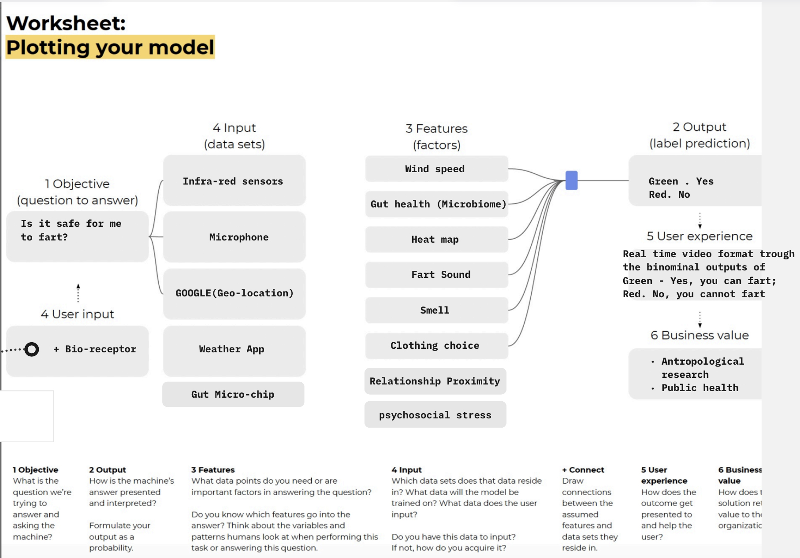
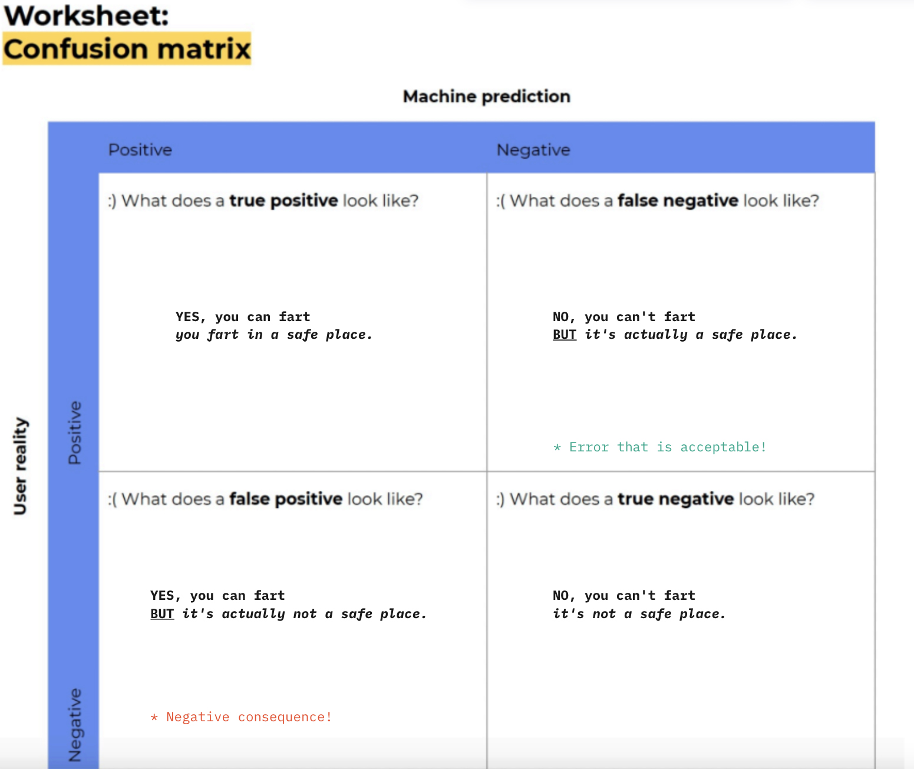

---
hide:
    - toc
---

# Extended Intelligence

What happens if an autonomous car hits someone?
Who will be the responsible for that accident?
The owner of the car or the company!
Can we send the AI into the jail?

Even if it’s still a big debate “the ethics of AI”, these questions were my first real contact with the artificial intelligence after DEEPBLUE beat Garry Kasparow in chess.

Artificial Intelligence used to be a black box for me so far. I didn’t know anything about the background-working principles of the Agents/applications. Even I didn’t hear about Machine Learning, Teachable Machines, which includes datasets, google collab notebooks, neural networks etc.

I was always wondering how the animations are done when the image of a human face changes into another one completely different. How a machine is able to fill the gap between two different human faces? One of the most exciting thing that I discovered during the classes is AI is able to generate anonymous human faces and it is also able to generate hundred variations in order to make an animation like transition. And the real name of this action is generating interpolation video between seeds;

With the google collab notebooks we have learnt how facial, object and item recognition work within the Agents with the different confidence percentages among images;

During the classes it was helpful to discover how machines learn by classes;

We started to design our Agent who is an expert on fart in the ecological base but during the process we decided to make it more simple and funny, as it would have been so complicated to deal with all the methane effects on the environment and all the other datasets that we need to design a stable and productive Agent.

After discussing about the general concept of the fart Agent we decided to use CCTV video recordings as the main dataset. Infra-red sensors, microphone, Google(Geo-location),weather apps, Gut Micro-chip(checking the microbiome) will be the other alternative and supportive datasets.

  <iframe loading="lazy" style="position: absolute; width: 100%; height: 100%; top: 0; left: 0; border: none; padding: 0;margin: 0;"
    src="https:&#x2F;&#x2F;www.canva.com&#x2F;design&#x2F;DAFUQsaPo_0&#x2F;view?embed" allowfullscreen="allowfullscreen" allow="fullscreen">
  </iframe>

<a href="https:&#x2F;&#x2F;www.canva.com&#x2F;design&#x2F;DAFUQsaPo_0&#x2F;view?utm_content=DAFUQsaPo_0&amp;utm_campaign=designshare&amp;utm_medium=embeds&amp;utm_source=link" target="_blank" rel="noopener">Can I fart? Report</a>

  <iframe loading="lazy" style="position: absolute; width: 100%; height: 100%; top: 0; left: 0; border: none; padding: 0;margin: 0;"
    src="https:&#x2F;&#x2F;www.canva.com&#x2F;design&#x2F;DAFUEu4fxrk&#x2F;view?embed" allowfullscreen="allowfullscreen" allow="fullscreen">
  </iframe>

<a href="https:&#x2F;&#x2F;www.canva.com&#x2F;design&#x2F;DAFUEu4fxrk&#x2F;view?utm_content=DAFUEu4fxrk&amp;utm_campaign=designshare&amp;utm_medium=embeds&amp;utm_source=link" target="_blank" rel="noopener">Can I fart?</a>
