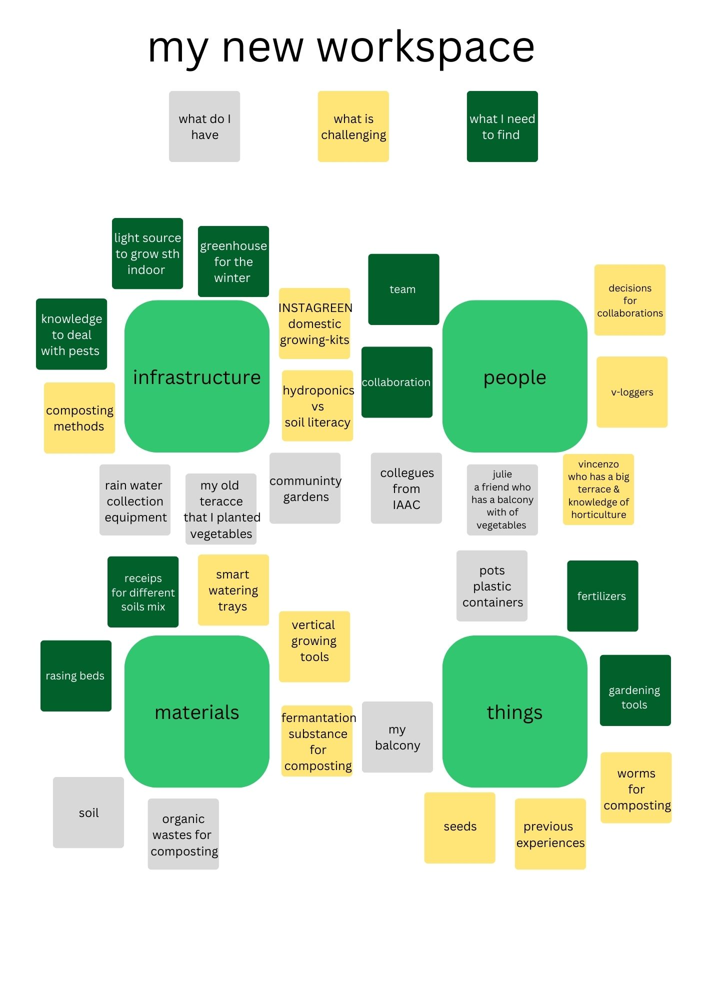

---
hide:
    - toc
---
## **Vision and Goals**

It's not easy to be totally aware that what kind of abilities, skills or knowledge we have. But, resulted from our experiences we have some practices.

## **Methods of Prototyping and Experimentation in RtD**

**role 1**: The prototype as an experimental component;                                        It’s a very helpful method to develop a product that already exists. In industrial design we can call it **redesign**. It’s also so common in **usability labs** for testing different user approaches , it’s not only to test interfaces but also to develop some user friendly forms and attachments.

I practiced this method on many design project for instance;  a portable X-RAY machine. We tried various designs for interface and most importantly we tried alternatives by dividing the machine into parts to make it easy to use but mostly in order to make it less harmful for the operators, as they are exposed to x-rays a lot.

**role 4**: The process of prototyping as a vehicle for inquiry;
I think this method is more efficient to test **new concepts**.

More or less I also experienced this method to generate a new concept for alcohol meter design. It was a station-kiosk which designed to be used by self decision to inform the driver to warn before start the engine. It was quite helpful to use first digital based prototype to see if the idea works second physical prototypes to test the usability and interactions.

**role 3**: The prototype as a research archetype;
This method would lead some ideas and projects to creative solutions, the examples on the presentation looked really breathtaking. On the other hand, the main idea has to be taken into consideration carefully.

I prefer to use “The process of prototyping as a vehicle for inquiry” and “The prototype as an experimental component” in order to generate a new concept and to develop it carefully. And during the design process as a way of drifting, serial method looks more interesting to me because I am still not so determined about my final project and I am open for new encounters and discoveries on the path that I want to walk.

## **Communication Methods and Mediums**

Urban productivity practices

Urban farming/ Urban growing/ Maker spaces/ Productive domestic spaces/ Productive community places/ Productive public places(meeting points

It isn’t easy to name or specify it, but all the productive practices above needs a kind of knowledge in any case. On the other hand, the amount of knowledge or the way of sharing the necessary info to do productive practices effects the creativity and possible developments in a negative way.

So, communication methods and mediums should be determined so carefully in order to have a sustainable productivity and creativity.

Stop motion videos,
Video journaling,
Icons or drawings to make it easy to understand the topics presented,
Photographing,
and Infographics, would be some ways to document, to show, to explain and give ideas/inspirations/motivations/support the people that I am planning to collaborate. But communication methods and mediums can change according to the locations and number of people that I want to reach. For example;

*If I start to do sth at my terrace and collaborate with the people just in my building or just with the MDEF people, a single WhatsApp group and some quick posters and short videos would help to built and support the community.

*If I start with a community garden and collaborate with in a neighbourhood, then a Facebook group or an Instagram page would help me to communicate better in terms of communication and support me to reach more people. Additionally, instagram stories and posts will be better to see the progress and the documentation of my project.

As the scale of the project change communication mediums and methods need to be considered and redesigned according to take more benefit.
