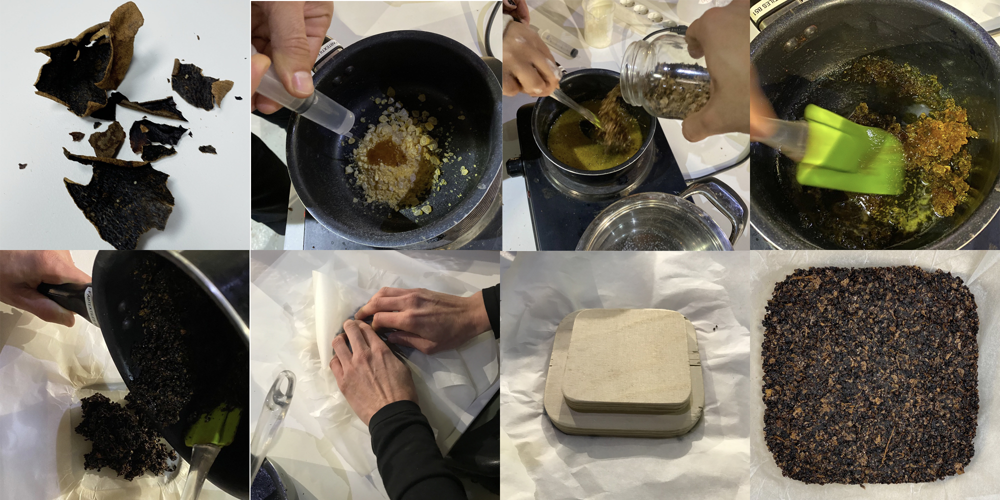
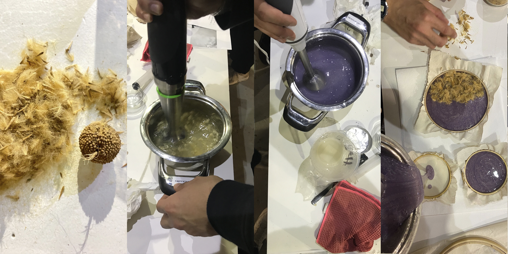

---
hide:
    - toc
---

# Remixing Materials

**Remixing Materials**

As an industrial designer, I didn’t have so much experience with bio materials as it isn’t an industrial material in terms of scale. But, since I arrived Barcelona I have the opportunity to spend more time on this concept. I attended Laras project presentation of “Almacen de Residues” and I found it really interesting in terms of making the scale up by collaborating with restaurants and community gardens. I was not able to attend the paper and soap workshop because I was so sick at that moment, but her works changed my perception to the biomaterial concept.

This week we started with so much practices and we worked within the groups. Seher, Ahmed and me we tried to build some bio materials with two different recipes very first day;

For the first one, we had 60 grams of coffee scrub, avocado and kiwi peels and oak leafs mixture.
**I guess because of the volume of coffee scrub 60 grams of food waste was a bit much for the station 4 recipe** with the 45 grs. pine resin, 15 ml. alcohol and 5 grs. carnauba wax.

The most amazing part of first recipe was to press the mixture with the mold. Probably that reminded me mold making and crafts processes which I worked on a lot.

Secondly, we had platanus occidentalis pollens for station 3 recipe and we added them on the mixture of 12,5 grs alginate, 500ml. water and 30ml. glycerin.

**We forgot to add 30grs. CaCl to water which enables the preservation. We sprayed that over after putting the mixture in mold.**

**The deliverable of the first week;**

  <iframe loading="lazy" style="position: absolute; width: 100%; height: 100%; top: 0; left: 0; border: none; padding: 0;margin: 0;"
    src="https:&#x2F;&#x2F;www.canva.com&#x2F;design&#x2F;DAFYPMkqDg0&#x2F;view?embed" allowfullscreen="allowfullscreen" allow="fullscreen">
  </iframe>

<a href="https:&#x2F;&#x2F;www.canva.com&#x2F;design&#x2F;DAFYPMkqDg0&#x2F;view?utm_content=DAFYPMkqDg0&amp;utm_campaign=designshare&amp;utm_medium=embeds&amp;utm_source=link" target="_blank" rel="noopener">Add a little bit of body text</a> by caglaralkan
