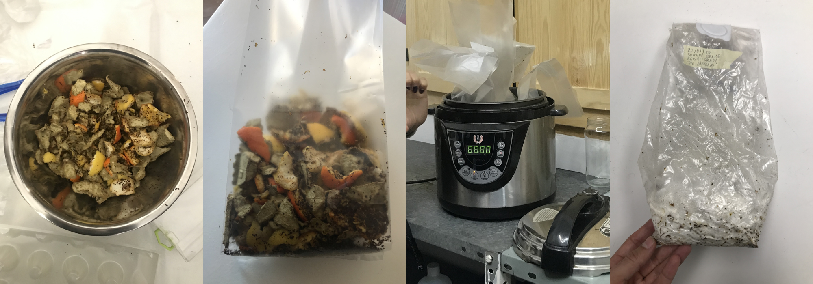
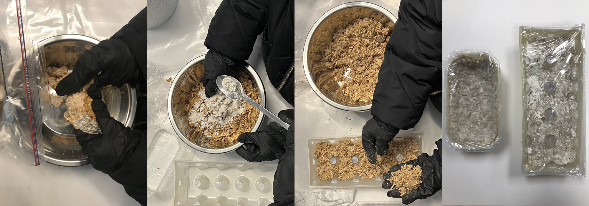

---
hide:
    - toc
---

# Remixing Materials

**Remixing Materials**

As an industrial designer, I didn’t have so much experience with bio materials as it isn’t an industrial material in terms of scale. But, since I arrived Barcelona I have the opportunity to spend more time on this concept. I attended Laras project presentation of “Almacen de Residues” and I found it really interesting in terms of making the scale up by collaborating with restaurants and community gardens. I was not able to attend the paper and soap workshop because I was so sick at that moment, but her works changed my perception to the biomaterial concept.

This week we started with so much practices and we worked within the groups. Seher, Ahmed and me we tried to build some bio materials with two different recipes very first day;

For the first one, we had 60 grams of coffee scrub, avocado and kiwi peels and oak leafs mixture.
**I guess because of the volume of coffee scrub 60 grams of food waste was a bit much for the station 4 recipe** with the 45 grs. pine resin, 15 ml. alcohol and 5 grs. carnauba wax.

The most amazing part of first recipe was to press the mixture with the mold. Probably that reminded me mold making and crafts processes which I worked on a lot.

Secondly, we had platanus occidentalis pollens for station 3 recipe and we added them on the mixture of 12,5 grs alginate, 500ml. water and 30ml. glycerin.

**We forgot to add 30grs. CaCl to water which enables the preservation. We sprayed that over after putting the mixture in mold.**

**The deliverable of the first week;**

  <iframe loading="lazy" style="position: absolute; width: 100%; height: 100%; top: 0; left: 0; border: none; padding: 0;margin: 0;"
    src="https:&#x2F;&#x2F;www.canva.com&#x2F;design&#x2F;DAFYPMkqDg0&#x2F;view?embed" allowfullscreen="allowfullscreen" allow="fullscreen">
  </iframe>

<a href="https:&#x2F;&#x2F;www.canva.com&#x2F;design&#x2F;DAFYPMkqDg0&#x2F;view?utm_content=DAFYPMkqDg0&amp;utm_campaign=designshare&amp;utm_medium=embeds&amp;utm_source=link" target="_blank" rel="noopener">Add a little bit of body text</a> by caglaralkan

##S-Biotica visit##

Even if it was freezing, the visit to S-Biotica was helpful to discover more about bio-materials.
Especially, we had the chance to have some hands-on experience on ##mysillyum##. We tried to recipes/methods;

1- Preparing a mixture(we used egg boxes cardboard, coffee ground, orange and lemon peels) to feed mysillyum, then sterilising that in the plastic bag by putting it in pressure cooker for 30 minutes, adding the mysillyum after cooling down a bit and by setting the sterile conditions in Bio-Lab in IAAC.

2- Making mysillyum bricks by adding a molding powder and water and putting and pressing it in a mold.

##Material exploration##

  <iframe loading="lazy" style="position: absolute; width: 100%; height: 100%; top: 0; left: 0; border: none; padding: 0;margin: 0;"
    src="https:&#x2F;&#x2F;www.canva.com&#x2F;design&#x2F;DAFZa8jFXIw&#x2F;view?embed" allowfullscreen="allowfullscreen" allow="fullscreen">
  </iframe>

<a href="https:&#x2F;&#x2F;www.canva.com&#x2F;design&#x2F;DAFZa8jFXIw&#x2F;view?utm_content=DAFZa8jFXIw&amp;utm_campaign=designshare&amp;utm_medium=embeds&amp;utm_source=link" target="_blank" rel="noopener">onion peels</a> by Seher Krishna

As a group, Seher led us to discover about biomaterials. She has some experiences on that.
We deceided to work with onion peels as onion is used widely all around the world and almost every cuisine have it. As the main idea is to work with some wastes, we decided to collaborate with a restaurant called Jerusalem in Poblenou and Micampus community for onion peels and we got coffee grounds from Itnig.  

After searching the properties of onion peels we decided to focus on the color and light reflection. Firstly, we work on starch base recipe to make the bioplastic. But, we were not happy with the elasticity of the result and even one of the trials was a fail because of using the onion peels without processing it into the blender. The material stuck on the mold.

Secondly, we worked on gelatin base recipe. It gave us the elastic property that we need on the third day, but we remarked that the material has to be cut into pieces (at least by cutter/hand)
on the third day, otherwise it looses its elasticity because it becomes dry and not let us to cut by hand. Additionally, it looses its flatness.

Moreover, we figured out that the one made of starch with intense onion peels became usable as it becomes drier. So, I think to make a data sheet is needed to work on bio materials.

On the other hand, we tried to design a lamp made of gelatin base bioplastic and pine resin base bio material for the stand of the lamp. But, we also failed with pine resin recipe. As we talked with Paige, we agree on the idea of over heating the mixture could be the possible cause of fail.  

My learnings are mostly on technical details as; timing and method for application is an important point to focus on. Some material samples need more time to dry and work on it, but some others need to be cut and shaped immediately in order to get the best result. Furthermore, selecting the appropriate mold is an other important point for succeed on material making. And lastly, some recipes need more details as we failed on pine resin base material making, its is important to know how much heat the mixture needs to me exposed.

I want to add one last thing about making bio material; as an industrial designer I have the habit to look everything in industrial scale, so normally I am skeptic on mass usage of bio materials. In my home town (Istanbul), there is a big chain for collecting the plastics, metals and cardboards from the public trash containers, on the other hand Germany is the perfect country for recycle and classification of the domestic wastes, but classification or collecting of the organic waste needs more energy, time and attention. So, I don't know what kind of system design can solve this problem in order to use the domestic organic wastes to be recycled or up-cycled efficiently.
