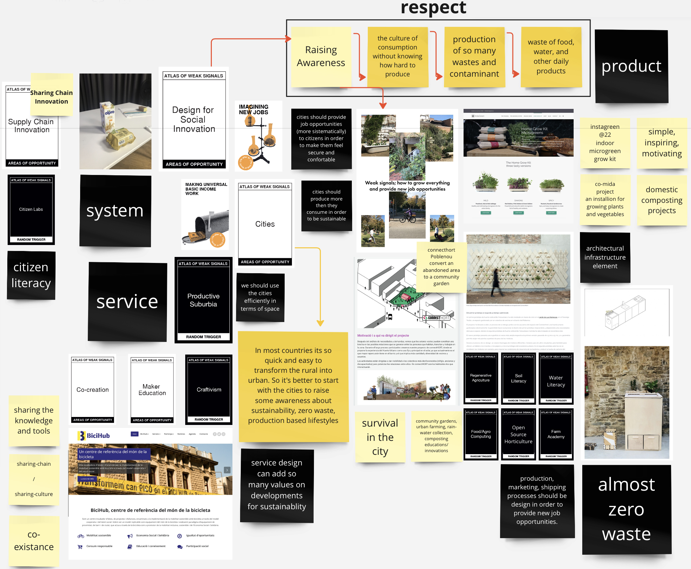
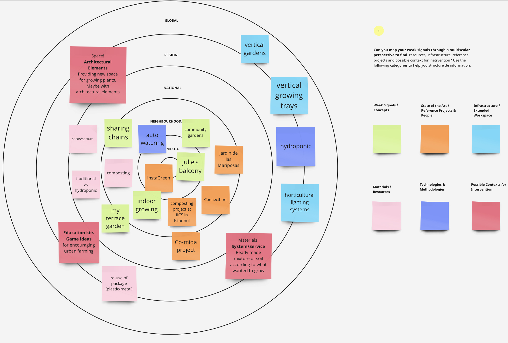

---
hide:
    - toc
---

# Atlas of Weak Signals

## **Design Space and Areas of Opportunity**

In their small balconies, on their medium size terraces, in community gardens, on the small garden of a school, sometimes by using small pots, by an old bathtub, by building vertical structures most of the people are so enthusiastic to grow some plants, vegetables and trees.

Since the pandemic started we all started to spend more time indoor for ourselves and for our hobbies. I guess its instinctive that most of us at least tried to grow some plants and vegetables. But still few of us into that activity. Because, even if it's so hard to produce some edibles at home or in our balconies or terraces. It's a great feeling to be able to grow something. Which means at a certain point you can survive in extreme conditions. And according to me to **survive in cities** has become more difficult than in a jungle.

As my main fight is to create added values, growing plants or vegetables locally/individually is something so precious. Additionally since years personally I am complaining a lot about the food supply chains in terms of **fair trade**, mediators, product wastes during transportation and mostly prices... So supporting the idea of local/indoor/individual production and develop some techniques to support them would sound so excited for me.

This idea would be supported in different ways; support who doesn't have space for growing something, support who finds it unpractical (carrying so many materials and needs to continue for soil, fertilizers, pesticides...and watering), support who finds it inefficient, expensive, time consuming...

On the other hand, it's really important to provide new job opportunities in the cities. Because cities will become more and more populated and to live in cities in a comfortable and secure way will be possible with **co-existing**.  New **job opportunities** would be provided redesigning the old jobs; as biker couriers, beach/park sellers, personal coaches... Basic income work models would be realized by urban farming system-methods and side jobs related to urban farming industry (a new local **supply/sharing chain** would be built).

To sum up (not easy), urban farming has so many areas of opportunity to work on it. It's possible to combine that with architecture in terms of designing infrastructural elements like **Co-Mida** project or working on an educational and experimental kits as **Instagreen** or with complete focus on product design as **Domestic Composting**. System or service design approaches are also some other fields to work on.

