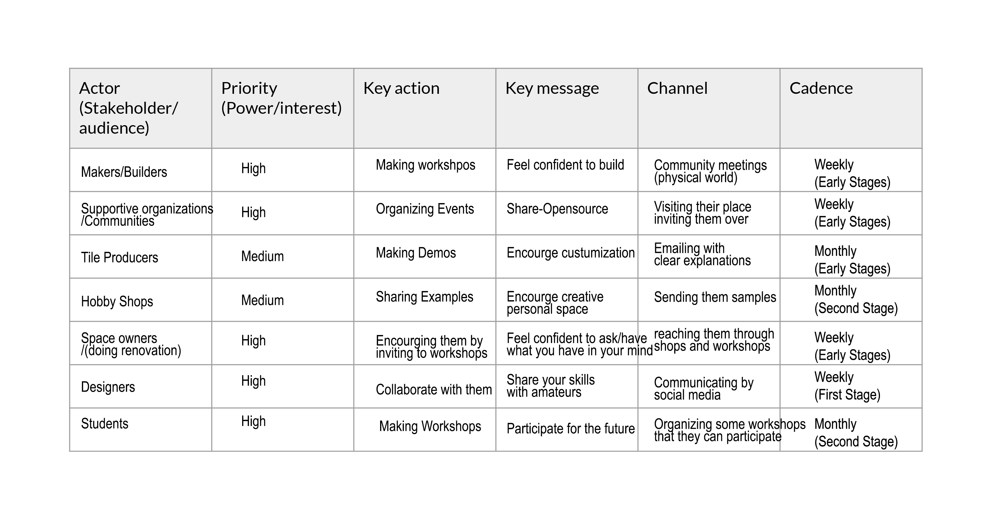

---
hide:
    - toc
---

# Communicating Ideas

**Communicating Ideas**

"Medium is the message"

In this class, we learnt about the significance of communicating ideas effectively. As a designer, it is crucial to have the ability to persuade others about our ideas through communication. It is essential to differentiate yourself from others and have a clear understanding of how you want to collaborate with others. Without having the skillset of presenting and comprehending your position, it might be challenging to work efficiently in your desired field.

  <iframe loading="lazy" style="position: absolute; width: 100%; height: 100%; top: 0; left: 0; border: none; padding: 0;margin: 0;"
    src="https:&#x2F;&#x2F;www.canva.com&#x2F;design&#x2F;DAFdA_d3u4I&#x2F;view?embed" allowfullscreen="allowfullscreen" allow="fullscreen">
  </iframe>

<a href="https:&#x2F;&#x2F;www.canva.com&#x2F;design&#x2F;DAFdA_d3u4I&#x2F;view?utm_content=DAFdA_d3u4I&amp;utm_campaign=designshare&amp;utm_medium=embeds&amp;utm_source=link" target="_blank" rel="noopener">SHARE</a> by caglaralkan

In the second session, the focus is on considering our work as a whole. This includes reflecting on who we are and what we have done. Through an activity in second class, we made sense of our previous work and see how it fits into the bigger picture. The goal is to prepare a communication strategy for our projects.

