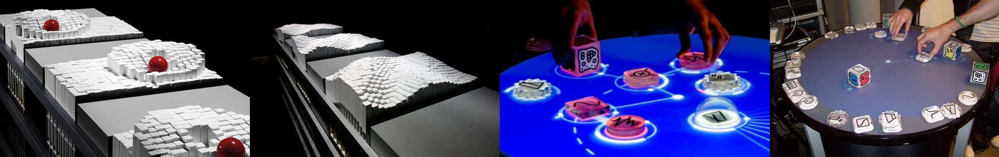
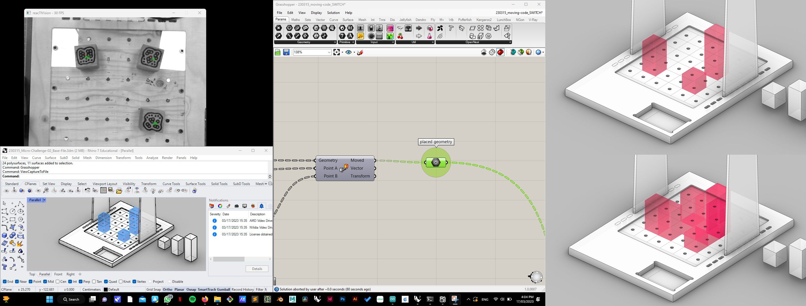
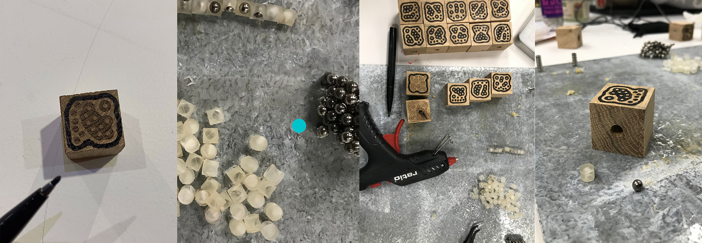
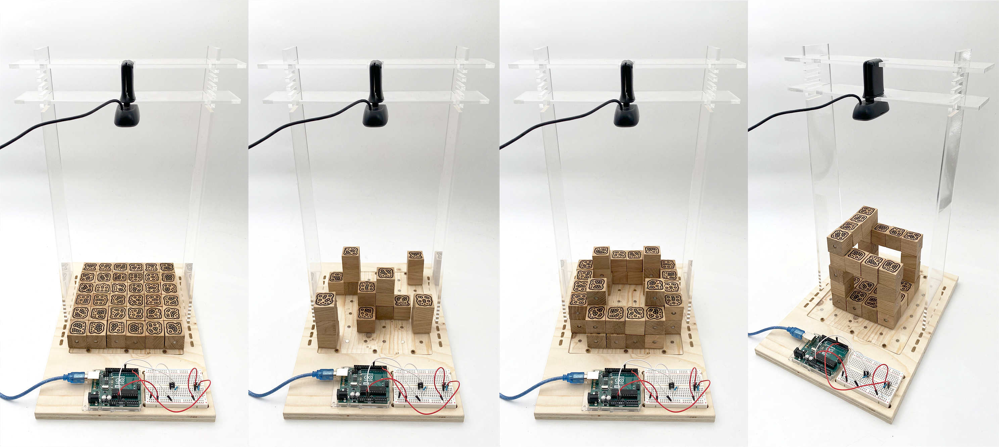

---
hide:
    - toc
---

# Design Studio II

**Design Studio II**

##Chapter 5: Reframing of the project##

Overview to lead the path for next stages;

Creating Values / Urban productivity practices

So far, I have tried to focus on potential collaborations and interventions in order to come together with communities that support maker spaces and urban productivity practices. Specifically, the organization 'Caixa d'Eines y Feines' strives to contribute to and support individuals who are curious about becoming makers, not only by providing them with equipment but also by organizing workshops and facilitating gatherings to encourage sharing of experiences. In my opinion, these gatherings are the first steps in building communities.

Firstly, the main idea is “democratization and accesibility of production” which can be done by hacking the monopoly on production/manufacturing. At this point it is compulsory to support DIY projects by easily accessible equipment, materials and alternatives making-production methods.

Additionally, I made some searches on the concept of transformation of the personal and collective working spaces into places to support the idea of urban productivity. Growing something -urban farming- or recycle/upcycle materials and resources (especially water) cardboard, wood, metals... And generating projects to use those resources efficiently.  

“Social making - A collective open-ending recipe-manual concept”

Secondly, I noticed that there is not a single way of doing something. There are always various possible ways of building anything with different tools and materials.
Moreover, every single person does not have access to every material and tool all the time. So a platform can be built to share all of those information about production and material alternatives. We can call this “a play ground” for curious, productive and maker-partaker communities.

By the help of this platform makers can share their own recipes, manuals, formulas, equipments, materials, time, labor, power, patience, experiences, clues, styles. As individual makers have the opportunity to come together and share their experiences, the maker communities and the idea of individual productivity will gain power and this would support the alternative futures concept which might grow different than the monopoly of industry and supply chain. We can also call this supporting low tech lifestyle – which is more sustainable – or living with less vs producing with less.

To sum up, I focused on to dream, support and create alternative urban futures which are more sustainable and individually and communally productive. The main purpose of these alternative futures is to offer alternatives to existing supply chains which provides so much to mediators rather than local producers.

Potential questions that I need to ask myself at this point:

How meaningful these ideas for others?
How to include others to interested and collaborate with you?
How to contribute-develop your ideas?

##Chapter 6: Experimentations and Interventions##

We started the second term with a general review of our personal/collective projects and the related interventions that we had made during the first semester. During the first session, we tried to find new collaboration opportunities in order to continue our interventions and make them as meaningful as possible. At the end of the first session, I came up with the idea of participating in two main project groups in order to narrow down the wide scope of DIY projects and focus on certain concepts in detail. In the first group, we decided to work on DIY projects related to gray water storage and reuse in domestic spaces.

Suddenly, the project group became crowded, and we decided to create sections within the 'water group' and name the potential areas to explore. Based on participants' areas of interest, each individual continued to work and conduct research in their respective field or fields. The potential areas of interest that concerned my interventions were: Brick Design (Geometry, Structure, Strength, Size) - Slip Casting and Connecting Clay Pieces Leak-free (Working with clay for our purposes) - Identifying Possible Communities to Interact with (Researching and generating ideas on who to involve and how) - and Filtering.

Collective Design Space(Water People)

"I had previously experienced collecting gray water for a project, and by the third day, I had run out of containers. The main motivation for me to join the water group is to develop a DIY project that provides an easy way to store gray water in domestic spaces. The design of a 'water brick' could be a potential solution for storing gray water, and this concept could evolve into an architectural or constructional item that enables the reuse of gray water for secondary purposes. While this concept can be seen as a final product, there are several steps involved in reaching that ultimate outcome. Below is a table that shows the average daily production of gray water and black water for an individual person."

During my first researches, I figured out that in any cases gray water has to be filtered before stored. Not only for bad smell and preventing the growth of bacterias and microbes in the grey water, but also keep the reservoir clean and long lasting. There are many ways and materials exist to filter different types of water. The most common method is using the rocks-gravel, sand and charcoal materials for filtration. Charcoal is the most common and accessible material to get rid of chemicals and bacterials whereas the sand and rocks-gravel used for bigger particles separation and physical filtration. Rocks-gravel and sand has to be cleaned yearly and charcoal needs to be replaced every two years. I reached these valuable informations through an organization “Aqueous Solutions” which works to promote livelihood security, environmental and economic sustainability, and local self-reliance through ecological design and appropriate technologies in water, sanitation, and hygiene (WASH) (www.aqsolutions.org). The organization have many experience on the field and they explain the system clearly for different scales. I collaborated with Josephine Bourghardt in order to built a small scale sand-gravel-carhoal filter and test if it works properly. We used the fab-lab and bought same material and succeeded to build and test it.

Furthermore, there are other methods and materials available for filtering water for both first and second use. Ceramic filtration is widely used due to its porous structure, which allows water to flow while retaining micro particles. Ultraviolet filtration and reverse osmosis are other popular methods, but they can be quite complex for potential DIY projects.

Additionally, Jonathan encouraged us to conduct further research on lipid separation, which is another form of physical filtration, prior to chemical filtration. Lipids can be up-cycled as soap or used to cultivate certain plants. Grey water needs to pass through a physical separator to retain the lipids in specific sections based on density differences. Ramiro, Korbi and I worked on a lipid separator and we tested that. (they continued to work on that separator during the third term)

On the other hand, as a second project and intervention group with Marc and Ahmed we agreed on exploring ways to combine digital and physical tools to support DIY projects. As there is a strict boarder between digital worlds and physical representations, its quite difficult to destroy the bias of how difficult to learn, use and integrate digital tools to generate DIY projects. However they look so complicated and hard to learn and use, digitals tools give us a lot of personalization and customization opportunities to modify any project. As those two terms -personalization and customization- are two important key words for DIY projects, democratization of the digital tools is essential.

During the second term with Ahmed and Marc we tried to develop a concept that combine the physical and digital worlds. We took the parametric design as a base and tried to create a base project which provides an environment to make the digital fabrication tools accessible and easy to understand.

##Collective Intervention no:4##

AAs a group, after discussing about our common interest and as we want to work on water bricks to store domestic grey water, we decided to work on something related to modularity, interchangeability, parametric design, personalization-customization of a product… We ended up with the idea of building a DIY toolkit which provides designing unique tile decorations and patterns made of those. We also took that opportunity as a first step to connect the digital and physical.

Firstly, we talked on 3D and 2D options and then we decided to focus on 2D option. For a simple tile decoration we need vinyl designs which needs to be sticked on stencil frame to transfer the ceramic ink. Instead of providing ready to use patterns, stickers, vinyls we preferred to work on a grid board and some geometric shapes which provides the user to make their own unique design.

Tile-Deco is a concept that consists of a grid made of acrylic and magnets. The grid is designed to hold geometric pieces, which can be attached to the grid using magnets, allowing for the creation of various tile decorations. During the design process of the grid board, we aimed to minimize shades and reflections that could negatively impact the quality of the photo-digitalization process of the vinyl.

However, due to the defined thickness of the acrylic and sizes of the magnets, it was not possible to completely eliminate these issues. Nevertheless, we covered the acrylic surfaces with a matte vinyl to reduce reflections and enhance the quality of the photo-digitalization process. While the transfer of the vinyl onto the grid board was challenging and required multiple attempts, we finally achieved a satisfactory design with the third vinyl application.

Another problem we encountered was the instability of some geometric pieces used to generate the tile decoration design. Some of these pieces had only a single magnet, causing them to be unstable on the grid. During the presentation, a constructive criticism suggested doubling the size of the grid board to address this problem, which could indeed be a perfect solution.

The next step involved aligning the patterns with the photo-digitalization process. We took photos of various tile decoration samples and worked on different pattern options using software such as Illustrator and Inkscape.

In summary, the process of building the grid board was a valuable experience, involving the use of a laser cutter after designing it on Rhinoceros and working on technical details to achieve the best results with the magnets on the grid. To improve the final result, it would be beneficial to use a thinner and matte acrylic and smaller magnets. This would help prevent shades during the photo-digitalization process and enhance the quality of the tile decoration edges. Furthermore, doubling the size of the grid board would ensure stability for all geometric shapes in building the tile decoration.

During our discussions in the MDEF group, we received valuable feedback on our first prototype. Initially, some colleagues found the digitalization process unnecessary and difficult to apply. However, after explaining our main goal of customization, their perception changed. I realized that our project was too focused on a specific end product, such as a tile, which made it challenging to fully explore and experience the connection and transition between the physical and digital worlds and tools. As a development plan, we could explore 3D options, but we are uncertain about how to integrate other digital fabrication tools into our project for future stages and make it more useful beyond being open-source. It is important to note that even if a product or concept is open-source, it does not guarantee easy replication or application. Additionally, it would be beneficial to shift the focus towards the process of connecting the digital and physical worlds and tools, rather than solely on the end product.

Reference Projects as Inspiration

##Collective Intervention no:5##

Ahmed, Marc, and I decided to develop the tile decorating kit that we had designed during the previous intervention. Our main focus was on the digitalization process, aiming to make it as easy and meaningful as possible. Additionally, we wanted to convert it from a 2D to a 3D experience, which was one of our initial goals. In other words, we wanted it to become more than just a tile decorating kit and serve as a playground to explore other digital and 3D fabrication tools as a bridge between physical objects and digital representation.

To help us with the project, we looked into reference projects such as MIT's interactive shape-shifting table and Reactable's Reactivision Improvisation with MIDI. However, due to time limitations, we had to simplify our goals.

Given that this project involves the connection of the physical and digital worlds, there were numerous details that needed to be addressed. This time, we decided to use the base-grid as a playground and allow people to play, change, and combine cubes attached to it using magnets, enabling them to build their unique designs on the grid rather than relying on predefined 2D geometric shapes. We named this project “Pixel Cubes”.

We started by working on the digitalization process. We put a lot of thought into how to convert the physical items into digital representations. We discovered a system called "fiducial ID" that functions similarly to QR codes but with more organic shape drawings. Fiducial IDs can be captured by cameras and work with a plug-in program called "firefly" in Grasshopper-Rhinoceros. Each cube placed on the grid has a unique fiducial ID, which provides a parameter on the Z-axis (height) to help form a unique 3D design.

On the other hand, while the camera detects the cubes on the grid and allows users to move them freely, we also needed to program Grasshopper to detect the grid made of slots (6x6) to frame the design area and simplify the post-digitalization process. Throughout this process, we encountered many issues, such as repetitive fiducial detection by the camera, resulting in system clutter. To address this problem, we decided to implement a system reset as a solution.

In addition to the digitalization aspect, we put a lot of effort into the physical objects. Initially, we 3D printed the cubes using two parts and included six magnets. However, this method was not suitable as it took three hours for each cube. Eventually, we came up with the idea of using wood to build the cubes and inserted the magnets onto the surfaces.

Since we had spherical magnets, it was crucial to insert them in the correct magnetic directions. To solve this problem, we designed a magnet insert (nest) for each magnet, which eliminated the issue. We 3D printed the nests using resin, allowing the spherical magnets to move and align themselves with the magnetic direction easily. Furthermore, we attempted to engrave the fiducials on the cubes using a laser cutter, but the camera did not detect them. As a result, we engraved the outlines and hand-drew the fiducials. Vinyl was not suitable for use on wood as it did not stick properly.

Moreover, we encountered difficulties in cutting the cubes out of the oak block. The block was initially 33 mm thick, and we needed to carve it to achieve a 30 mm thickness. With the assistance of Adai and Edu, we managed to carve the surface using the facing function of RhinoCam-CNC, which provided the carving function with an end-mill of 30 mm diameter. Efficient use of the material posed another challenge. To minimize material loss in the CNC process, Adai helped me cut the cubes manually using a saw, which required great attention and physical effort.

After engraving the fiducials with the laser cutter, we cut the cubes using a manual saw and manually drilled each surface to insert the magnets with their 3D printed nests.
Additionally, we utilized the CNC machine to construct the grid using plywood. We designed and laser cut acrylic to create a structure that held the camera above the grid. This structure was designed to be positioned at different locations on the grid to capture the cubes clearly and frame the design appropriately. We primarily used Grasshopper for the digitalization process. However, we also integrated Arduino to utilize the firefly plug-in and added a button to capture the desired design and build it using the 3D printer.

##Chapter 7: Updated Vision and Identity##

Overall, we had the chance to show, test and get feedbacks about Pixel Cubes during Design Dialogues II. Mostly, our guests found the idea quite interesting and helpful as a bridge between physical and digital worlds. As we tried to explain our main goal -which supporting the maker spaces and DIY project by making digital tools accessible and easy to use- our intervention made more sense.

Most helpful comments and feedbacks and questions were;
- Able to model or 3d print without 3d model skills,
- What will be the next step to explore,
- Simplify digital and physical processes
- Human machine interface Which combine the physical and digital worlds
- Focusing on loops-gaps between two worlds and let the digital fabrication processes less complicated
- Short cuts; Can visually impaired people design by the help of this concept
- Can we simplify and make accesible design processes for everyone
- It’s better to recognize the fiducials in the physical world to have the sense

According to my fight and my vision my alternative present can be defined like this; “Citizens that interested in making and DIY projects but don’t have experience and courage on digital fabrication to develop advanced projects, now have the opportunity to discover the link between physical and digital worlds”

As an updated vision and development plan we need to test our concept within some communities like “Caixa d'Eines y Feines” which supports maker space movements and provides tools and workshops to individuals.

