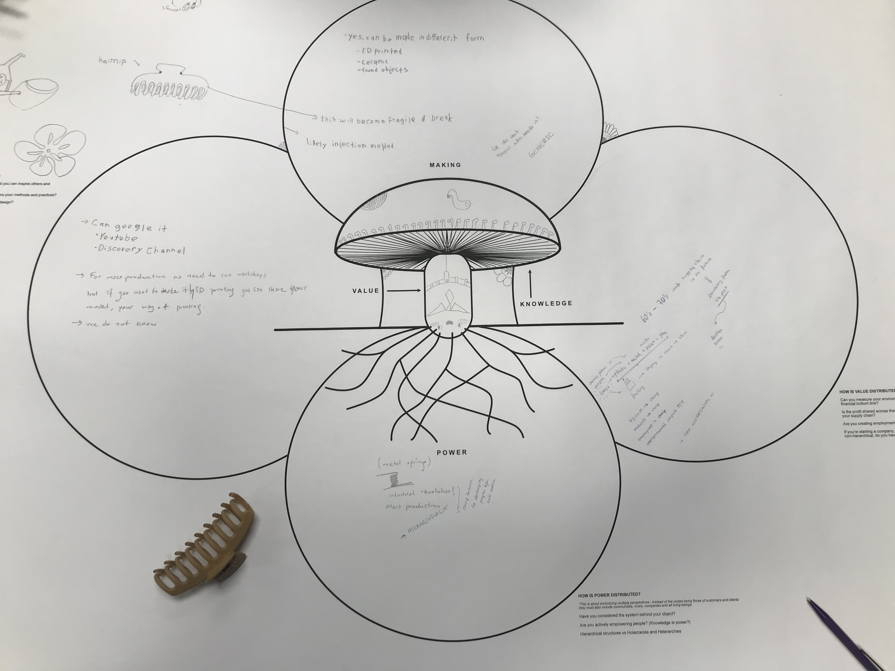
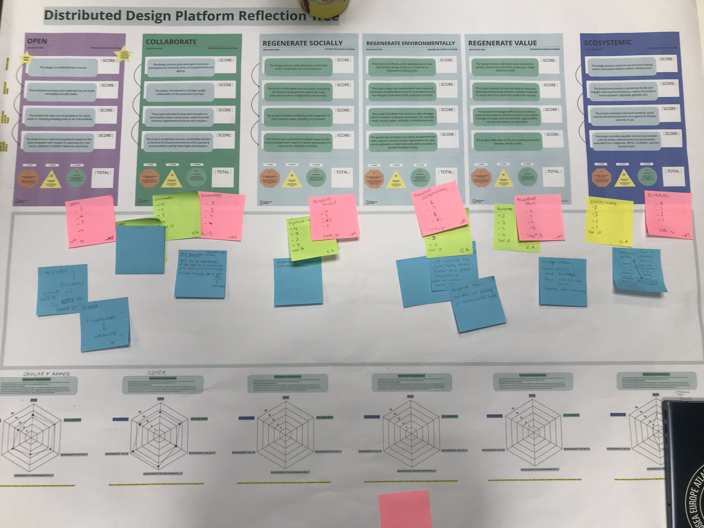
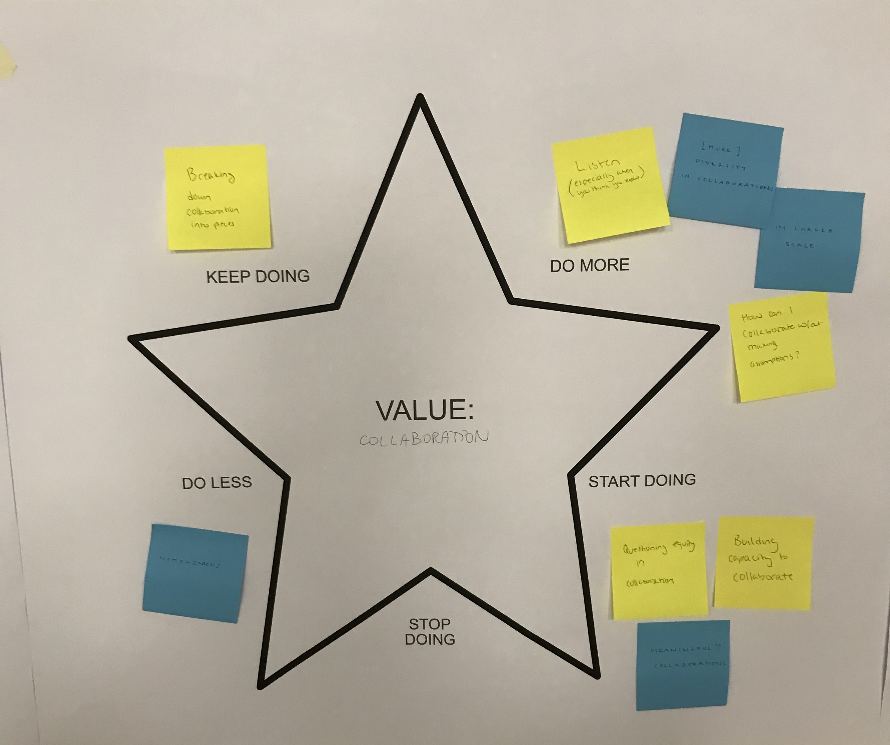

---
hide:
    - toc
---

# Distributed Design

**Distributed Design**

How to aproach a problem?

The Mushroom Model: Interconnected to all natural systems

Making/Values/Knowledge/Power

Firstly, we worked on mushroom model on a specific object/product/service in groups. In our group we discuused on a plastic hair-clip. We continued by visiting other groups which worked on ChatGPT, fertilizer, and bread. We ask and share our questionmarks. Each group started from the making section and ended up with the power. After coming back to our own tables/groups we again shared our interactions. And our group representative also shared her interaction with the guests. The most important one was the feedback about the cultural value of the hair-clip and different representation of a simple product.

**1st Day**
Learning Skills; Participation, curiosity, ready to share, ready to learn, ready to ask.
Dynamics; Horizontal, Relax
Interactions; If you are open and ready to share ,it effects the rhthym of the group. I spent most of time by visiting the other tables and asked about their methodology.

After, working on distributed design platform reflection tree individually and noted the scores, we started to share and discuss about the scores of our projects on different aspects-values. But mostly we agreed on some common points especially on being open-source. We figured that out being open source does not mean easy to replicable. In other words, project descriptions and its resources-manuals should be easy to understand in order to be useful. Otherwise it will not be helpful and meaningful for the others who are interested in. Additionally,  accept of Seher project we noticed that we were not focused on the value of regenerate environmentally.

**2nd Day**
Learning Skills; Participation, collaboration, integration, patience.
Dynamics; Horizontal, active
Interactions; I was aware and curious about the projects of my teammates, so it helped me to be more active in the group.

During the last day of the lecture we mostly worked on values. With some other classmates we decided to work on a presenation on the value of collaboration. according to my view point main impact of collaboration is to develop together. In other words to develop by sharing knowledge, experiences and all the tools/equipments and reach a goal-achieve all together.

The presentation:

Feedbacks:

