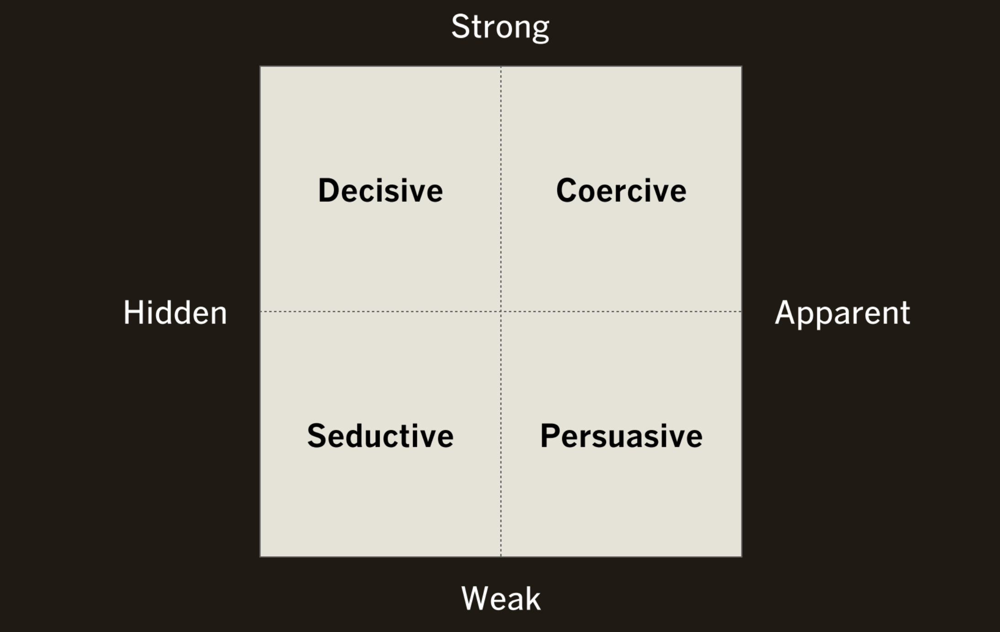

---
hide:
    - toc
---

# Design Ethics

**Design Ethics**

During my bachelor and my professional life I heard a lot about “marketing” that it is a vital topic and not possible to let the marketing department to deal with it. I strongly believe that “design ethics” is also a substantial topic to talk/discuss on it. So, two days of lecture on design ethics was just a good start. But, it was a nice session and I heard some new names and things interesting and I would like to discover more about those as Nassim Parvin, Don Ihde and some extreme design fails but good example for ethics vs profit as Pinto Car Explosion.

"The hand-mill gives you society with the feudal lord; the steam-mill society with the industrial capitalist." ― Marx, Poverty of Philosophy.

As an Industrial designer Marx’s explanation and approach is so clear for me to get the idea of design ethics. So,  technology is the agent of social change as it moulds society and changes our behaviours. On the other hand, if we are smart enough we should know that we can be out of technology in some cases. We should have some social skills (maybe more than just social) in order to survive.

I attended the first day of the class and I enjoyed it a lot and I tried to participate and gave some examples about the baby care item and general culture in my own country. How it is seen to have a baby and how much support you can have from your parents and friends during the first years when you have a baby. I attended the second class through FaceTime with the help of my friend and I tried to listen the lecture and discussions. But, it was not as efficient as in person. I did my best.

During the discussion at class in the first day on the marketing approaches of two different brands which sell a new-born product to support the parents were completely different yet still both took the baby as a source of problems and focus on bringing a solution to that problem. This approach is totally against the idea of having a child but somehow technologies (in terms of marketing) are taken as services to problems.

Embodiment relation of mediation
human + technology = world
Glasses - if a person always wears glasses or contacts then it is always relevant in their perception of the world. Even when you're driving a car or a skateboard, the whole technology becomes a part of you. The rear of the car becomes like your literal back.

Hermeneutic relation
human = technology
A thermometer, example the weather app, you’re just reading the number but you don’t get the sense of what it is. you need to decode the representation of the world.
Digital Twin - tomato and of human’s for the sake of medicine advancement which is useful as you use less resources, less harm and you don’t have to test on animals then.
But creating digital twin to predict crime by creating digital twin of people from crime dense neighbourhoods, it’s never going to work. It’s not accurate.

Cyborg relation
pacemaker, deep brain stimulation

“Design seeks to influence behaviour in a particular way, it’s never neutral.”

I have heard about Peter-Paul Verbeek but, did not know about the classification of Influence Based on Intended User Experience. This chart is really interesting for me as an industrial designer. This will help me to think and critic myself when I will work on my next projects.

To sum up, the lecture was really nice and helpful. Surprisingly, it was not heavy. Subjects like ethics could be so heavy sometimes. I felt so happy with the approach of this lecture. I was able to discover new people and approaches.
