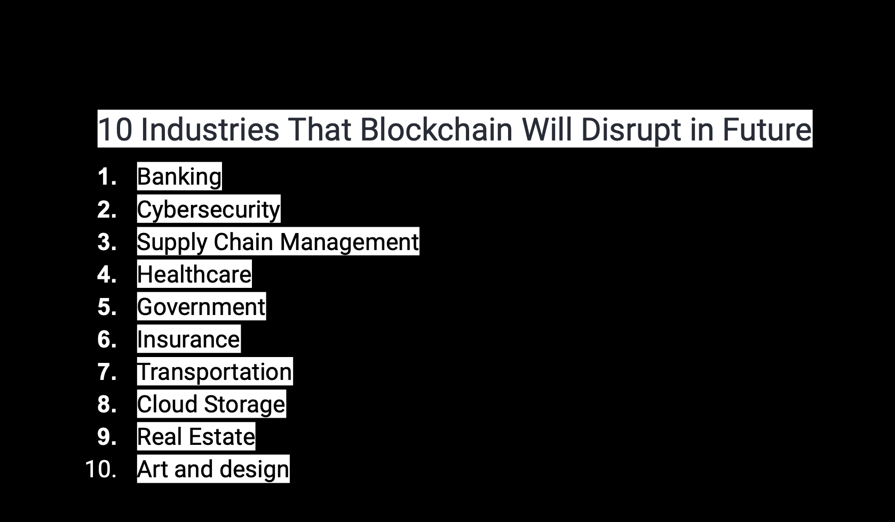
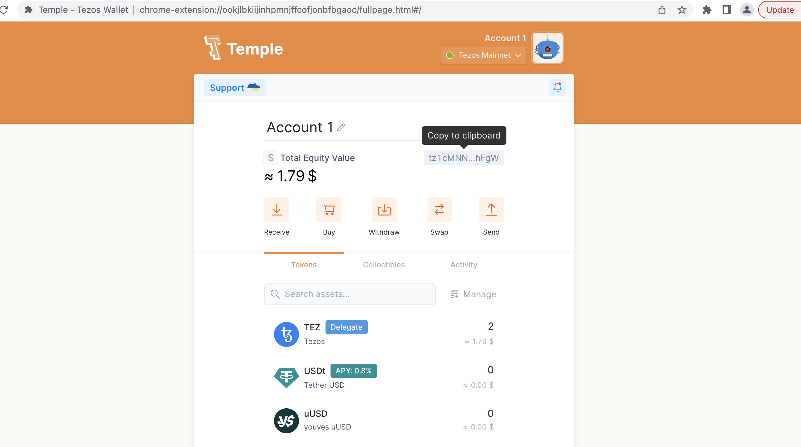
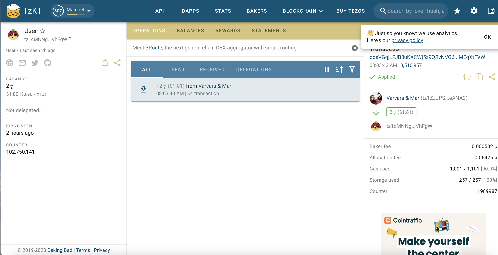
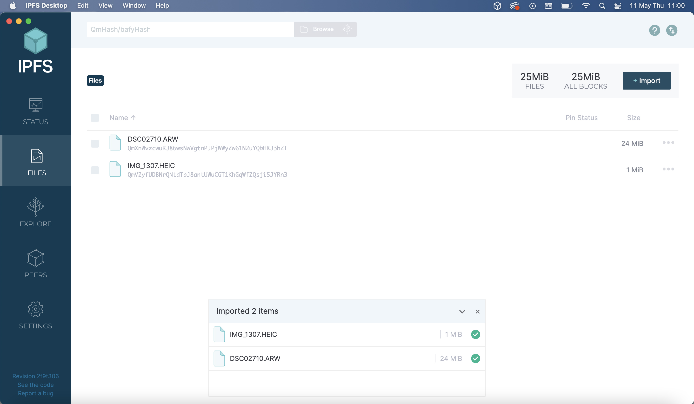
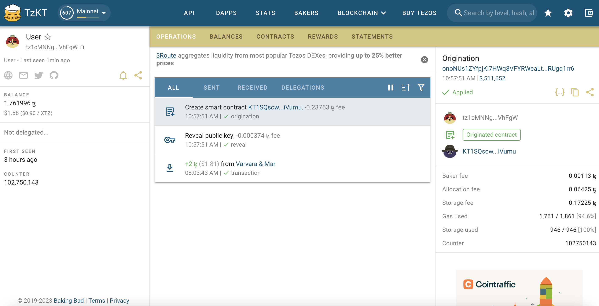
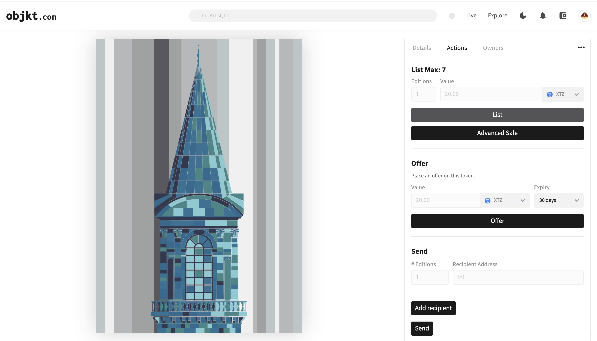

---
hide:
    - toc
---

# Collective Intelligence

**Collective Intelligence**

Guillem started the session by explaining us how WhatsApp messages sent through the phones, Wi-fi, internet providers, servers-clouds, cables, networks, data-centers… and also he tried to explain how those messages are encrypted. He drew a schematic for that. Even I heard about that several times it is still a bit complicated.

At the second day of the session Mar Canet brought many subject to the class. We started with the different network structure as centralized, decentralized and distributed networks. And the list of the 10 most industries which will be disrupted by the blockchain. Among the 10, I only have doubts about healthcare. I am not sure in which way or how blockchain will do that?

Then, we continued with the concept of crypto currencies. I already know something about cryptos and token. The idea behind the Bitcoin, mining and the energy consumption of mining of bitcoin and its effects on global warming. But, during the session I have learnt about the Ethereum 2.0 and its green energy policies.

As a final activity we have learnt to create a wallet for the web in the Tezos blockchain.

Third day of the session; we found out that Mar Canet sent to our wallets 2 Tezos in order to create NTF and work on the blockchain. We had to verify our Tezos wallet profile instead of working with anonymous profiles. We had to upload an URL for our images and we need to upload that to the IPFS(a file server). Additionally, we need to pay gas fees to verify our profiles.

During the last day of the session we saw other examples of some AI tools and digital art installions and NFT projects. And we finished the lecture by preparing or own NFT collection projects.

  <iframe loading="lazy" style="position: absolute; width: 100%; height: 100%; top: 0; left: 0; border: none; padding: 0;margin: 0;"
    src="https:&#x2F;&#x2F;www.canva.com&#x2F;design&#x2F;DAFisg4ngNU&#x2F;view?embed" allowfullscreen="allowfullscreen" allow="fullscreen">
  </iframe>

<a href="https:&#x2F;&#x2F;www.canva.com&#x2F;design&#x2F;DAFisg4ngNU&#x2F;view?utm_content=DAFisg4ngNU&amp;utm_campaign=designshare&amp;utm_medium=embeds&amp;utm_source=link" target="_blank" rel="noopener">Towers of Istanbul + Bosphorus Habitat</a> by caglaralkan
