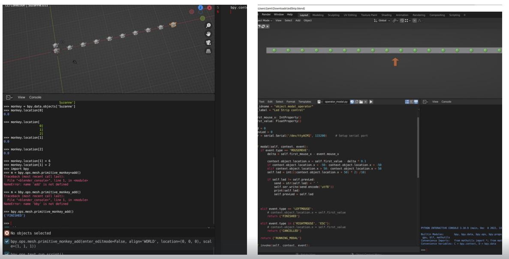
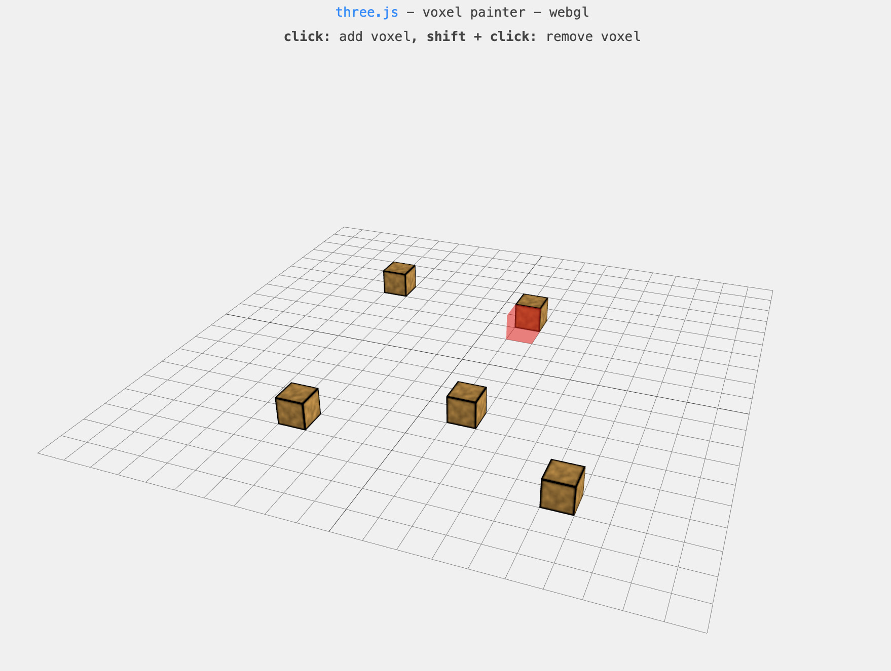

---
hide:
    - toc
---

# Prototyping for Design

**Prototyping for Design**

##Class Task No:9##

Josep gave a brief introduction for robotics and acquired knowledge about robotic arms. The advantages of utilizing a robotic arm compared to other manufacturing methods lie in its flexibility across multiple axes. I can say that it resembles a CNC machine, but certainly it offers additional possibilities like antigravity printing. We tried to explore Grasshopper to comprehend how to generate simulations and experimented with scripts to observe how we could control and modify the parameters. When constructing a path to connect points together, we can determine a curved joint instead of a straight line. This curved path, known as a spline, should be converted to include the corresponding plane for each point. In the Grasshopper simulation file, I tired to obtain the necessary plugins and libraries for robotics. Finally, we were able to execute a script that creates a line in space with friends from MDEF.

<iframe width="560" height="315" src="https://www.youtube.com/embed/ycJ9lMgZVuA" title="YouTube video player" frameborder="0" allow="accelerometer; autoplay; clipboard-write; encrypted-media; gyroscope; picture-in-picture; web-share" allowfullscreen></iframe>

##Interface Class Activities##

In this course, we discovered a bit the concept of live coding and explored a visualization tool called Hydra, which enabled us to manipulate and design our own real-time visuals. Through Hydra, we gained the ability to modify existing visuals, write code from scratch, incorporate our own cameras, and even control the visuals using sound inputs. As someone without a coding background, this experience proved immensely beneficial in comprehending how each command affected the visuals and their parameters. It provided valuable insights into the direct relationship between coding commands and the endless possibilities that these tools offer for creative expression. The most entertaining and interesting part was to try to work with the microphones of our computers can be used as an input to get some outcomes. It was quite nice to learn a bit the coding language again.

  <iframe loading="lazy" style="position: absolute; width: 100%; height: 100%; top: 0; left: 0; border: none; padding: 0;margin: 0;"
    src="https:&#x2F;&#x2F;www.canva.com&#x2F;design&#x2F;DAFjjHvxD4M&#x2F;view?embed" allowfullscreen="allowfullscreen" allow="fullscreen">
  </iframe>

<a href="https:&#x2F;&#x2F;www.canva.com&#x2F;design&#x2F;DAFjjHvxD4M&#x2F;view?utm_content=DAFjjHvxD4M&amp;utm_campaign=designshare&amp;utm_medium=embeds&amp;utm_source=link" target="_blank" rel="noopener">Design</a> by caglaralkan

##Blender Introduction and Integrated Arduino##

During the initial session, Victor introduced us to the concept of Blender, its vibrant community, and the diverse range of applications it offers. When selecting a design tool, it is crucial to choose one that not only facilitates learning but also allows for versatile application. I knew that Blender serves as a powerful tool for animation, but I also discovered its other functions on CAD, rendering, and seamlessly connects with numerous devices and interfaces. While there are many tools that promise instant gratification by making things easier, we often tend to avoid investing time in learning such tools due to their lack of intuitiveness. However, this inclination towards simplicity primarily stems from a desire for quick solutions and personal validation.

In the second session we started using Blender and learned basic functions in moving models in space and created an array. Victor showed us to use the coding interface of Blender to command the program rather than the basic interface tools. I guess this function is an advantage of Blender than the other CAD and rendering programs, Blender has a lot of ways to interact with it. Then we continued with how to connect Arduino to Blender, using a switch modeled in Blender it could control a light on Arduino. Unsurprisingly, I had a lot of problems with Arduino IDE and its libraries and could achieve to finalize the task that we wanted to achieve. But, at the end it was nice to discover a bit about Blender.

##Challange No:3##

As a group we decided to develop an interface for our tile-deco and pixel-cube  projects ( maybe a website) in order to eliminate the use of grasshopper apps  and firefly plugin and make the process more accessible and easier if possible. Briefly, our main goal is to support the makers and crafts, and encourage them to use digital fabrication tools.

We agreed on using OPENCV shape detector. But, in order to use OPENCV we need PHYTON, ANACONDA and VISUAL STUDIO too. Firstly, we set the anaconda and PYTHON and OPENCV. Then we found a code for shape recognition-detection especially for “circle” from an image. We tested that through the anaconda and of course code had some problems and we asked from CHATGPT to fix the code. More or less the code works through the image but we needed to calibrate the parameters in order to get more accurate results.

During the second day we continued to work on shape detection code. After detecting the circles on the still images we tried to configure the code for squares, rectangle, triangle, semi/quarter circles. We used edge detection and tried to convert them to defined geometric shapes, but we had problems with some undefined ones as lemon shape or croissant shape. So, in order to solve this we worked on polygon contouring but it did not ended up with smooth curves. Then, Pietro joined to support us for using PYTHON libraries.

After some discussions, we decided to use QR code detection in OPENCV libraries for assigned geometric shapes as we did with the fiducials on Grasshopper-firefly application model during the Challenge-No2 and we wanted to combine that with Three JS Interactive Voxel Painter project as a grid base. We spent some hours on this approach. Finally, we decided that would take months to finalize the work.

We went back to the basic idea to detect the edges of the each geometric shapes on the grid that we designed and decided to eliminate the shades and work on lighting in order to get the best results with this basic and simple method which can be done on OPENCV and PYTHON.

During the following two days, we mostly worked on building a new set of shape detecting and tile decorating kit in order to solve the problems of the previous one. Additionally, we built a frame out of hard wood in order to make a hydrolic  tile. Hydrolic tile is an old method to decorate the tiles out of color pigments cement and dirt with the help of high pressure. By using our tile deco kit we captured a design and convert that into a STL file and we 3d printed the pattern that we want to paint the tile.

We used the CNC machine to cut the frame out of wood. We used the laser cutter to make the tile deco kit out of plywood and acrylic. And we used 3d printer to print the inner frame to decorate the tile with color pigments.

We are planing to test the kit next week and get ready for MDEF FEST.

Personal note: During this challange we tried to use OpenCV and Python for the first time. Even if we couldn’t get the results that we want it was a nice experience to try these digital tools. And, as I told to Santi and Victor this time we tried to work together rather than dividing the responsibilities and by this way it was more efficient for everyone to have the chance of trying digital tools.
