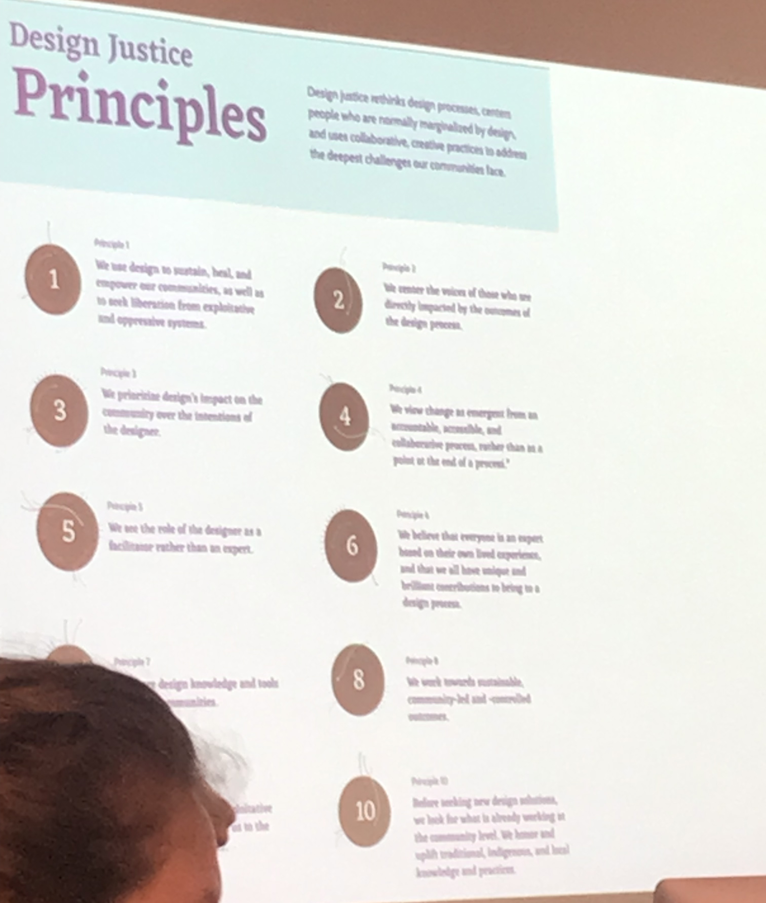

---
hide:
    - toc
---

# Critical Transfeminist Design

**Critical Transfeminist Design**

In this class, Laura introduced us critical practices that blend design, art by researching and examining the intersections of fiction, philosophy and ethics. We explored the impact of fiction and how it can shape our ideas of the future, including its hyper-real consequences. Additionally, we  also lookied into colonial backgrounds, racism in system structures, and philosophical theories that have justified immoral actions.

The importance of critically analyzing terms, narratives, and power dynamics was emphasized. We learned about Indigenous Feminism and Radical Indigenous Survivorship as counter-narratives to colonialism. The discussion touched on systemic racism, identity denial, and the struggles faced by subaltern individuals who are marginalized by various social divisions.

There were some topics that not easy to digest for me (as a 40 years old, oldfashion guy) like; biohacking, epistemic violence. I feel like I am listening the class under water when there were so much philosopic and abstract terms used during the discussions. We encountered with plenty of subjects and it made the class hard to focus.

But, on the other hand, it was nice to discover new way of approaches, when they were explained in more practical ways. Especially during the second sessions some topics were quite interesting;

- Power makes us sick!

- Who is missing in this space? What is toxic? What is Pure?

- Design Justice Principles!

Moreover, we watched a video by Aqua_Forensic, which visualizes anthropogenic pollutants in water habitats, aiming to raise awareness of their effects.

To sum up, the class provided valuable insights into critical thinking, the impact of fiction, power dynamics, social divisions, and the intersection of art, design, and science in addressing societal issues.
