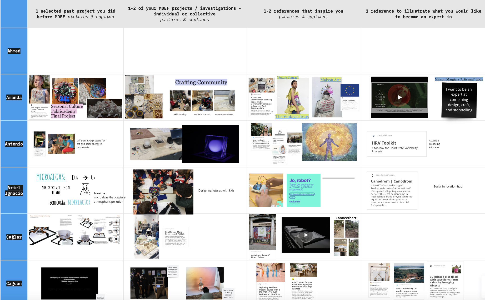
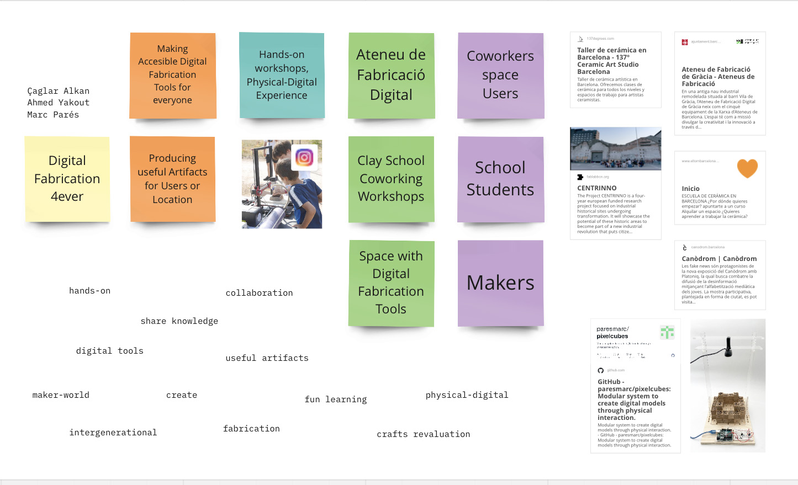
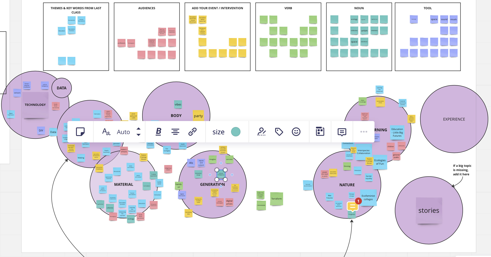
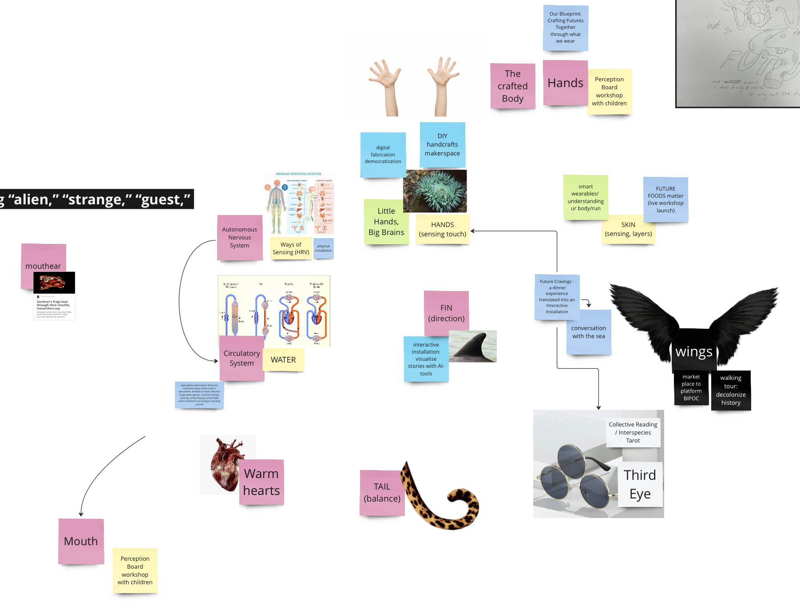
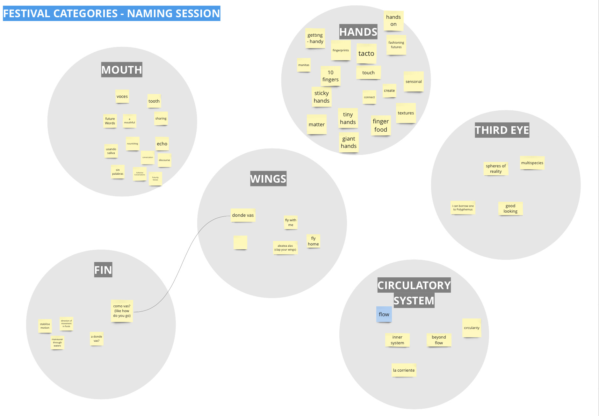
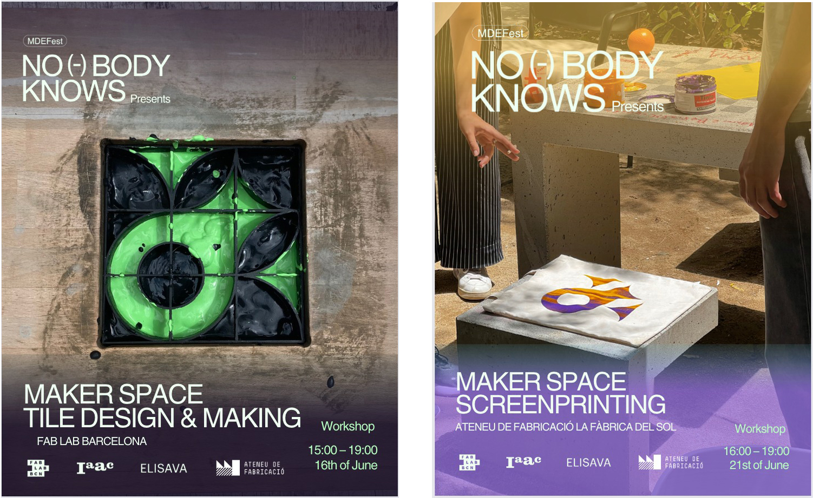

---
hide:
    - toc
---

# MDEF-Fest

**MDEF-Fest**

MDEF Fest

As they are alumni of MDEF, Audrey and Sally supported us to plan and organize a festival as a closing event for the first year of MDEF. In the beginning, it started as a speculative approach, but it turned into and continued with the real content of our individual or collective intervention plans. Basically, we worked on a collective Miro board;

<iframe width="768" height="432" src="https://miro.com/app/live-embed/uXjVMVMmtdU=/?moveToViewport=25284,-2283,3903,2061&embedId=933186226037" frameborder="0" scrolling="no" allow="fullscreen; clipboard-read; clipboard-write" allowfullscreen></iframe>

A collective Miro board makes the structure easy to track, accessible and clear.

We discussed on various approaches, events, workshops and audiences. We started with sharing our personal approaches. What and how we would like to present? What kind of events we would like to organize?

Then we continued to work with our collective intervention structures and potential event plans. I worked with Marc Pares and Ahmed Yakout to organize a set of workshops by using the gadget that we developed during the second term. And we discussed on the potential of it.

During the following session we tried to define the theme and sub-themes of the festival by using the tools that Audrey and Sally prepared for us on the Miro board. As we are 24 in the MDEF class and we have different backgrounds, interests and topics that we are working on, we need to build some cohesive and related events and find an inclusive theme to connected every single event to each other.

To succeed on this, we made an exercise on the human-non-human body parts and even if it was blur, the festival started to take shape. Meanwhile, we were working on contacting with some stakeholders, communities and exploring places for possible events that we could organize during the festival. Additionally, we also looked for some possible collaborations with our colleagues. Amanda J. and Samantha P. were working on a project called indigo dying. So, it would be an option to worked with them and share the same space, as they were looking for a space and we already had one.

The next step was to decide the name of the festival and we voted for that on the Miro board. Finally, we agreed on the name of “Nobody Knows (the Future)” The following steps of the class directed by the communication team of IAAC. They supported us to define the communication tools as posters, colors, language, etc.

In sum, the session was really helpful to plan and organize a collective event by taking the stakeholders, colleagues, audiences, communities and places into consideration.

**Phygital Therapy**

Finally, we agreed to organize the hydraulic tile making workshop for MDEF-FEST, we conducted a quick search for the tile mixture recipe. As it is an ancient craftsmanship process, finding a specific recipe proved challenging, and we even consulted Chat-GPT for assistance.

Essentially, a single hydraulic tile consists of three layers: the top layer is made of marble powder, white cement, color pigments, and water; the middle layer consists of fine gray cement; and the bottom layer is a mixture of sand and cement. For the second trial, we obtained marble powder and white cement and made several attempts to achieve the best results. We experimented with different ratios for the top and bottom layers to optimize the production process. The main focus of the second trial was to improve the mold, as the imperfect edges of the tiles posed a challenge.

Ultimately, we realized that we are not professional tile makers but rather designers seeking to test the Phygital Therapy Grid (PTG) for various applications. Despite not achieving perfect tiles, we decided to continue our journey and explore further possibilities.

Furthermore, we also decided to organize an extra screen-print workshop at Atenau de Fabrication.

