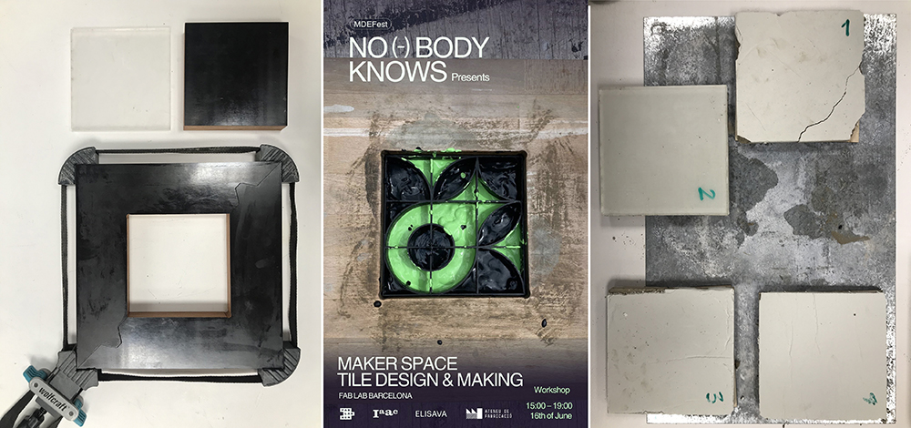
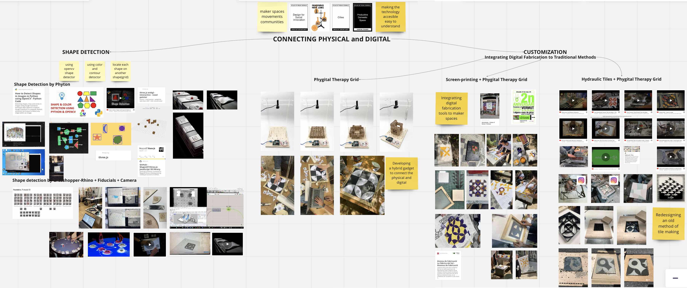

---
hide:
    - toc
---

# Design Studio III

**Design Studio III**

**Chapter 8: Final Interventions**

We began the third term with the aim of further developing the gadget that we had been working on, which combines the physical and digital worlds to support the integration of digital fabrication tools in maker spaces. To make our project as accessible as possible, we explored potential open-source interface and infrastructure programs. This aligns with the third challenge of the Prototyping for Design course, which we used to our advantage. Our intention was to address the issues with the grasshopper code for shape/fiducial detection and the interface of the grid. Although we experimented with other shape detection systems, we ultimately decided to continue with grasshopper, as it worked nearly perfectly. As a result, we merged our previous two projects and utilized fiducials to detect each geometric shape, facilitating the generation of designs on the grid-board. Once the design is captured by the camera, the grasshopper code can convert it into different formats, allowing us to export it for vinyl cutting or 3D printing. Consequently, we can create screen prints or hydraulic tiles with the same design.

“The power of first person perspective; designing within the communities”

**Collective Intervention no:6**

As planned at the end of the second term, we proceeded with conducting interventions to test our gadget and design approach. As mentioned earlier, our primary focus is to support maker spaces and encourage makers/craftspeople to integrate digital tools and technologies into their work and workspaces. The gadget we developed during the second term serves as a bridge between the physical and digital worlds.

Initially named Tile-Deco, we later upgraded it to Pixel Cubes, expanding its operating principles from 2D to 3D. In addition to this upgrade, we aimed to enrich the usage of our gadget and held a brainstorming session to explore alternative applications.

Considering the importance of a first-person perspective approach in our interventions, practicability, applicability, and suitability for testing were our main considerations. We also took into account the applicability and testability during the brainstorming session, leading us to two ideas for testing our developed gadget. The first idea was to use it to generate designs for screen-printing, and the second idea was to explore the concept of hydraulic tiles.

To start, we reached out to Caixa D'Eines y Feines to organize a screen-printing workshop. As a warm-up plan, we agreed to collaborate with a two-hour sewing workshop and share the space and participants. We made the necessary preparations and organization, but unfortunately, on the day of the workshop, the IAAC building experienced a flood, preventing us from bringing the vinyl cutter to Caixa D'Eines y Feines. Fortunately, we had already cut some stencils in advance.

We briefly introduced ourselves and our gadget that is designed to generate unique designs for each participant. However, due to the last-minute issues, we had to explain that we would be using the pre-cut stencils. We then proceeded to explain the process of transferring the vinyl to the frame using transfer tape, providing a demonstration. Since it was not our workshop space, we needed tools such as tweezers, a cutter, scissors, and additional materials like tape. The space and participants were very enthusiastic about helping and supporting the workshop.

Due to a heavy and unexpected rainstorm, there were only four participants in the workshop. Nevertheless, they brought their own fabric samples, shirts, and items. We aimed to avoid directing them too much, as we had learned from previous workshops at the same location. The primary ethos of Caixa D'Eines y Feines is generally to support makers and share experiences. After transferring the stencil onto the frame, participants selected their preferred colors, and we began the screen-printing process.

Introduction of the gadget and explanation of the screen-printing process

We demonstrated the process of screen-printing on white sheets that Amanda J. and Samantha Piercy provided from the old clothes and fabric recycling center. Initially, we showcased mono-color printing in our demonstrations, but our participants expressed their interest in mixing colors and creating patterns by applying the same design multiple times on their own. These attempts were highly motivating and encouraging for both us and the participants, confirming that we were in the right place and collaborating with the right community.

A Demonstration of Screen-print
(transfer of the vinyl, covering the frame, usage of color, application with spatula)

During the first session, we applied screen-printing on various surfaces, textures, fabrics, and clothing items such as t-shirts, shirts, and pullovers. This allowed us to explore the versatility of the technique. Additionally, we received a request from the director and participants to repeat the workshop at the second anniversary party of CdFE. Their enthusiasm and creativity made us feel proud of our work.

In conclusion, despite encountering some weather-related challenges, our first intervention was highly successful and provided valuable insights for testing our approach and the gadget we developed to support makers and encourage their integration of digital tools into their work.

Colorful Results

**Collective Intervention No:7**

As planned, we successfully organized the second screen printing workshop at the CdEF anniversary. This provided us with an opportunity to test the gadget we developed during the second and third terms, which I personally refer to as the Phygital Therapy Grid (PTG). The workshop had a high level of participation, with over 30 makers from diverse backgrounds, including architects and finance professionals. Some of our MDEF colleagues also joined to support us.

To begin, we provided a brief explanation of the workshop's main purpose and informed the participants about the equipment and the whole process. Ahmed Yakout took the lead in guiding them through the design generation process using the PTG, while Marc Pares and I carried out the vinyl cutting and stencil transfer for the screen printing process.

Explaining the Grid-Board, Geometric Shapes, Vinyl Cutting, Screen-Printing

During the design generation process, each participant provided us with different and valuable feedback. Since the grid and geometric shapes have magnets, participants were not entirely free to place items wherever they desired, which caused some initial confusion. However, we explained that the Grasshopper detects shapes with the reference of each square, which has a magnet at its center.

This clarification led us to realize the need to redesign the grid interface to be more intuitive and avoid confusion. Surprisingly, some participants expressed a desire to design rectangle-shaped patterns instead of using the square-shaped grid, which challenged our initial assumption. The most significant and useful feedback from the workshop was the need to redesign the interface of the PTG to improve clarity.

Participants experienced the Phygital Therapy Grid (PTG) to generate their design

Furthermore, the interactions we had during the vinyl cutting and stencil transfer process were highly valuable. After participants generated their designs on the PTG, Ahmed captured their patterns with the camera and used the Grasshopper to convert the files into .dxf format, which were then sent to us. We borrowed the vinyl cutter from IAAC and brought it to CdEF to cut the vinyl according to the participants' designs. We then transferred the stencils onto the frames using transfer tape. Throughout this process, we encouraged participants to assist us to maximize their hands-on experience. Many attendees found this process easier than anticipated and felt confident after gaining some support. Their newfound confidence was evident during the screen printing step, as they eagerly utilized the spatula to apply the ink throughout the frame to their fabric pieces.

Screen-Printing Process

Moreover, some participants expressed curiosity about the technology behind the PTG and sought to integrate it into their maker space. We provided a brief explanation, and one participant mentioned that their friend had designed the fiducial system we used in Grasshopper to detect shapes and reflect them on the computer screen through RhinoCeros.

In conclusion, the second screen printing workshop was highly valuable in terms of interacting with a diverse group of people and receiving feedback to further develop our Phygital Therapy Grid. Personally, it provided me with valuable insights and boosted my confidence and enthusiasm for participatory design processes, which is a new experience for me after fifteen years of industrial design.

Outcomes of the Workshop

**Alternative Explorations**

Besides the two screen-printing interventions we conducted, we also explored different ideas and applications to maximize the efficiency of the Phygital Therapy Grid (PTG). During the interim period between the screen-printing workshops, we decided to collaborate with a ceramic artist named Evan, who works at "Studio 137" in Poblenou. We reached out to him, introduced ourselves, and presented our project, PTG. We visited his workshop at TMDC, and he showed interest in collaborating with us. After a quick brainstorming session, we decided to utilize our gadget to create a set of hydraulic tiles, an ancient tile production technique.

During the third challenge of the Digital Prototyping class, we attempted to produce hydraulic tiles using the Phygital Therapy Grid. After capturing the design on the grid, we sent the file to Cura, the software for the 3D printer, and printed the design as a frame to define the tile pattern. We placed the 3D printed frame within the wooden frame we had constructed for hydraulic tile production.

3D-Printed Frame for Hydraulic Tile Decoration

The next step involved preparing the color and cement mixtures for decorating the tiles. Normally, powdered color pigments are mixed with white cement, to which water is added. However, we used liquid color pigments typically used for fabric painting and mixed them with gray cement. To achieve the best result and avoid large particles, we sieved the gray cement. We then filled the 3D printed frame with the color pigments and cement mixtures according to the desired decoration. After removing the 3D printed frame, we added more cement by sieving it on top. In the first trial, we added a mixture of sand and cement on top and applied excessive pressure with the hydraulic press. The result was unsuccessful. For the second trial, we decided to add only cement on top, but it resulted in a dry and uneven finish. In the third and final trial, we applied thinner layers of cement, sprayed water on each layer, and applied 2 tons of pressure using the hydraulic press. The end result was quite satisfying. However, as we planned to organize a hydraulic tile workshop for MDEF-FEST, we decided to conduct further research to find the best recipe for hydraulic tiles before attempting another trial with Evan.

First Trial Outcomes

Once we agreed to organize the hydraulic tile making workshop for MDEF-FEST, we conducted a quick search for the tile mixture recipe. As it is an ancient craftsmanship process, finding a specific recipe proved challenging, and we even consulted Chat-GPT for assistance.

Essentially, a single hydraulic tile consists of three layers: the top layer is made of marble powder, white cement, color pigments, and water; the middle layer consists of fine gray cement; and the bottom layer is a mixture of sand and cement. For the second trial, we obtained marble powder and white cement and made several attempts to achieve the best results. We experimented with different ratios for the top and bottom layers to optimize the production process. The main focus of the second trial was to improve the mold, as the imperfect edges of the tiles posed a challenge.

Second Trial Outcomes

Last Trial with the New Molds and Poster of the Workshop

Ultimately, we realized that we are not professional tile makers but rather designers seeking to test the PTG for various applications. Despite not achieving perfect tiles, we decided to continue our journey and explore further possibilities.

My personal Design Space (Term 3)

**Chapter 9: Final Alternative Present**

“Participative Design Processes” that include digital fabrication tools and combine them with traditional production techniques encourage makers to be more productive in urban spaces and support them in integrating technology into their workspaces in the age of the post-industrial revolution. In other words, makers gain confidence in using new technologies in their work and seamlessly blend traditional techniques with digital fabrication tools to enhance productivity both individually and within their communities, with the aid of “Participative Design Processes”.

**Chapter 10: Designing yourself out: Strategies for Continuity and Scalability**

Creativity in personal and collective spaces, support for maker movements, supply chain hacking, democratizing production, and providing alternatives for the post-industrial revolution era regardless of the terminology used, my primary objective is to explore alternative approaches that enhance productivity in urban spaces. Instead of adhering to the consumption culture's dictates on how to spend our money, I aim to inspire communities and individuals to be more productive and offer them support in various ways.

Mariana Quintero coined the term "Participative Design Process" to describe this approach, and as a designer, I aspire to work with and consult on these processes. One of my goals is to establish stronger connections between craftsmanship and new technologies to foster sustainable practices. Additionally, making new technologies accessible and understandable is another objective of these processes.

**The 5 W of Scaling and Continuity**

Why?
To form a community, make technology accessible for everyone, encourage people-makers to participate into design processes and digital fabrication tools. Built an alternative way for design and production processes in the age of post industrial revolution era.

What?
Simplify and integrate digital fabrication tools to participative design processes.

Who?
Makers and DIY enthusiasts

Where?
Around maker spaces and product libraries

When?
From now on…

**How? Which structures can be used?**

Job/Freelance
Business/Startup
Non-profit/Cooperations
Collective/Network
Event/Physical space
Academic Research
Documentation/Guide

Personally, I am keen on further developing Participative Design Processes by organizing more events, collaborating with different maker spaces, and engaging with other networks. Consulting on participative design processes will lead me down different paths and enable me to gain deeper insights into the design and production processes. Furthermore, documenting and publishing these processes can create more opportunities to establish new connections and networks. In summary, harnessing the potential of collective making, thinking, and designing is crucial in promoting participative design processes.

**Chapter 11: Final Reflection**

As an industrial designer, I have had the opportunity to work on project briefs that range from strict to flexible over the course of fifteen years in various design fields. Seeking to explore a different design methodology, I enrolled in the Master in Design for Emergent Futures (MDEF) program. My previous design experiences involved predominantly working alone or in collaboration with other professionals, primarily utilizing computer-based design tools. In some cases, I had the luxury of conducting observations to inform design decisions, but I was often the sole individual responsible for considering the entire usage scenario of a product, system, or service.

Understanding and internalizing the core concepts of the MDEF program, such as "Design Intervention," "First Person Perspective," "Designing within the Communities," and "Interconnectivity," proved to be a gradual process. It took time to fully grasp the significance and value of these terms. However, by the middle of the second term, I began to appreciate their meaning as I gained more experience interacting with communities. Concepts like "design intervention" and "first person perspective" started to resonate with me, fostering a growing sense of confidence.

With the assistance of the MDEF program's content, I was able to explore a range of topics and acquire the necessary skills to pursue the path I desired. The combination of lectures and hands-on learning provided a comfortable environment that encouraged exploration. Despite occasional frustrations with the workload, I considered myself fortunate to have the opportunity to discover numerous new technologies, software tools, and production methods. I have previously expressed my thoughts on the MDEF program's content and the importance of elective courses, particularly given the diverse backgrounds and bachelor degrees of the students in the program. I strongly believe that the inclusion of elective classes would enhance the efficiency of the master's program for its participants.

I would also like to reiterate the significance of "emergent futures" and "alternative presents" as key concepts within this master's program. Rather than focusing solely on speculative future scenarios, I learned to generate alternative present approaches by combining today's tools with emergent technologies. This perspective became increasingly evident to me throughout the trimester, as I followed the steps, concepts, and ideas in my design journey.

Moreover, both individually and collectively, I delved into various topics and engaged with different communities, allowing me to develop a new design perspective. My MDEF journey began with a personal interest in "urban productivity practices," followed by collaborative work on "playfully production practices" with colleagues, emphasizing low-tech approaches. Subsequently, I had the opportunity to conduct research and implement gray-water collection, filtration, and recycling systems alongside other colleagues. Ultimately, I culminated my journey with a project that integrated digital fabrication tools into craftsmen's workspaces, empowering maker communities to make efficient use of technology. Along the way, I interacted with community gardens, attended numerous workshops, visited craftsmen's workshops, made observations in supportive maker spaces and product libraries, organized workshops, and shared my knowledge and experiences with participants. I embraced the role of a designer as a mediator rather than the sole decision-maker, and this shift in attitude brought me greater comfort.

In conclusion, my journey in the Master of Design for the Emergent Futures program introduced me to a new design approach. Emphasizing the first-person perspective, designing within communities, and hands-on learning were the key takeaways from this trimester. I have significantly developed my vision and eagerly anticipate applying my newfound skills in various fields, ranging from urban productivity practices to participatory design practices. I firmly believe that I will increasingly contribute to and consult on participatory design practices in the near future.
