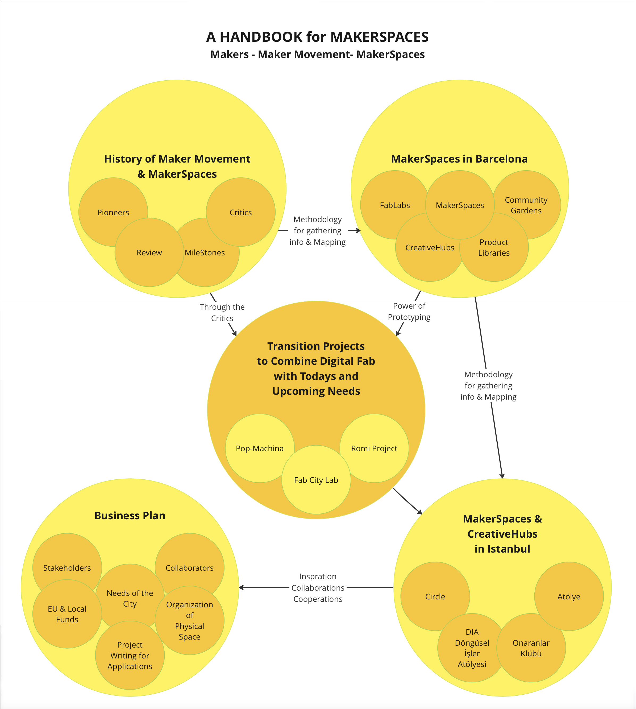
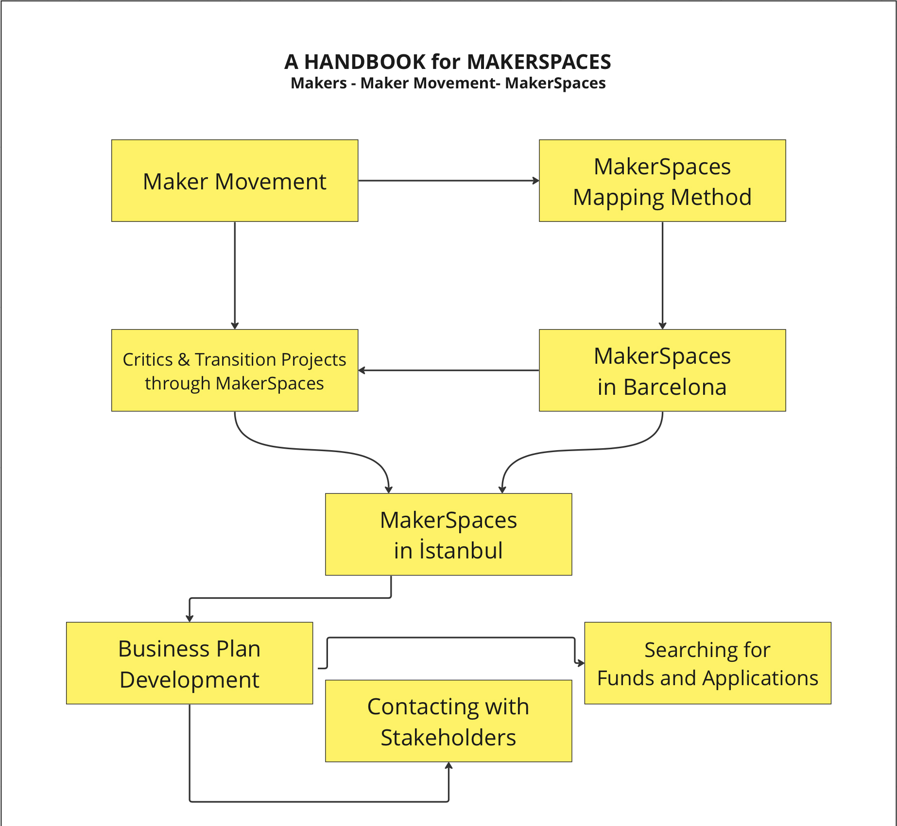
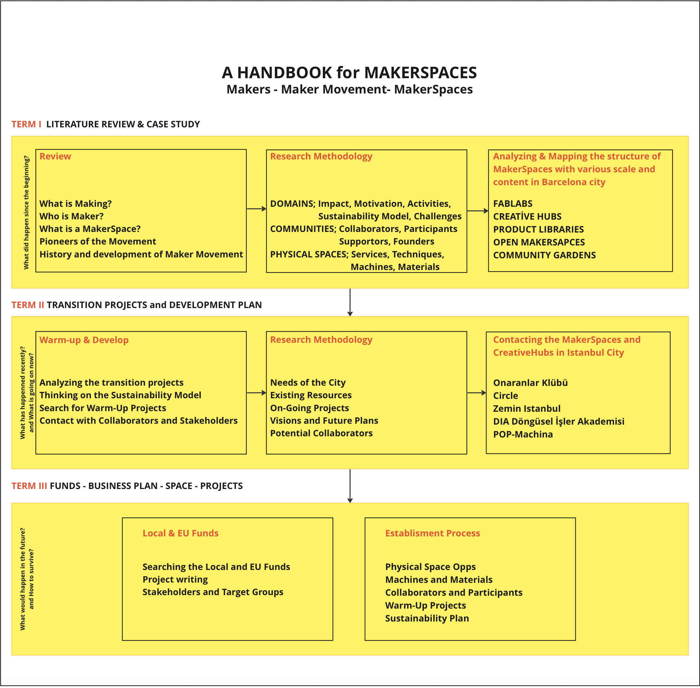
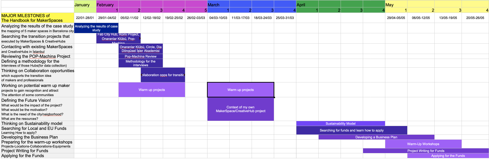

---
hide:
    - toc
---

# Research & Method

**Outline of Master Thesis**

In the era of post industrial revolution, maker movements become more visible since 10-15 years. Open source concepts, digital fabrication tools, and participative design processes supports the makers in the urban spaces. Through this research I will examine the structures, management methods, community engagement plans, business models and establishment processes of several makerspaces. Consequently, there will be a handbook that would be used as a guidance for makers who would like to build their own makerspaces.

Preparing a handbook that focuses on the structures, management methods, community engagement plans, business models and establishment processes of makerspaces  which provide an alternative way to indivudials for being creative and productive in the urban spaces within the communities.  

  <iframe loading="lazy" style="position: absolute; width: 100%; height: 100%; top: 0; left: 0; border: none; padding: 0;margin: 0;"
    src="https:&#x2F;&#x2F;www.canva.com&#x2F;design&#x2F;DAGIayGeBgo&#x2F;nKdh_XBCACiZQuAfbE-xvQ&#x2F;view?embed" allowfullscreen="allowfullscreen" allow="fullscreen">
  </iframe>

<a href="https:&#x2F;&#x2F;www.canva.com&#x2F;design&#x2F;DAGIayGeBgo&#x2F;nKdh_XBCACiZQuAfbE-xvQ&#x2F;view?utm_content=DAGIayGeBgo&amp;utm_campaign=designshare&amp;utm_medium=embeds&amp;utm_source=link" target="_blank" rel="noopener">Thesis Statement</a> by caglaralkan

**Data Sourcing**

The data sourcing class more like the AI class that we had in MDEF01. Mainly it focuses on the google collars tool to get information through images and keywords. There are 4 different codes to analyze and gather information according to the images and keywords that we provide(upload) to the code. They are retrieval, similarity, detection and attention.

But before going through the images we worked on a specific related topic to make the process more relevant for everyone. As group we decided to work on Social Architecture and we made a brainstorm on wording exploration. At the end of this process we selected some key architectural outcomes of social dynamics and structures. They are co-housing/shelter, co-working spaces, education hubs, market places, recreational areas, sport facilities and medical centers. Humanitarian and mixed-use are the cover words for exploring the images that we will use to provide to the codes.

**Explore Wording**

Forensic study

Finding some social architecture projects and collect their images
Then use the google collabs ai tools to analyze the images with keywords that we decided according to the project and social architecture

And render the results of those analyses

Gathering information by providing data to ai tools

  <iframe loading="lazy" style="position: absolute; width: 100%; height: 100%; top: 0; left: 0; border: none; padding: 0;margin: 0;"
    src="https:&#x2F;&#x2F;www.canva.com&#x2F;design&#x2F;DAGIawpZkKc&#x2F;o3fmj-mVFsaMdoSGS8IbuA&#x2F;view?embed" allowfullscreen="allowfullscreen" allow="fullscreen">
  </iframe>

<a href="https:&#x2F;&#x2F;www.canva.com&#x2F;design&#x2F;DAGIawpZkKc&#x2F;o3fmj-mVFsaMdoSGS8IbuA&#x2F;view?utm_content=DAGIawpZkKc&amp;utm_campaign=designshare&amp;utm_medium=embeds&amp;utm_source=link" target="_blank" rel="noopener">Design</a> by caglaralkan

**Working Plan / Research Map**

Analyzing the case study-the mapping of 5 maker spaces in Barcelona city-
(Similarities and differences, focuses, motivations, impacts, communities, sustainability models)

Analyzing the transition projects that executed by makerspaces which is compulsory for the sustainability of maker movement. Fab City Hub, Romi Project, Onaranlar Klübü

Contacting with existing makerspaces and HUBs in İstanbul (Onaranlar Klübü, Circle, Atölye, Pop Machina/DIA Döngüsel İşler)

Thinking on Collaboration potentials which support the transition idea of makers and professionals

Working on potential warm up maker projects to gain recognition and attract the attention of some communities

Defining the Future Vision? What would be the impact of the project? What would be the motivation? What is the need of the city/neigborhood? What are the resources?

Education? Youths (Maker Education)
Intervention projects in Urban areas? (Creative Hub)
Collaboration to realize the transitions which connects makers and professionals to create new alliances

**Map:**

**(Research Map)**

**(Starting Diagram)**

**(Enhanced Diagram)**

Makerspaces in Barcelona
Power of prototyping
Power of traditional knowledge/cumulative and based on experience
Power of Digital Fabrication

Transition scenarios/projects;

Food: agriculture and other food sources
Energy, Material, Waste management

Collaboration possibilities in İstanbul
Space sharing?
Projects and Communities; Onaranlar Klübü / Circle /
Workshop Trials/Samples

What could makerspaces do as the game changers in the cities?

**Warm up projects?**

Collaboration to use the space and communities

**Cities as test-Labs**

increase the business viability of their circular maker projects
community-building aspect that focuses on peer-to-peer support.
vision was not only to help demonstrate the business potential of the circular maker’s ecosystems, but also their contribution to sustainable, resilient, and integrated urban regeneration.

Aimed to strengthen community engagement and skills development, thus empowering the local maker communities further opening up the makerspaces to the local community enabling the makers’ involvement

The overall focus is normally to stimulate local economic development while achieving social and/or environmental impact.

Transition to a local circular economy is also one of the fundamental principles

However, makers can often surprise you, as they are empirical innovators who think and operate “outside the box”, creatively working around ideas and challenging norms, a process that stimulates excitement for the participating members

Grassroots organizations and communities can contribute to a transition towards a circular economy by engaging citizens in sharing, repairing and reusing products as well as recycling materials.

contribute to sustainable development goals by reducing CO2 emissions through localized production and transportation of goods

Local Future Stories (LFS) to gather the values, visions, and dreams of local communities that may potentially support community building

How to integrate the priorities, visions, and values of local stakeholders

MakerSpaces transition need paragraph ; Makerspaces are organized around creating knowledge and physical or digital products. They allow makers from diverse backgrounds to interact with each other, learn from each other and collaborate in making projects, which in turn helps build a community. This community-building aspect is highly essential for maintaining a makerspace since tools supporting fabrication activities become meaningless without an engaged community of makers. Previously, several suggestions have been made to help engage the community around a makerspace such as engaging students, using social media channels, organizing maker fairs, or creating a pool of maker mentors.

But know Circular Economy, Environmental and urban Sustainability, Distributing local production and consumption and services, waste management in urban spaces, urban mobility, reducing CO2 emission, urban farming, sustainable tourism concepts should be taken into consideration and distributed to the citizens by makerspaces.

To support the circular economy, reuse, recycle, refurbish,… 30 years ago we used to have homogeneous neighborhoods which we used to have citizens with various professions. But during the last two decades the demographic structure has changed a lot. Resellers took the stage first of all and then 3rd wave coffee shops appeared at every corner and old wood workshop spaces, electricians and repeirman kiosks disappeared. So, there is no quick way to have a service

We dont buy tools- We buy outcomes!

Purchase to get the ability to get somewhere

scale-up their ideas and projects into viable business models following circular principles

**MakerSpace as a Start-up:**

Not sure where to start? Ask your investors. You should already have access to a few if you have followed the first steps of this handbook!

Makerspaces are all about people as well. Makers, founders, mentors, investors, etc. are at the core of the programme.
Therefore, following a user-centred approach from the beginning is essential. Hear them out, their needs, their concerns, their ideas, their questions... and of course their feedback! This starts with the makers/founders but also extends to mentors, the management team, as well as any other stakeholder group involved. Overall experience! No matter if it is a successful process or not, the main idea is to support the idea of experiencing and trying

**Sponsor:**

Always remember to make your approach tailored to the stakeholder(s) targeted. Check their profile, their values and ideology, and their Corporate Social Responsibility (if any), and make sure that your programme fits their ideals.

**Transition:**

The maker movement has grown rapidly in recent decades, benefitting from the expansion of open workshops (makerspaces), the increase in availability and affordability of digital fabrication tools such as 3D printers and laser cutters, and the prosumer trend in general. The next step is to create new projects in order to sustain the maker movement. Digital Fab tools are already affordable and accessible. The movement and makerspaces needs to be grassroot. In order to do so, we need new collaborations to avoid the gap between generations. We need to design projects that supports the coalitions between makers and traditional method users and all kinds of local producers in various fields.

**A new approach that combines makerspaces with start-ups**

1- A new sustainability plan

2- A new community engagement plan

The maker movement is a community of do-it- yourself enthusiasts who create innovative products from waste materials or repurpose items that are discarded or no longer in use
The growth of makerspaces, affordable digital fabrication tools, and the prosumer trend has propelled the maker movement, sparking creative communities across the globe.

One key goal of the makerspaces should be to distribute citizens around the concept of circular economy, collaborative production, empowering communities to innovate and make their cities more resilient and adaptive to socio-economic and environmental challenges

the maker movement currently lacks diversity, and as such, is emphasizing the engagement of citizens to become members of the Circular Maker Movement

The exploration of futures often involves creating intentional, provocative, or just absurd scenarios to promote debate and reflection. These scenarios can help individuals imagine alternative futures and raise questions about the impact of an intended technology, product, or service on society, the environment, and human values

**(Work Plan)**
