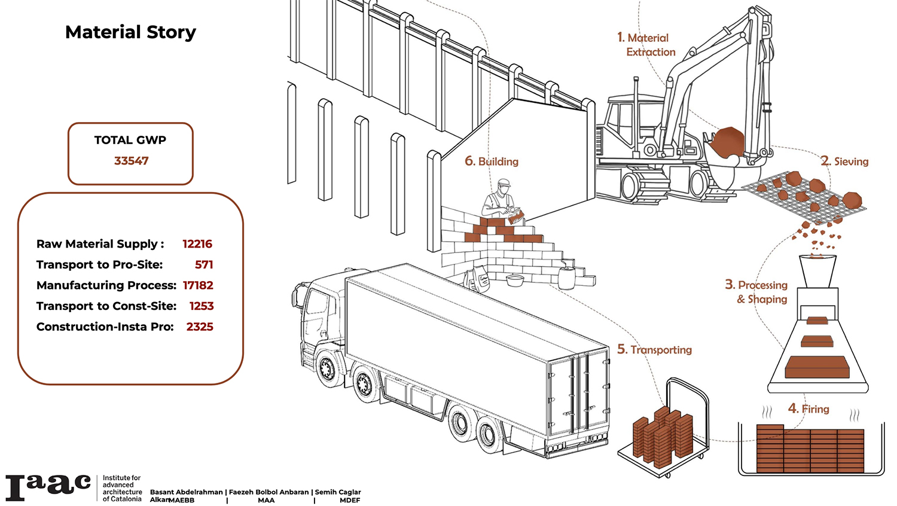
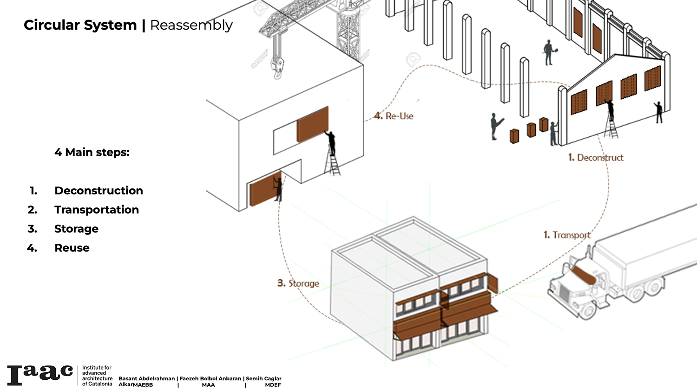

---
hide:
    - toc
---

# Circular Matter

**Circular Matter**

**System Mapping**

“Sustainability is the goal you want to achieve, circularity is the way you get there.” Ignasi Cubiña

“Reduce, repair and remanufacture” Walter R.Stahel, 1976

“Antropocyne”

“Social interaction for sustainability” during the presentation there was a moment I heard this sentence and this reminds me the intervention that we tried to achieved during the MDEF01 and participative design process, first person perspective, designing within the communities rather than decision making by authorities or certain group of people.

Moving from scale of individual to building, neighborhoods and cities in order to maintain the sustainability.

**How to map a system?**

**Task 1:**

As the first assignment we worked on a system mapping for “The driver for new demolition and new construction activity in Barcelona”. System mapping based on “Nodes” and “Loops”. “Nodes” can be representatives of the factors, causes, results, problems, solutions. So, we can create “Loops” which as the symbols of systems. That’s why we are calling it System Mapping”

I worked within the group of 5 to make a system mapping for the first assignment. We discussed and defined the “Material Demand” as the main node which is the result of demolition and construction activity in Barcelona that led by the “Housing Demand” which is another node. Housing demand is effected by population growth and tourism. We also agreed on the immigration (especially digital nomads) and refugee crisis (because of war and climate change) factors that effect the population growth.

As material demand increases material transportation also increase and both result with a negative effect on the environmental sustainability. And, less sustainable environment will cause more refugees of climate change. On the other hand, housing demolition and construction as a result of the governmental policy ends up with the gentrification which causes increase in the cost of living which means more housing demand for the low income population.

During the review we got feedback especially for the governmental policy and sustainable materials. As we are spending so much time at IAAC we idealize the sustainable material idea so a lot and at the end we decided to add a node of “NGOs and Academy Projects” as the environmental impact getting into consideration. This node let us to draw a loop for sustainable materials which have less impact on the environment. Also, governmental policy has an indirect effect on sustainable material node.

**Material Story**

**Task 2:**

Presentation / Diagram for a certain material(BRICK) in the Atelier building and search through  EPD(ENVIRONMENTAL PRODUCT DECLARATION) in order to calculate its CO2 release and effect on the GWP(Global Warming Potential).

First of all we visited the building and defined the brick. Mainly two types of bricks were used to construct the building; Mostly red bricks (columns, back walls and right side wall) and additionally, clay hollow bricks used on the left side wall and painted. So, we made a research on ibu-epd.com to see the EPD and find out the GWP of the two types of bricks. We also considered the GWP of the paint.

Then, we use the 3d model of the building two present the brick walls and columns. We located the 3d model and added our photos that we took. We also remarked that some openings on the back wall were filled up with new (shaped egdes) red bricks. It was obvious that that addings did not applied by a qualified labor as the surface finishes and structure of the added wall. Also, we saw some other fill-ups the holes for old timber beams.

TOTAL GWP FOR BUILDING:

**COLUMNS:** 1.21 E +04/ **LEFT INTERIOR WALL:** 4.39 E+03/ **PAINT ON LEFT INTERIOR WALL:** 5.7 E+01/ **INTERIOR BACK WALLS & RIGHT WALL:** 1.70 E+04

**TOTAL:** 3.36 E+04

As a final visualization of the GWP of the Atelier Building we made the visualizations of the raw material extraction/sieving, transport of the raw material to manufacturing site, manufacturing process, transport of the bricks to construction site and construction-installation process. We also defined the GWP numbers accordingly and also in total.  

**Raw Material Supply:**12216E/ **Transport to Pro-Site:**571E/ **Manufacturing Process:**17182E/ **Transport to Const-Site:**1253E/ **Construction-Insta Pro:**2325E

**TOTAL GWP:** 33347E

**Task 3:**

Deconstruction and reuse scenarios(proposals) of the brick walls and columns of the Atelier building. Basically, the main idea of the 3rd part of the lecture and task is to create an alternative project to use the bricks instead of demolish the whole structure and use to landfilling. By this method, we will be able to have less environmental impact by reducing the GWP.

In order to so, we made a small research on the state of art projects and we found some creative and effective usage of brick blocks. As the brick walls need a lot of qualified labor both to build and deconstruct, it is hard to store the bricks separately from the mortar after being demolished. We proposed cutting blocks from the walls and columns and rebuild/reattach them on panels which would be used as collage brick facades.

At first we define the conditions of the bricks and visualized that with color coding. We use bricks in good, bad and new conditions. Secondly, we went through the axonometric view of the walls and columns that we proposed to cut into blocks to rebuild collage brick panels. After that stage we tried to cut the walls into with the dimensions 1meterX1meter and 0,5meterX1meter and columns into blocks with the dimensions 0,6meterX1,2meter.

As a visualized material story of the bricks after deconstruction process that being cut into blocks and rebuilt into collage brick panel walls, we used the 4 main stages; Deconstruction, Transportation, Storage and Reuse.

**Presentation Link:**
https://docs.google.com/presentation/d/1wZoNghK-11OKKKtnszYIYMjdOUALgpphS6gEYqnC8bM/edit?usp=sharing

  <iframe loading="lazy" style="position: absolute; width: 100%; height: 100%; top: 0; left: 0; border: none; padding: 0;margin: 0;"
    src="https:&#x2F;&#x2F;www.canva.com&#x2F;design&#x2F;DAF1X7wX98Y&#x2F;view?embed" allowfullscreen="allowfullscreen" allow="fullscreen">
  </iframe>

<a href="https:&#x2F;&#x2F;www.canva.com&#x2F;design&#x2F;DAF1X7wX98Y&#x2F;view?utm_content=DAF1X7wX98Y&amp;utm_campaign=designshare&amp;utm_medium=embeds&amp;utm_source=link" target="_blank" rel="noopener">Design</a> by caglaralkan

To sum up, during the lecture we went through the system mapping, material story of a construction and its GWP and deconstruction proposals of a certain material. The second part of the tasks were really inspiring for searching alternatives for bricks rather than demolishing a building and use the ruins in landfilling. I discovered about the GWP and how to make calculation in the building scale. Additionally, proposing alternative projects to reusing the brick walls and columnist order to have less environmental impact with construction and demolishment activities were really inspiring.  
