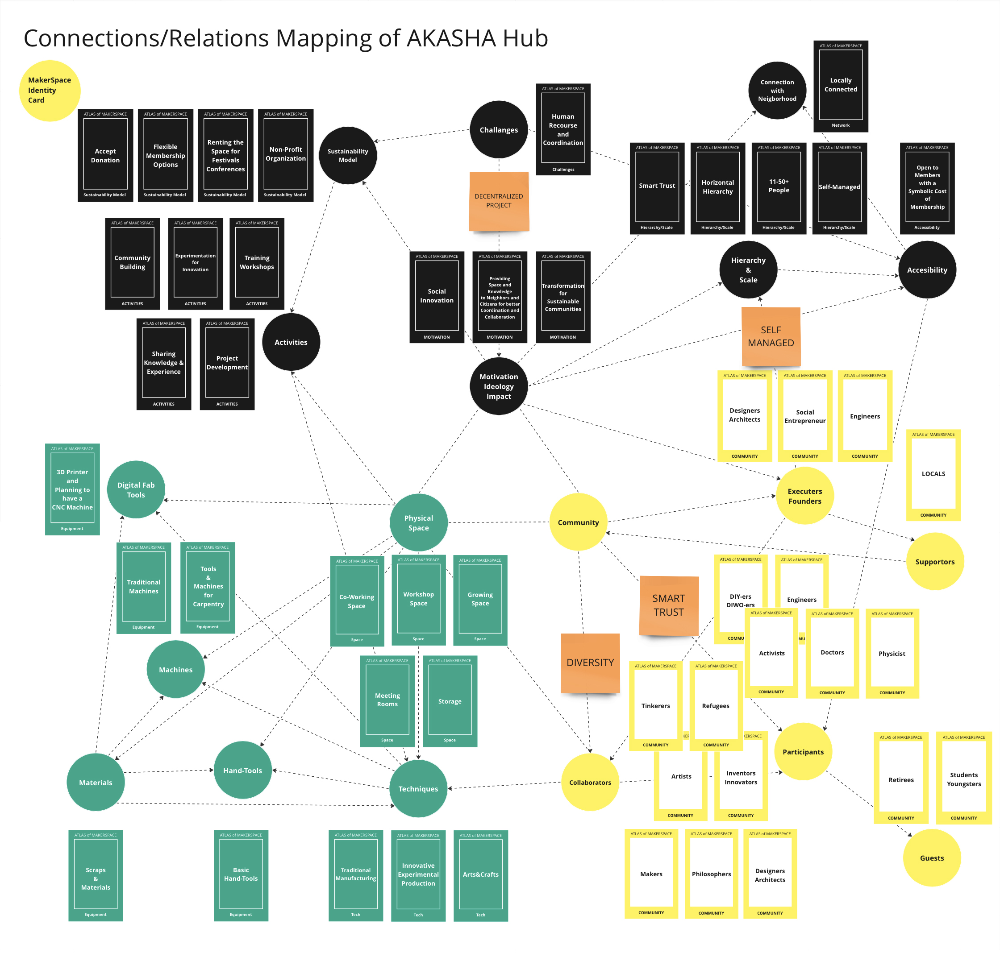
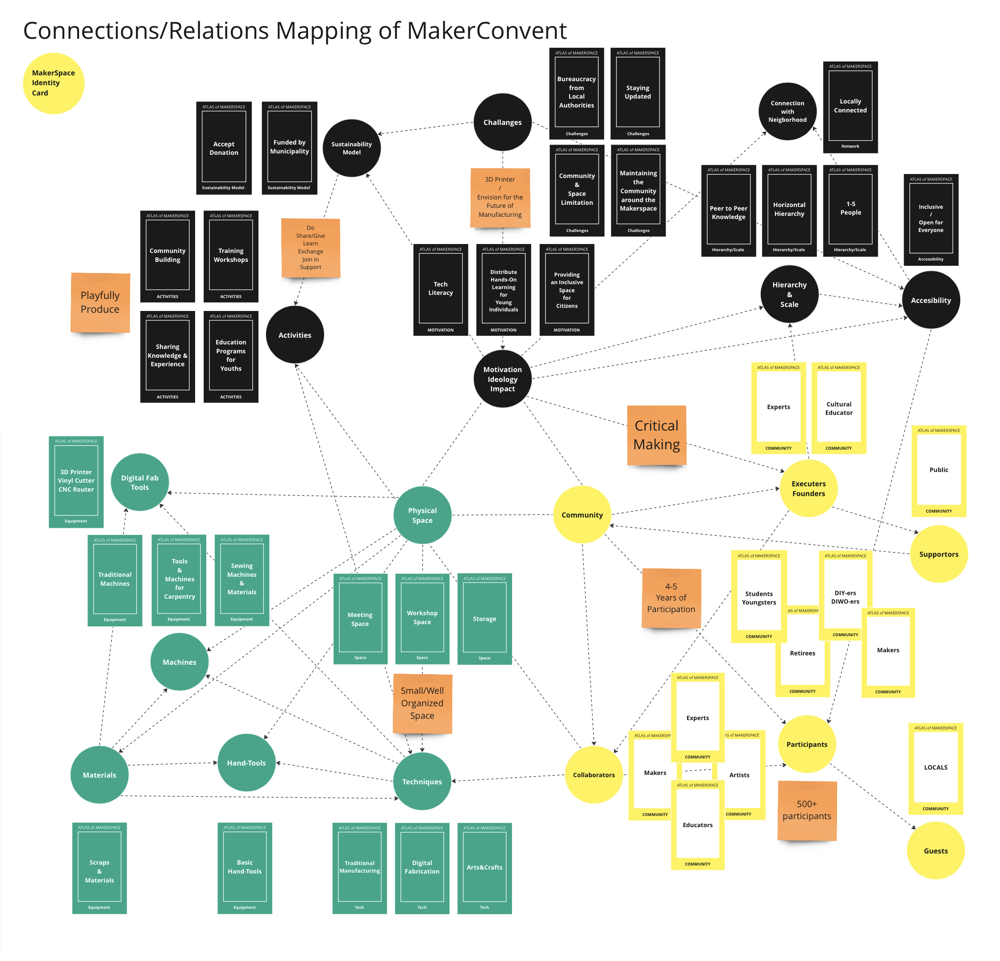
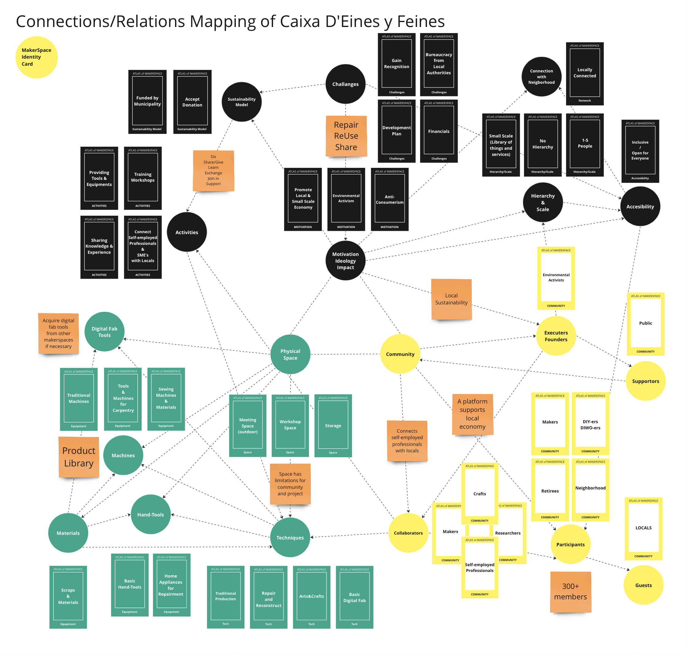
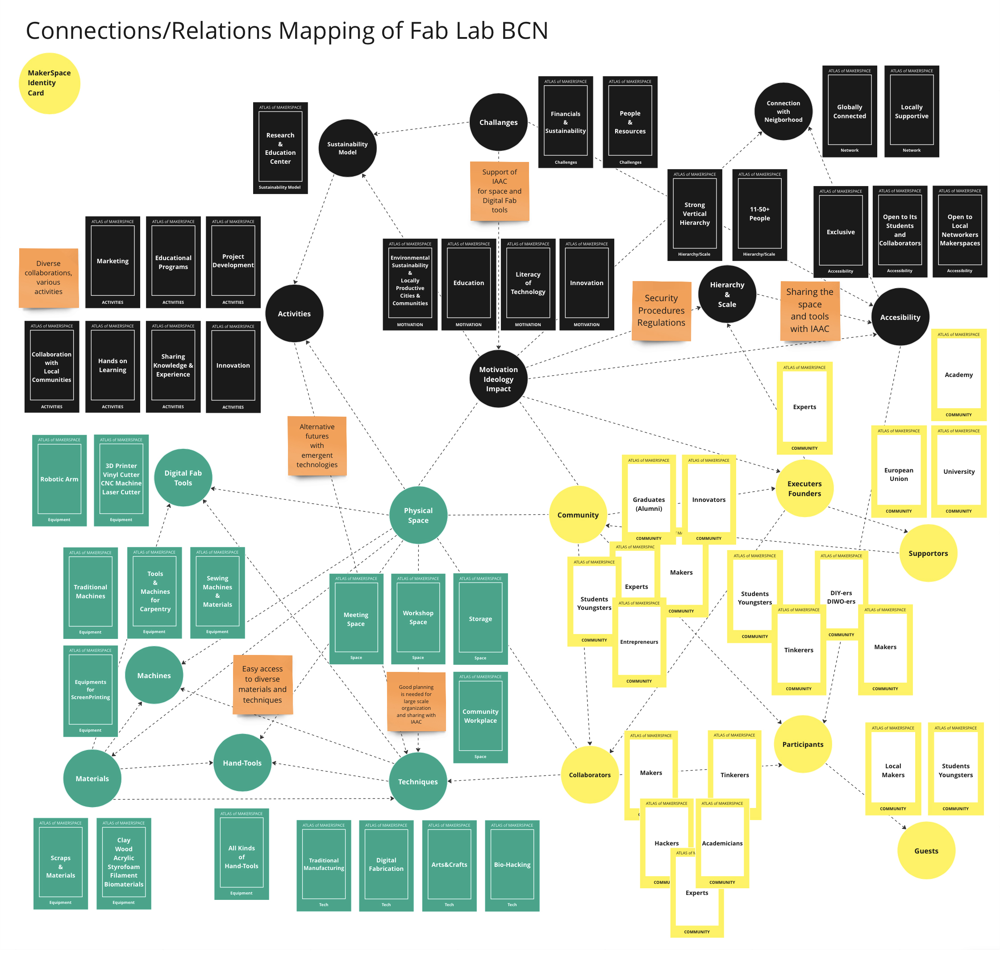

---
hide:
    - toc
---

# Master Project

**HANDBOOK FOR MAKERSPACES**

##Introduction##

After spending a year in the MDEF01, delving into the community-based design approach and proposing alternative futures with the support of existing and future technologies, I have decided to continue my journey through MDEF02, focusing on maker movements. My aim is to explore new ways and methods to support creative personal spaces and community-based participative design processes by developing projects that combines digital fabrication tools and traditional craftsman techniques and projects in the makerspaces.

This journey is also a guiding force for realizing my dream of establishing my own maker space, a dream I've nurtured for 15 years. In a conversation with Tomás Díez-Master in Design for Emergent Futures(MDEF) program director-, he recommended careful consideration of various aspects, including location, an atlas of weak signals for those locations, available resources (people, space, stakeholders, financial support, potential collaborators, business model), and more.

To initiate this endeavor, several fundamental steps must be defined to structure the idea of building and developing a maker space. These include questions such as: How to build a maker space? How to integrate digital fabrication tools into maker spaces? What projects can be developed to support makers/crafts, enhancing the idea of makerspaces and gaining recognition? How to combine a startup model with the idea of a maker space?

Throughout this process, I plan to visit and participate in workshops on various topics in different makerspaces, and collaborate with makers from diverse backgrounds to understand multiple perspectives and needs of makers, participants, visitors, and staff. Through these interactions and collaborations, I aim to gain more experience and knowledge on the subject. By sharing our knowledge, we can create more opportunities for integrating digital fabrication tools into maker spaces and reinvigorating craftsmanship methods with the help of new technologies.

In the era post-industrial revolution, the monopoly of manufacturers, restrictions in supply chains, and susceptibility to digital marketing attacks have dampened the productive and creative capacity of human beings. Fortunately, there is still a chance to hack the system and rediscover our abilities to produce, make, and grow our own goods locally, leveraging traditional knowledge and today's tools. Makerspaces serve as strong indicators, pioneers, and supporters of this movement. This research aims to provide guidance for individuals or groups interested in building their own or collective makerspaces.

The primary focus of this research will be on urban productivity practices. In the realm of productivity and creativity, not only making but also growing represents a way to develop and rediscover our ability to add and create value in our environment. Therefore, urban farming will also be included in urban productivity practices during this research.

Beyond the outcomes, making and growing involve multiple layers that guide makers toward their results. Throughout this research, I will attempt to define most of these steps, providing an alternative way of urban living in the era of post-industrial revolution, technology, and digitalization.

First and foremost, this research will analyze the general structure of makerspaces, the ideology behind them, their management systems, and their marketing and development plans. Additionally, the research will explore and classify the makerspace movement according to industrially integrated, technologically integrated, and low-tech/craftsmanship models.

Furthermore, I will draw on references such as thesis projects, books, articles, TEDx talks, and websites. Beyond those, I will also organize meetings, interviews, workshops, surveys with both maker space owners and participants that contribute those spaces. In line with the hands-on learning principles of MDEF program, this research will be an outcome of both theoretical information and creative hands-on practices. Throughout the literature review I will mention some names, books, websites and articles;

“Neil Gershenfeld”- computer scientist and physicist, director of MIT's Center for Bits and Atoms,- and his book “Fab: The Coming Revolution on Your Desktop—from Personal Computers to Personal Fabrication”. Neil Gershenfeld is widely recognized as the originator of Fab Labs(Fabrication Laboratories- tech base makerspaces). He introduced the idea of Fab Labs in the early 2000s as a way to provide communities with access to digital fabrication tools and technologies, enabling them to create and innovate at the local level.

“Chris Anderson” -an entrepreneur- and his book “Makers: The New Industrial Revolution”. Chris Anderson, a prominent figure in the maker movement, has significantly contributed to its popularization through his writings and activities. The book explores the impact of modern manufacturing technologies, such as 3D printing and open-source hardware, on the economy and society.

“Tomás Díez” -an advocate of tech literacy at the grassroots level and co-founder of Fab Lab BCN- and his article “Personal Fabrication: Fab Labs as Platforms for Citizen-Based Innovation, from Microcontrollers to Cities”. As an advocate of tech literacy and co-founder of Fab Lab BCN, Tomás Díez explores how digital fabrication tools empower communities, promote sustainable practices, and enable individuals to turn their ideas into tangible products.

“Nurgül Meriçliler” -an architect and maker- and her thesis “An Interdisciplinary Perspective Towards MakerSpaces: 5 Cases from London”. The structure of her work helped me to structure this project.

“Dale Dougerthy” -an entrepreneur and publisher- and his website “www.makered.org”. As the founder of MAKE magazine and the co-founder of Maker Faire, Dougherty has been instrumental in creating platforms that celebrate and showcase the creativity, innovation, and DIY (Do It Yourself) spirit of makers around the world.

“Adrian Smith” and his article “Social Innovation, Democracy and Makerspaces”. Adrian Smith's article delves into the social impact of the maker movement, providing valuable insights into its challenges from a broad perspective.

“Will Holman”-an architect, write and maker- and his article “Makerspace: Towards a New Civic Infrastructure”. Will Holman's article explores how makerspaces can play a pivotal role in shaping the civic fabric of communities, emphasizing collaboration, hands-on learning, and the democratization of tools and technology.

The article “Human Capabilities For Innovation In UK MakerSpaces” by Cian O’Donovan and Adrian Smith

The article “Soon You’ll Be Able to Make Anything. It’ll Change Politics Forever” by Neil Gershenfeld, Alan Gershenfeld and Joel Cutcher-Gershenfeld

The article “The New Production Ecosystem. Personal, distributed, open fabrication” by Tomás Díez

In the first chapter, I will conduct a literature review to elucidate concepts such as 'What is making?,' 'Who is a maker?,' 'What is a makerspace?,' 'Types of Makerspaces,' 'Maker Movement,' and 'The history and other processes that support the maker movement.' Subsequently, as a case study, I will analyze five makerspaces in Barcelona city, varying in scale and content, to illustrate the main structure of a makerspace and its impacts on society. This analysis will encompass different management approaches and community engagement plans. Finally, I will conclude the chapter by summarizing the outcomes of this case study and segue into the next chapter of the project.

During the first chapter of this framework, my focus will be on the makerspaces in Barcelona. Currently residing in Barcelona, I find it advantageous to engage with them physically. I've had the opportunity to attend events and workshops hosted by these makerspaces in their physical spaces. This first-hand experience has allowed me to observe their interactions with the community, understand their production processes, and witness their organizational methods. Barcelona stands out from other European cities as an ideal location for investigating makerspaces due to the widespread use of community-based networks, projects, and digital fabrication techniques. The city, being a center and model of urbanization in Europe, offers a unique cultural perspective.

The second chapter will predominantly cover topics such as 'Working on the Context of a Makerspace,' 'Sustainability Plan,' 'Planning the Physical Space,' and 'Community Engagement Plan.' I will initiate contact with potential collaborators and stakeholders in the initial stages. Finally, for the last chapter, I will make search for European Funds, local funds, develop a business plan, and work on establishment strategies.

To sum up, in the era of post industrial revolution, maker movements become more visible since 10-15 years. Open source concepts, digital fabrication tools, and participative design processes supports the makers in the urban spaces. Through this research I will examine the structures, management methods, community engagement plans, business models and establishment processes of several makerspaces. Consequently, there will be a handbook that would be used as a guidance for makers who would like to build their own makerspaces.

##Chapter 1: Literature Review and Case Study##

##1.1. What is Making?##

We are in an era where every gadget, especially electronics, often leads us to live more individualistically with the support of digital tools. This is why the phrase “Food is the new internet” has become popular in some circles, emphasizing the idea that activities like sharing food bring people together in physical spaces. In a similar vein, we could propose a new motto: “Making is the new clubbing.” Making not only fosters creativity, productivity, and cooperation but also enhances social connections and a sense of community, reinforcing our ties to the neighborhood and cultivating a stronger sense of citizenship.

Making is a multifaceted endeavor that goes beyond the mere act of creation. “Making is an activity that encourages people to use their minds more holistically for creating, using, and sharing” (Canino-Fluit, 2014), on her article Canino suggests that making involves a comprehensive engagement of the mind, encompassing the creative process, utilization of created objects, and sharing of knowledge or creations with others. Canino emphasizes the holistic nature of the mental activities involved in the act of making. In line with Caninos approach, “Making is a process and a practice, not just an outcome.” (Loes Bogers & Letizia Chiappini, 2019, p.9), according to Bogers and Chiappini making is presented as an ongoing process and a continuous practice, highlighting that the value of making extends beyond the final product. The emphasis is on the journey, learning, and skills development that occur during the making process. As a blend of these two, David Gauntlett “Making is connecting” (2011) approaches to making as a form of connection, not just between physical materials but also between people. The act of making can bring individuals together, fostering connections and collaboration. It underscores the social aspect of making and its potential to build relationships.

Making is a broad term that is used to refer the action of creating, producing, manufacturing an object, but mostly adding a value and meaning on an artefact. In his book "Makers: The New Industrial Revolution," (2012) Anderson refers making as an act of creating physical objects using various tools, equipments, and manufacturing techniques. Making, in this way, goes beyond traditional craftsmanship with the support of modern technologies such as 3D printing, CNC machining, and other digital fabrication methods. Anderson describes making as a democratizing force that empowers individuals and communities to become and innovators, creators and entrepreneurs. Anderson describes making as a fundamental shift from traditional mass production to personalized, small-scale manufacturing.

Additionally, Neil Gershenfeld, in his book "Fab: The Coming Revolution on Your Desktop-from Personal Computers to Personal Fabrication," (2005) approaches to making as a fundamental human capability,and sees making as a transformative process that allows individuals to move beyond just being consumers of products to becoming participative producers. Gershenfeld believes that digital fabrication tools, such as 3D printers and laser cutters, can empower communities by providing access to technology and enabling individuals to turn their ideas into reality.

On the other hand, it is essential to take a look on the definition of hacking when the subject is making. Hacking is has been used since 1960s. Whereas hacking involves the modification or repurposing of existing technology, making more centers around the creation of new artifacts from scratch. Both hacking and making promote open-source principles, encouraging collaboration and the sharing of ideas within a community of like-minded enthusiasts and contribute to the democratization of technology by breaking down traditional barriers and fostering a culture of innovation and resourcefulness. Even both activities need creativity, the slang term hacking used to sound a bit negative while making have more positive sense, making can be seen as a kind of hacking the system, industry, marketing, supply chain, monopoly in order to create alternative ways of living, producing, consuming, sharing. As Nurgül Meriçliler summarizes that “The meanings of making and identifying as a maker are subjects of ongoing discussion, similar to the term hacking. While making is often linked to the utilization of digital tools, it also encompasses traditional creative practices like knitting, sewing, woodworking, and metalworking.” (Meriçliler, 2023, p.29)

To sum up, this framework approaches making as a process of producing knowledge than focusing on an artefact. Making encompasses a wide range of activities, including creating, producing, crafting, tinkering, building, and growing. It represents an intersection of art/craft and science, incorporating traditional techniques, technology, and design. It is a comprehensive term referring to the action of creating, producing, and manufacturing objects, with a primary focus on adding value and meaning to artifacts.

##1.2. Who is a Maker?##

“We are born Makers” Chris Anderson

“We are all Makers” Dale Dougherty

I certainly believe that we, as humans, possess amazing skills, particularly in survival, with instinctive abilities and an innate capacity to learn, discover, and improve. We have been transforming the world since the day we started crafting tools from stones and wood. However, personally, I disagree with the notion that we are all born makers. The influences of capitalism, industry, and marketing gurus have caused many individuals to overlook their creative potential. Numerous people are ensnared by ready-made meals provided by supermarket chains, and many struggle to prepare a simple dish to feed themselves.

In his book "Makers: The New Industrial Revolution," Chris Anderson describes makers as individuals who leverage modern manufacturing technologies, such as 3D printing and open-source hardware, to innovate and create. In addition to tech-knowledge, entrepreneurship, and creativity are the other two essentials of Anderson's vision and definition of being a maker.

Even though the cool term 'maker' commonly refers to a person with knowledge and skills in using digital tools like 3D printing, laser cutting, CNC machine cutting, and a 6-axis robot arm, this framework aims to define a maker from a broader perspective. In behalf of this exploration of the maker definition we have to analyze some more related terms as 'craft', 'hobbyist', 'do-it-yourselfer'.

Firstly, craft refers to the skilled practice of making things by hand. It often involves traditional techniques and artistic qualities and usually craft is a person who is an expert on a specific occupation with perfect skills in order to fulfill the tasks that necessary for the production processes. Secondly, a hobbyist is someone who engages in a particular hobby, which is a regular activity done for enjoyment during one's leisure time without financial gain focus. Thirdly, a DIYer is an individual who engages in the practice of doing tasks or creating things on their own, typically without professional assistance. DIYers mostly focus on home improvement projects, repairments, or creative endeavors. Self-sufficiency and personal accomplishment are the main take ons. Finally, a maker is someone who creates or constructs things, often using a combination of traditional and modern tools and technologies. The maker has a broader and more contemporary scope, incorporating a diverse range of skills and technologies, often with an emphasis on collaboration and sharing.

Certainly, these terms—hobbyist, craft, DIYer, and maker—encompass a spectrum of creative pursuits, productivity and time commitment. A hobbyist engages in activities for personal pleasure during leisure, which may include crafts or DIY projects. Additionally, hobby is an activity that someone reproduce, copy, and repeat, while making is a way of being productive with more discipline and effort and needs more time commitment and collaborations. Craftsmanship involves skilled handiwork, emphasizing precision and artistic expression. DIYers take on tasks independently, often centered around home improvement or personal projects. In contrast, being a maker extends beyond these definitions. Makers embrace a diverse range of skills and technologies, incorporating traditional craftsmanship with modern tools like 3D printers and electronics. The maker ethos emphasizes collaboration and community, with makerspaces serving as hubs for shared resources and knowledge. While a hobbyist may indulge in crafting, and a DIYer seeks self-reliance, being a maker encompasses a broader and more contemporary approach, fostering a culture of creativity, innovation, and communal learning.

In essence, being a maker can encompass elements of being a hobbyist, engaging in craftsmanship, and embracing a DIY ethos, but it goes beyond these terms by emphasizing a diverse set of skills, tools, and a collaborative community. Maker is a curious person who is eager to explore new fields and experience new techniques in order to transform the interacted environment by creative and productive processes and share all those in the community that he/she collaborates with.

##1.3. What is a makerspace?##

In his book "The Great Good Place,(1989)" Ray Oldenburg contends that third spaces play a crucial role in promoting civil society, democracy, civic engagement, and cultivating a strong sense of place. The third space can foster inclusivity, supporting a sense of belonging and connecting citizens to each other, communities, and cities through specific characteristics. These include being a neutral ground, where participants are not bound financially, politically, or legally and have no obligation to come and go; acting as a leveler, with socioeconomic status playing no role in acceptance; prioritizing conversation as the main activity in a playful atmosphere, avoiding tension; ensuring accessibility and accommodation; relying on regulars to set the mood and attract newcomers; maintaining a low profile with a horizontal hierarchy and cozy environment accepting of all individuals; and offering a home away from home, providing participants with a comfortable space similar to home. Even though Oldenburg's book doesn't directly discuss them, makerspaces, as contemporary examples of third space, embody the main principles of the third space concept, especially in the context of social interaction, community building, innovation, creativity, and accessibility.

Basically, makerspaces are collaborative environments that provide tools and resources for individuals to create, innovate, and share ideas. In line with the concept of third space theory, David Gauntlett, in his book "Making is Connecting" (2011), associates making and makerspaces with the idea that individuals feel more connected and engaged with the world when they actively contribute by creating things rather than just consuming. Gauntlett's perspective on making and makerspaces emphasizes active engagement, contribution, and a sense of connection, all of which resonate with the principles of third spaces, where individuals come together to participate, contribute, and build meaningful connections within communities. Therefore, makerspaces encompass both physical and social dimensions, providing participants with tools and knowledge while fostering connections with communities."

Additionally, makerspaces are community-base productive places that provide workshop places with tools, equipments and knowledge on design, crafts, manufacturing techniques, technology, and various skills on fabrication to non-professionals in order to support innovation and entrepreneurship in society through co-making and co-producing in communities. Fablabs, hacker-spaces, product libraries/library of things, co-working and co-making spaces, community gardens, bio-construction sites, and decentralized creative hubs are examples of makerspaces. While these spaces may vary in ownership, membership structure, and specific focuses, they share a common commitment to providing 'tools and knowledge for people.'

Furthermore, Adrian Smith approaches makerspaces from a sociological perspective, emphasizing their social innovation potential in his 2017 article "Social Innovation, Democracy, and Makerspaces." Smith delves into how makerspaces contribute to social innovation by fostering collaborative, community-driven solutions. He argues that these spaces empower citizens to actively engage in the innovation process, democratize technology, and address societal challenges. Smith's approach involves examining the social impact and democratic potential of makerspaces, revealing their role beyond technical innovation and into broader community development. However, Smith critically highlights issues such as consumerism, marketization, enclosure, intellectual property problems, social, gender, and demographic imbalances, and limited impact on structural change. Overall, Adrian Smith characterizes makerspaces as innovative spaces with a complex history, framed simultaneously as agents of social transformation, valuable educational tools, and promising environments for entrepreneurship.

In summary, a makerspace is a collaborative and communal workspace that provides individuals -especially non-professionals-, often referred as makers, with the tools, knowledge, some resources, and place to create, experiment, and innovate. Makerspaces are equipped with various technologies, ranging from traditional tools to digital fabrication equipments like 3D printers, laser cutters, CNC machines, and robot arms. They serve as hubs for interdisciplinary collaboration, where individuals from diverse backgrounds, such as technology, design, and craftsmanship, can come together to work on projects, share knowledge, and learn new skills. Makerspaces embody the principles of hands-on learning and community engagement, fostering a culture of creativity, innovation, and entrepreneurship.

##1.4. The maker movement##

The Maker Movement is a social and cultural phenomenon that emphasizes the creation of physical objects as a way to empower individuals, foster innovation, and encourage a hands-on, do-it-yourself (DIY) approach to learning. It is characterized by a community of individuals who share a passion for creating things and often involves the use of technology, open-source hardware, and collaborative spaces.The Maker Movement gained momentum in the early 2000s, inspired by the ethos of hacker and DIY cultures. Influences can be traced back to earlier movements like the Homebrew Computer Club in the 1970s and the early days of personal computing.

The rise of the open-source software movement and the availability of information on the internet also played a crucial role in fostering the Maker Movement. Platforms like Arduino and Raspberry Pi became popular, providing accessible hardware for enthusiasts to experiment with. Additionally, manufacturing tools such as 3D printers, laser cutters, and CNC machines, become affordable. By this way, individuals are able to turn their ideas into physical prototypes more easily. Finally, the new educational approach which is called hands-on, learning contributed to the popularity of making and maker movement in schools and universities.

Maker Movement gets ahead community collaboration. Makers often share knowledge, resources, and projects through makerspaces, local and international events and online platforms. Makers and DIYers play a role in creating and modifying objects actively, and often using readily available tools and materials. In line with these they also embrace and support open source principles by sharing knowledge, design processes, results which encourage collaboration and the improvement of existing projects. Another characteristic of the maker movement is its interdisiplinary nature; Makers generally have diverse backgrounds, including technology, arts, crafts, engineering, design, which promotes exchange of ideas.

In line with this approach, in his work Chris Anderson(2012) also explains the main features of the Maker Movement, centering predominantly on digital technologies intertwined with the movement's cultural ethos. Firstly, people uses digital desktop tools to craft designs for innovative products and subsequently create prototypes. Secondly, an established cultural practice to share the design and production processes and collaborate with others in online communities (supporting open source). And thirdly, using standardized design file formats enables individuals, at their creations, to submit their designs to commercial manufacturing services for production in any quantity. This significantly shortens the journey from conceptualization to production, mirroring the transformative impact the Web had on the dissemination of information and software.

“Make magazine, which I founded in 2005, harkens back to the magazines that hit their peak in the mid-20th century, such as Popular Mechanics, which had the attitude, ‘if it’s fun, why not do it?’. Such publications often helped people to start a hobby and learn new skills. Moreover, they helped the new hobbyist find a community of like-minded tinkerers to share ideas and experiences with. Maker Faire, which started in the San Francisco Bay Area in 2006, expanded this idea of learning and community and created a space where readers of the magazine could get together. At the faire, a maker could put an object they created up on a table and have people ask them about it. Having that kind of conversation with a range of people is the essence of the magazine, and of the whole movement.” (Dale Dougherty, 2012, p.12)

Maker Magazine and Maker Faire, founded by Dale Dougherty, have had a profound impact on the Maker Movement, contributing significantly to its growth, visibility, and community building. Launched in 2005, MAKE Magazine served as a crucial publication that showcased a wide array of DIY projects, hacks, and the maker culture. It became a central platform for sharing innovative ideas and practical tutorials, inspiring individuals to embrace hands-on creativity. Maker Faire, initiated in 2006, further propelled the movement by organizing large-scale events where makers from diverse backgrounds could exhibit their creations. These events not only brought the maker culture into the mainstream but also provided a physical space for enthusiasts to connect, collaborate, and share their passion for making. Maker Faire, with its vibrant and diverse showcases, played a pivotal role in fostering a sense of community and encouraging the collaborative spirit that defines the Maker Movement today. Together, Maker Magazine and Maker Faire have played instrumental roles in popularizing the maker ethos, inspiring creativity, and establishing a global community of makers.

While Maker Faire and Maker Magazine played a crucial role in popularizing and catalyzing the Maker Movement, it's essential to note that the movement itself had early roots and influences before the inception of both. Certainly, there are some other factors, events, movements, developments that we need to consider in order to understand the maker movement better. I will provide a brief overview of the evolution of making, highlighting key movements and insights spanning from the 19th to the 21st century.

**The Great Exhibition (1851) & Arts and Crafts Movement (Late 19th to Early 20th Century);**

Within the social environment of England during the early stages of industrial revolution The Great Exhibition event gave an opportunity to show to the public how everyday objects/tools were manufactured. This raised an awareness about the production and manufacturing techniques, the backstages of the shops and stories of everyday objects. The exhibition's emphasis on industrial progress sparked a reaction against mass-produced, standardized goods. Individuals began to value craftsmanship and unique, handmade items, setting the stage for a shift towards a more individualistic and artisanal approach which were the first inspirations of the DIY culture. In line with “The Great Exhibition” event, the arts and crafts movement, that was a reaction to the negative impacts of industrialisations and the comparatively low standing of the decorative arts, celebrated handmade goods and the skilled artisans who created them, emphasizing the connection between the creator and the crafted object.

In summary, "The Great Exhibition" and the Arts and Crafts Movement influenced the Maker Movement by inspiring a return to craftsmanship, individual creativity, and a rejection of mass production.While the direct link between The Great Exhibition and the Maker Movement may not be overt, the exhibition's impact on industrialization, technological innovation, and changing attitudes toward craftsmanship set the stage for a renewed appreciation for hands-on creativity and a return to individualized, artisanal approaches to making. The Maker Movement, with its emphasis on DIY culture, innovation, and craftsmanship, reflects a contemporary echo of the questions and values raised during the time of The Great Exhibition.

**Bauhaus school and Movement (1919-1933);**

Bauhaus was a design school that started to operate in 1919 in Germany and continued till 1933. (based in Weimar until 1925, Dessau through 1932, and Berlin in its final months) Beyond being a design school, Bauhaus is a movement and a strong, long-lasting design principle. This is the case that occurred by the very well organized, executed and developed educational curriculum and structure which combined arts and crafts with technology.
Walter Gropius, the founder of the Bauhaus, aimed to built an inclusive community for artists and crafts people through the education methodology in the Bauhaus School. In order to achieve this, the educational programs focused on collaborations of teachers and students with the public and industry. This cooperation philosophy helped to school to become a trend that was influenced by not only arts and crafts but also modernism and constructivism and a long-lasting design principle. Later on, these cooperations expanded to the industrialisation by working on mass production.

Workshop practices of the Bauhaus school became the core of the educational structure and encouraged the students to craftsmanship a lot and were transformed into manufacturies that were another kind of executing and connecting with the public. This transformation can be taken as a model of todays makerspaces and the makerspace movements.

Walter Gropius (1883 –1969) was a German - American architect and founder of the Bauhaus School. Gropius managed the Bauhaus as its director until 1928.

**Do-It-Yourself Movement (1960s);**

Do-it-Yourself(DIY) is making, building, repairing or modifying things/projects without any support from an expert or a professional. The DIY as a term and ideology appeared with the home improvement and maintenance activities during 1910s, but became more popular and turned into a movement in 1960s. The DIY projects are designed to be realized at home or small workshops. DIY projects also need the knowledge of using practical hand-tools and machines.

Even anti-consumerism was one of the main aim of the DIY movement, practical hand-tools and machines manufactures marketed DIY projects and supported the ideology a lot. While the DIY movement more focused on individualism, with the makerspace movement it turned into Do-it-with-others(DIWO) by collaborative projects in the makerspace workshops.(Hartmann & Mietznel, 2017)

The DIY (Do-It-Yourself) culture of the 1960s serves as a crucial precursor to the contemporary Maker Movement, influencing its ethos and values. Rooted in countercultural movements and emphasizing self-sufficiency, the 1960s DIY culture initially focused on hands-on practices and a rejection of mainstream consumerism. As technology became more accessible, the DIY movement evolved to incorporate electronics and emerging technologies, with enthusiasts engaging in hacking and modifications. The open-source and collaborative spirit inherent in the 1960s DIY culture became a cornerstone of the Maker Movement, where makers openly share knowledge, designs, and project details. The DIY culture's emphasis on empowerment, individual creativity, and a shift from consumerism to active creation resonates strongly in the Maker Movement, which builds upon these principles while expanding its scope to include advanced technologies and collaborative community spaces. In essence, the DIY culture laid the foundation for the Maker Movement, shaping its approach to technology, innovation, and the celebration of hands-on creativity. Both share a fundamental belief in the power of individuals to shape and create their own technological and creative destinies.

**Hackerspace movement and open-source concept;**

Hackerspaces, also known as makerspaces or fab labs, are community-centric spaces where individuals gather to share tools, knowledge, and resources. These physical spaces provide a collaborative environment for makers to work on projects. Hackerspaces provide access to diverse tools, from traditional hand tools to digital fabrication equipment as 3D printers and CNC machines. This accessibility lowers barriers to entry and offers makers to experiment with technologies they do not have at home. Furthermore, the community-base nature of hackerspaces encourage collaboration and sharing. By peer to peer learning, makers can learn from each other, collaborate on projects, and access a diverse range of expertise within the community. Thus, experimental and free environment of hackerspaces foster innovation and iteration. Makers can explore new ideas, overcome challenges, and develope projects with the community support.

In agreement with hackerspace movement, open-source concepts, rooted in transparency and collaboration, have significantly influenced the Maker Movement. The concept of open source promotes the sharing of knowledge and project documentation. Makers freely share their designs, code, and detailed instructions, contributing to a collective pool of resources and facilitating learning within the community. Additionally, the concept democratizes technology by making it more accessible and its iterative nature aligns with the iterative approach of makers. Projects are continually improved upon, and the collaborative feedback loop encourages innovation and refinement.

Both the Hackerspace movement and open-source concepts boost the collaborative and community-based characteristics of the Maker Movement. Makerspaces provide physical spaces for collaboration, whereas open source promotes the sharing of recources and knowledge. Democratization of technology is the consequence of the combination of both movements that makers with diverse backgrounds can access tools, learn new skills, and play significant role in technological innovation. In essence, the hackerspace movement and open-source concepts also contributed the collaborative, accessible, and innovative culture of the Maker Movement.

**Critics on makerspaces and maker movement?**

Critics of makerspaces and the Maker Movement have focused on various topics, highlighting both the potential difficulties and the societal implications of these creative environments. While Daryl Koehn offers criticism regarding the Maker Movement's lack of diversity, its origins, and its future trajectory, highlighting concerns about the maker culture's failure to adopt an inclusive stance for all individuals in his article “The Ethics of the Maker Movement: The Potentially Good and the Possibly Terrible”(2015), Minka Stoyanova (2017) mainly highlighted the demographic, social and gender imbalances in the makerspaces.

On the other hand, Adrian Smith, in his 2017 article “Social Innovation, Democracy, and Makerspaces”, highlights the varied concerns raised by critics of makerspaces regarding these creative environments. The focus is on institutional developments and the potential drawbacks associated with their increasing popularity. One major critique revolves around makerspaces' tendency to fixate on object production and oversimplify complex social challenges through prototyping, emphasizing the necessity for a more nuanced approach to broader social transformation. Another area of concern is the commercialization of the maker movement, where initiatives like Make magazine and Maker Faires are perceived as showcases for consumer tools, materials, and kits, supporting a new form of consumerism. Criticisms also extend to makerspace organizations receiving sponsorship from corporations and government agencies with questionable social responsibility records, raising questions about co-option and the compromise of grassroots autonomy. Moreover, concerns are raised about new forms of exploitation in maker-related design and fabrication platforms, potentially encroaching on open design principles. In response, there is a growing interest in cooperative models and public funding for more open-ended makerspaces, but persistent social imbalances and demographic disparities highlight ongoing challenges in achieving inclusivity and transformative social innovations within these creative spaces.

Despite these criticisms, there are ongoing efforts within the maker community to address these concerns, including exploring cooperative models, promoting inclusivity, and advocating for public funding that aligns with social goods and sustainable development goals. The debates surrounding makerspaces and the Maker Movement highlight the complex interplay between creativity, technology, and societal impacts.

So far, makerspaces have made significant progress, evolving from their earlier stages as 'tools for everyone' to becoming hubs for technology literacy, accessible digital fabrication, and meaningful social production. Moving forward, in order to ensure the sustainability of both new and existing makerspaces in the era of technology and artificial intelligence, there should be some development plans. Without such a plan, like 95% of startups and small businesses, they might share the same destiny of being erased from the system.

##1.5. Case Study; Mapping and Analysing the Structure of Makerspaces in Barcelona##

##1.5.1 Atlas of Makerspaces/Mapping Methodology/Makerspace ID Cards##

This case study involves analyzing five makerspaces with varying scales, contents, sustainability models, community engagements, and management plans. While makerspaces are commonly associated with digital fabrication, emergent technologies, and technological literacy, this case study also encompasses urban farming and spaces dedicated to cultivation in the urban. As various makerspaces have started to work on projects related to sustainable food production and agriculture this makes sense for the case study. These final informations were gathered through a series of interviews, with outcomes predominantly derived from active participation in events, workshops, multiple visits, volunteering, and studying within these makerspaces and projects.

During the literature review and advisory sessions with Santi Fuentemilla, the Future Learning Lead at Fab Lab BCN, we explored the identity cards of machines in Fab Lab BCN. This exploration inspired me to extend the concept to the creation of identity cards for various makerspaces. In my search for a suitable method to design these identity cards, I attended a makers gathering known as the 'Network of Productive & Collaborative Spaces in Barcelona' at MakerConvent. This experience highlighted the significance of documentation for improvement and how digital tools can support this process. Although the meeting was conducted in Catalan and primarily involved physical tools and materials, I didn't leave with tangible resources except for a few photos. Consequently, I decided to create a miro board to develop identity cards for each makerspace that I intended to focus on.

At this stage, I contemplated options to involve my guests in the creation process of identity cards during interviews. The first lecture of MDEF, titled 'Atlas of Weak Signals,' aimed at helping participants build and enhance their personal design space throughout the MDEF journey. This lecture served as inspiration, prompting me to initiate the development of a set of cards named 'Atlas of Makerspaces.' These cards were intended to facilitate the construction of identity cards for each makerspace, making the interview process more engaging and meaningful compared to a basic question-and-answer session.

To establish a structured approach for conducting interviews, I recognized the need for a mapping system. After analyzing the components of makerspaces, I designed a connection and relation map applicable to every makerspace. This mapping divided makerspace components into three main groups: domain, physical space, and community, each with its own sub-categories. The 'domain' category, for instance, included subcategories such as impact, motivation, ideology, activities, sustainability model, challenges, scale, hierarchy, accessibility, and network. The 'physical space' category encompassed components like machines, tools and equipment, techniques, and materials. Lastly, the 'community' category comprised collaborators, participants, executers, supporters, and guests.

Furthermore, I expanded the set of cards to support each category based on my experiences and observations during my visits, participations, volunteerings to various makerspaces. As part of the collaborative process, during MDEF01, I encouraged collaborators to create additional cards if deemed necessary. This iterative approach allowed the card set to evolve and improve with increased use. While I have conducted only five interviews thus far, continued usage is expected to contribute to further enhancements.

“The necessity of keywords and visualization to attack the attention, reach more people and get more feedbacks”

While the power of words, sentences, and paragraphs is undeniable, we find ourselves in an era where time is a precious commodity, especially when contemplating complex subjects. ChatGPT widely used for summarizing every single article. The primary concept behind analyzing makerspaces through identity cards is to craft a visual representation with easily digestible keywords that capture attention at a glance. Undoubtedly, further detailed work is required to enhance the design. Nonetheless, the current approach adequately lays the groundwork for structuring the idea and mapping the connections and relations among makerspaces.

Through this case study, I selected five makerspaces with various scale, content, ideology, sustainability model, accesiblity, and community engagement plan. There makerspaces are;

AKASHA Hub: A creative hub with decentralized, and self-managed community
MakerConvent: A makerspace focuses on tech literacy among young individuals and retirees
Caixa D’Eines y Feines : A library of things and platform that connects self-employed professionals and locals
Fab Lab BCn: A research and education center focuses on digital fabrication
Bioma/ConnectHort: A local community garden and center of bio-construction research.

##1.5.2 AKASHA Hub##

”We are a community that believes in continuous improvement, transparency, collaboration, and our independence as a symbol of resilience, intellectual freedom and action. That is why we prefer to generate our own economic income, in order to reinvest them in the project, in its infrastructure and in its community”

AKASHA Hub is a community based alternative project that supports the social innovation through co-making, co-creativity, materialization of ideas, and experimentation. Social innovation is the fundamental motivation and impact since its establishment. As Carmen Tanaka mentioned during the interview “AKASHA Hub is a non-profit association and they are trying to build a diverse, decentralized, and self-managed community which is interdisciplinary, independent within the self-financed structure. They are working to offer innovative solutions to citizens and to the neighborhood so that they have resources and models to build, improve or create together a sustainable society.”

The horizontal hierarchy of the structure and different membership options promote the accessibility of the project. Consequently, the project can empower the social innovation supported by creativity, productivity, collaboration, environmental sustainability, and technology literacy. Additionally, the diversity of AKASHA Hub members, their professions, backgrounds and experience, makes each contribution of knowledge unique, valuable and differential, which leads to create actions-projects with a local focus and with global impact.

Akasha-Hub is a new model for a productive and creative co-working community. It provides an alternative creative space with its 2 warehouses, to 38 residents and 600+ members. AKASHA Hub looking for collaborations in social causes, creating innovative projects focused on a sustainable, green and conscious city-society since 2017. In order to achieve this goal, they generated, designed, hosted, and organized a variety of projects and events to showcase their contributions to their community, neighborhood, and the city of Barcelona.

Off Topic Films, Urban Planting Project, Geo-Llum, Hub Networks, and Green City Lab are some of the major projects that Akasha-Hub distributed. So far, Akasha did not get any European Union funds or support from the central or local governments. But, Green City Lab is a special project that Akasha community designed and developed and got the support from public (Cuerpo Europeo de Solidaridad and Ajuntament de Barcelona) fro the first time. Green City Lab is a big scale project which provides residency to some participants, provides space, knowledge, and opportunities for refugees.In short, the primary objective of the project is to build the New Model of the Urban Garden of El Clot. However, it also serves as a perfect showcase for the diverse approaches of AKASHA Hub in terms of project variety, structure, and community engagement.

While one of the warehouse mostly used as a co-working space which is quite hybrid, also used for experiments, events and getherings, the second warehouse provides a space with traditional hand tools, machines and with limited digital fabrication tools to the makers and manufacturers who wants to build and produce some goods. Akasha has a solid plan to buy a CNC machine to support the manufacturing activities more in the near future.

Furthermore, they are also trying a new model of management structure which is called Smart-Trust to make things more accessible and processes easier. Carmen described this way as a new model of community engagement and to let the members more participative and responsive in the Hub. Smart-trust is a part of self-management that AKASHA Hub uses to maintain the decentralized projects that distributed.

In sum, AKASHA Hub is a decentralized project and a self-managed community, with its main node in Barcelona. A community with diverse professional profiles that connect people, projects and agents to generate sustainable ideas, find possibilities for innovation and develop new models of local society and applicable gloablly.

Key Words;
Alternative, interdisciplinary, independent, self-financed, flexible membership options, self-managed, smart trust, social innovation

##1.5.3 MakerConvent

“Seeing the potential of maker movement, there is a strong popularization of "manufacturing and digital manufacturing" as a form of practical learning, entrepreneurship and the promotion of STEAM thinking. This wave of interest puts the focus on makerspaces and spaces related to digital manufacturing. Schools, cities, universities, libraries... this new model of spaces suddenly appears everywhere”

MakerConvent is a makerspace founded by Oscar Martínez Ciuró in 2011. Oscar, who holds various titles and has diverse interests, can be broadly described as a cultural educator. In one of our conversations, he expressed a consistent interest in alternative education methods, particularly for young individuals. After encountering 3D printers several years ago, he foresaw the future of manufacturing and production. This led him to concentrate on digital fabrication techniques, making the establishment of a makerspace an unavoidable project at that time.

Oscar referred to MakerConvent as a creative hub and education center with a significant influence on tech literacy and local social interactions. In order to do so, Oscar invested a lot of time, energy to this project. His primary emphasis is on inspiring young individuals to engage with maker culture, particularly those who may lack motivation for conventional and traditional educational approaches. MakerConvent has, to date, distributed long term education projects for youths related to making that also include digital fabrication.

Oscar set MakerConvent within the direction of the “Centre Civic Convent Sant Agusti”. He took the advantage of EU fundings through the municipality for the establishment but donations were accepted as well especially for the tools, equipments and machines. MakerConvent is a project inspired by FabLabs but socially more open for local communities. Moreover, MakerConvent positions itself within "Critical Making" that combines creation with critical reflection on technology in everyday life. In Critical Making, the act of creating is considered a form of critical reflection, a pedagogical practice that evokes and provokes socially critical attitudes through creation.

There is a horizontal hierarchy at MakerConvent, where peer-to-peer knowledge serves as the primary learning method. The community emphasizes learning by doing, sharing, giving, enjoying, exchanging, and participating. The space is inclusive and welcomes participants across a wide demographic range. MakerConvent not only focuses on young individuals but also strives to enhance tech literacy among retirees. Moreover, they conduct workshops on traditional production techniques such as sewing, carpentry, and screen printing. Despite not being very large, the space is well-organized and accommodates various activities simultaneously. Oscar mentioned that the size of the space imposes limitations on participation. Additionally, dealing with bureaucracy from local authorities, maintaining and nurturing the community surrounding the makerspace, staying updated, and being able to address the community's needs are the primary challenges faced by MakerConvent.

“Do. just do This is the key.”

At MakerConvent making is central to what it means to be human. There is a unique feeling about doing physical things. But, first of all, we have to learn how to do. Always try to learn more about what we build. Then, we need to have access to the right tools to be able to do and maker tools have never been cheaper, easier to use, or more powerful as today. Also, we have to be playful with what is being done, and we will be surprised, excited and proud of what we discover. Additionally, sharing is highly recommended what we have done and what we know how to do with others is the method by which the feeling of a maker is achieved in its entirety. So, this is a movement, and it requires emotional, intellectual, economic, political and institutional support. The best hope for improving the world comes from doing, and we are responsible for making a better future in MakerConvent.

In order to achieve so, through several collaboration with other makerspaces in Barcelona and also various EU projects MakerConvent looks for the link between creation and empowerment, critical attitude and citizenship.

Key Words;
Critical making, playfully produce, do-share/give-learn-exchange-join in-support, digital fabrication, young individuals, tech-literacy, local social interactions, creative hub

##1.5.4 Caixa D’Eines y Feines

“We are the association CERCA (Communities, Tools and Resources at Ancient District), a group of people with a community and territorial perspective, which promotes the culture of sharing, the reuse of materials and the local economy”

Although they refer to themselves as a library of local objects and professional services, Caixa D’Eines y Feines (CdEF) is a small-scale makerspace. Daniel Pardo, an ecological activist, coordinator, learner, one of the co-founder of the project, successfully manages the space. Despite the size of the space limiting participation in each event held for the project, as Daniel mentioned during our meetings, their persistent decision on the location of the space, which is in the old quarter and has direct access from the street, supports both visibility and accessibility of the makerspace in the neighborhood.

The initial concept of establishing a product library to improve the local people's lives by sharing tools, equipment, and machines emerged in 2014. However, the process of drafting a project proposal to secure EU funds through the municipality took some time. In 2019, they made a second attempt and successfully obtained support from the municipality. Then, as Daniel mentioned, 'the pandemic happened all of a sudden.' Despite the unexpected challenge, they persevered. They managed to find a location with direct street access, enhancing the organization's visibility and accessibility, as mentioned earlier. They seized the opportunity to situate themselves in the heart of the old town in Barcelona.

Ecological activism is one of the main motivation for this project. That’s why in CdEF, they are trying to build a community around the idea of “repair, reuse, and share” against consumerism. In order to do so, first of all they are providing several tools, equipments, and machines. Locals can borrow them by visiting the space physically. All the tools and informations on their availabilities can be checked through their website www.einesifeines.org. Membership is needed to borrow any item and a symbolic fee is necessary for registration. They are funded by municipality and accepting donations of things for product library. In parallel, the registration fees are taken as donations and there is not a fixed price for that. Thus, to support the idea “Sharing resources extends their useful life and reduces waste production” they are managing a basic system that is completely inclusive and accessible.

“Why do we need large agencies when there is someone in the neighborhood who can do it?”

Additionally, at CdEF, they actively organize workshops to foster a sense of community around the makerspace. These workshops serve as a platform connecting individuals seeking services with independent professionals and small to medium-sized enterprises (SMEs) that offer them. The primary motivations for participation include reforming, repairing, sharing knowledge, seeking advice, and fostering collaboration. Notably, the organization operates without a hierarchical structure, making it easy for researchers like us in MDEF/IAAC to gain a first person perspective and engage in design within the communities. Unlike tool borrowing, workshop participation does not require membership, promoting inclusivity. Workshop announcements are disseminated through both their website and physical posters placed around the neighborhood, ensuring outreach to diverse communities. Beside the workshops, at CdEF they offer a platform to contact the self-employed professionals and SMEs with the locals. With this service, they facilitate the neighborhood's access to quality services, promote the local and small-scale economy and strengthen community ties in the neighborhood.

As CdEF is a small-scale makerspace that is still growing, they may not currently have access to a comprehensive range of tools. However, the absence of digital fabrication tools does not hinder them from organizing and offering workshops related to tech subjects such as coding and robotics. Collaborators can source the required tech-tools from other makerspaces. Furthermore, Caixa directly collaborates with MakerConvent for various projects, including a Robotics workshop organized by researchers for young individuals. On the other hand, as Daniel shared, they have faced challenges since the beginning, including gaining recognition, financial aspects, and dealing with bureaucracy. Nevertheless, they are experiencing growth, currently having 10-15 collaborators and acquiring over 300 members within three years.

Due to space limitations, Daniel mentioned that they primarily advertise workshops within the neighborhood but are open to participation from anywhere. In an ideal scenario, Daniel envisions a product library for each neighborhood becoming a mainstream movement supported by local governments. They are open to collaborations to realize this goal, aiming to raise awareness of ecological sustainability and foster connections between self-employed professionals and SMEs with the local community on a citywide scale.

Keywords;

Accesible, inclusive, advantage of direct entrance from street, against consumerism, repair-reuse-share, promote the local and small-scale economy, ecological sustainability

##1.5.5 Fab Lab Barcelona

“Give ordinary people the right tools, and they will design and build the most extraordinary things.” -Neil Gershenfeld

Neil Gershenfeld, in his book "Fab: The Coming Revolution on Your Desktop—from Personal Computers to Personal Fabrication," (2005) ntroduces the concept of "Fab Labs" (Fabrication Laboratories). Gershenfeld emphasizes the idea that everyone is inherently a maker, capable of creating and fabricating things. The concept of Fab Labs, which Gershenfeld pioneered, involves creating community spaces equipped with digital fabrication tools, where people can come together to learn, collaborate, and bring their creative projects to life.

Fab Lab Barcelona is a research and education centre that mostly focuses on digital fabrication and technology which will shape our way of living, working, and discovering in cities. Fab Lab organizations are among the most important pioneers of the maker movement. Fab Lab BCN, founded in 2007, holds the distinction of being the first Fab Lab established in the European Union. It was a cosmic encounter moment that Tomas Diez, Shane Salisbury, and Victor Vina met with Neil Gershenfeld -a professor at MIT/computer scientists and physicist- and with the housing and technologic support of the Institute for Advanced Architecture of Catalonia (IAAC) they founded the Fab Lab BCN.

Fab Labs are large-scale maker organizations executed by tech experts connected to a powerful network of over 1800 Fab Labs in over 100 countries. At Fab Lab BCN, experts engage in research projects such as Smart Citizen, DIY 3D Printers, Making Sense, MakeIt, Grow, Centrino, FoodShift. On the other hand, in collaboration with partners, they provide educational programs such as the Master in Design for Emergent Futures (MDEF). The lab also incubates projects like Fab Academy, Green Fab Lab, Fab City, and Fab Textiles. The primary motivation and impact of these projects are innovation through tech literacy, support for local communities and the economy, and the use of technological infrastructures to enhance daily life standards in urban areas. Additionally, their educational programs incorporate design methodologies that include public and social participation.    

As an alumnus of IAAC and Fab Lab BCN, I had the opportunity to experience and witness many processes. Additionally, I conducted an interview with Guillem Camprodo -Executive Director- to gather his insights and share details about the experience. Guillem mentioned that, although it was a significant advantage that IAAC shared space and digital fabrication tools with Fab Lab BCN for the establishment, it posed a challenge to gain recognition and establish a sustainability plan for Fab Lab BCN independent of IAAC. Until that time, the research and development processes/activities were primarily distributed and financed by global companies and well-known universities. This was not the conventional approach, especially in Europe, for working on innovative possibilities among independent labs. In order to gain recognition, they organized many events included the young individuals and developed projects to attended well-known events as Hyperhabitat at Venice Biennale. Additionally, they organized the first Exhibition about 3D Printing in Barcelona, and they run a Fab Lab at the Design Museum.

Furthermore, maintaining a reasonable level of hierarchy to provide personal space and freedom for innovation became another challenge as the staff grew. Guillem also emphasized that this challenge is not unique to Fab Lab BCN but is shared by all makerspaces. While makerspaces have grown by providing digital fabrication tools and knowledge for individual and communal production, the focus now shifts to developing sustainable plans for the future. The question arises: What will be the development and sustainability plan for each makerspace to continue existing as a valuable contribution to the communities?" Then, he quickly suggested that there should be some transitions and new coalitions to build new structures for communities in order to share knowledge, spaces, tools and support innovation.

“Our mission at Fab Lab Barcelona is to provide access to the tools, knowledge and means to educate, innovate and invent using technology and digital fabrication to allow anyone to make (almost) anything.”

Based on my experiences, Fab Lab BCN provides access to a wide array of tools, enabling participants to create almost anything. Digital fabrication tools, including a robotic arm, are readily accessible. While there isn't an injection molding opportunity, makers can engage in discussions about alternative production/manufacturing methods to bring their plans to life. The space offers traditional production techniques, often combined with digital fabrication tools. The staff comprises experts who willingly share their knowledge when needed. The fostering of a collective mindset, sharing, constructive feedback, and open communication are highly valued to improve making skills.

Unlike some Fab Labs that have open days for local makers to access the space and facilities, Fab Lab BCN is an exclusive maker space. Training programs come at a cost. At first glance, this might seem contradictory to the ethos of the maker movement, but several considerations, such as security, organization, and regulations, must be taken into account when hosting guests in a large-scale organization like Fab Lab BCN. On the other hand, Fab Lab BCN is open to other local communities and makerspaces working in innovative fields. They host numerous events and collaborations, both locally and internationally. However, sharing the space and tools with IAAC is another factor limiting public access.

“Locally productive, globally-connected cities, Barcelona became the first city to sign up to the challenge to produce everything the city consumes by 2054. Fab Lab Barcelona, alongside IAAC and Barcelona City Council are collaborating locally to implement new models through interventions in governance and policy.”

In summary, Fab Lab BCN is a large-scale maker space organization that serves as a driving force within the global maker movement. Functioning as both a research and education center, it designs, conducts, and supports various projects. This goes beyond merely providing digital manufacturing technologies and tools for prototyping; it involves hosting events, supporting collaborations, and fostering alternative maker and grower communities, both locally and globally. All of these efforts align with the overarching goal of working towards environmentally sustainable futures and locally productive communities.

Key words;

Large scale makerspace, driving force of maker movement, digital fabrication, distributed maker communities, research and education center, sustainability, make almost anything

##1.5.6 Bioma-ConnectHort

BIOMA project in Barcelona, which was formerly known as ConnectHort stands for "Barcelona Institute of Organic Market Gardeners" (in Catalan: "Barcelona Institut d'Oficis de la Pagesia Ecològica"), and it aims to promote sustainable agriculture, particularly organic farming, within the city. The project provides training and support for urban farmers and promotes the consumption of locally grown organic produce. It's part of Barcelona's broader efforts to promote urban sustainability and resilience through initiatives such as urban agriculture and local food production. They also host some communities that work on bio-construction and related materials workshops to contribute other communities.

The phrase “Food is the new internet" suggests a comparison between the transformative impact of the internet on various aspects of life and the potential for a similar transformation in the food industry. It implies that innovations, technologies, and changes in the way we produce, distribute, and consume food could have a revolutionary impact, similar to how the internet has transformed communication, information access, and various industries. The concept often relates to advancements in areas like sustainable agriculture, food tech, and alternative food sources, emphasizing the potential for positive change and disruption in the food sector. Consequently, I had decided to include Bioma(An urban community garden and bio-construction project) as a part of makerspace movement.

Community gardens are, in my opinion, essential in urban spaces to maintain a connection with the soil and agriculture, especially for younger generations. In many metropolitan cities, younger people believe that food is automatically produced by chain supermarkets' shelves, leading to a lack of awareness about production processes and resulting in significant food waste. The Bioma project began in 2013 under the name ConnectHort. The community organization decided to transform the land, previously occupied by a building in Barcelona's old industrial area, into a community garden. The land is owned by the municipality, and the Bioma community occasionally needs to renew their contract for its use. Because the project relies on volunteering, there are sometimes delays in decision-making. Additionally, like most other small community gardens in Barcelona, the space is not open to the public 24/7. This limitation is a significant disadvantage for community garden projects, preventing them from becoming mainstream. Vandalism is cited as the reason for not keeping the community garden spaces open and accessible to the public around the clock.

I attended the ConnectHort community garden several times as a volunteer, helping to organize the space during the spring. From community members, I learned skills and knowledge about growing vegetables and planting trees. I also met new people who came to volunteer like myself. While there isn't a strict hierarchy, orientation is necessary as volunteering is the main structure. Additionally, I contacted Sebastian Barreto, who manages the Bioma Project community, and gathered more information about their future plans. Permaculture and sustainable agriculture are the main activities in the garden, attracting a large international community. They maintain connections with other urban gardens, makerspaces, and academic institutions like IAAC, which supports the international community. Furthermore, with the help of neighbors, they produce a significant amount of compost necessary for the space and its agricultural activities. They hosted the Comida (Vertical Garden) project led by IAAC and are currently working on ongoing projects, including making cobs (sun-dried bricks) from mud and straw by guest communities, as well as organizing bio-plastic workshops. Moreover, they are exploring possible solutions to make the urban garden more open and accessible to diverse communities.

The primary challenge of urban gardens in big cities is vandalism. Since urban gardens mostly rely on volunteering, ensuring safety in crowded cities can be difficult. Even in most metropolitan cities, municipalities prefer to close central parks at night for security reasons. However, this security measure reduces the accessibility of urban gardens and diminishes community diversity. It's common for urban green space initiatives to face various challenges related to land use, zoning regulations, funding, and community engagement. As Sebastian mentioned, dealing with bureaucratic processes within the Barcelona municipality, such as obtaining permits, licenses, or approvals, can be time-consuming and complex. Moreover, maintaining open and well-maintained spaces requires ongoing effort and resources. Ensuring that the space remains sustainable and accessible to the community over the long term can be another challenge.

To sum up, Bioma project in Barcelona is a fascinating initiative aimed at creating a sustainable and biodiverse urban environment. It involves the development of green spaces and ecological corridors within the city to promote biodiversity, improve air quality, and enhance the overall quality of life for residents. The project encompasses various elements such as green roofs, vertical gardens, urban parks, and tree planting initiatives, all designed to integrate nature into the urban fabric and mitigate the effects of urbanization on the environment.

Key words;

Urban Farming, Bio Construction, Compost, Community Engagement, Last Green Areas in Urban, Small Scale, Growing rather Buying, Sustainable Agriculture, Connection with Nature

##Chapter 2: Development and Transition Journey of Makerspaces##

##2.1 From Basic Workshops for Digital Fab to Social Innovation and Creative Hubs

Since the maker movement started over a decade ago, makerspaces have been developing rapidly. This development journey, often referred to as the “transition of makerspaces,” has been a dynamic and transformative process. Initially, makerspaces were simple workshops focused on digital fabrication, but they have evolved into vibrant social innovation and creative hubs deeply integrated into neighborhoods.

The early makerspaces, often inspired by the Fab Lab model developed at MIT, primarily served as workshops equipped with digital fabrication tools like 3D printers, laser cutters, and CNC machines. These spaces aimed to provide individuals with access to advanced manufacturing technologies that were typically inaccessible to the general public at the time. But, even in the early stages, education and community-building were the key components. Fab Labs based makerspaces offered workshops and training sessions to teach members how to use the equipment and develop their technical skills. This is the key component that give the chance of evolving to a movement like the Bauhaus movement as mentioned in the previous chapters.

As the maker movement grew, makerspaces began to diversify their activities beyond digital fabrication. They started to include more traditional tools and crafts, integrating activities like woodworking, metalworking, electronics, and textiles. Consequently, makerspaces increasingly became venues for collaborative projects, where individuals with different skills could come together to work on shared goals. This collaborative spirit led to the creation of innovative products and solutions, often with a focus on sustainability and community benefit. Motivated by expansion and diversification, makerspaces went beyond being just workshops for digital fabrication.

Makerspaces began addressing broader social issues, such as sustainability, education, and local economic development. They became platforms for social innovation, where communities could come together to tackle local challenges. This vision shift allowed makerspaces to engage more directly with local communities. They hosted events, workshops, and programs tailored to the specific needs and interests of their communities, neighborhoods and cities, fostering a sense of ownership and participation. Consequently, makerspaces evolved into cultural and creative hubs, offering not only technical and fabrication skills but also arts, crafts, and design. They became places where creativity could flourish in various forms, supporting artistic endeavors and cultural activities.

Furthermore, it is essential to mention the circular economy approach to understand the transition of makerspaces from digital fabrication workshops to social innovation and creative hubs. This evolution has been driven by the needs and opportunities within communities and urban areas, especially in big cities. Climate change,  growing population, and modern consumption culture have raised the need for sustainability. As a solution and key factor in achieving a sustainable future, the concept of circular and regenerative cities was born. Many makerspaces, particularly those aiming to remain relevant and pioneer change, decided to adopt circular principles. With support from the European Union, numerous projects have been developed to realize the concept of circular and regenerative cities.

In the second chapter of this framework, we will examine the transition process of makerspaces as they evolved from basic workshops focused on digital fabrication to social innovation and creative hubs fully integrated into their neighborhoods and local communities. To understand this evolution, it is necessary to explore several concepts and related projects that makerspaces have engaged in and created in response. Key components include the circular economy, waste management, redesigning artisanal practices with digital fabrication tools, the power of prototyping for development and social innovation, and community engagement, as well as building new coalitions between makers and professionals. These elements are crucial for understanding the development process of makerspaces and ensuring that the maker movement continues to evolve and remain grassroots

##2.2 How Makerspaces Benefit and Support the Circular Economy?

The circular economy is an operating model where we reduce the amount of natural resources needed and minimize waste by keeping materials in use for as long as possible. This contrasts sharply with the current linear economy, where we extract resources, manufacture items, use them, and then dispose of them in landfills. The world faces a significant waste problem, with 300 million tons of plastic disposed of each year, equivalent to the weight of the human population. Additionally, we are running out of resources. Thus, transitioning from a linear economy to a circular economy is essential for sustainability.

The concept of the circular economy began gaining significant attention in the European Union (EU) around the early 2010s. Since 2011, the European Commission has published several roadmaps outlining the need for a shift towards a circular economy and action plans to promote recycling, reusability, sustainable products, and waste management practices. This concept has gained considerable traction recently, particularly among makerspaces and the maker movement. Makerspaces—community workshops providing access to tools, resources, and knowledge for creation, innovation, and collaboration—are uniquely positioned to support and benefit from the principles of a circular economy.

As environmental concerns have grown, so has awareness and education about sustainable practices. Makerspaces often emphasize education and community learning, making them ideal for spreading knowledge about the circular economy. They align with the circular economy's focus on resource efficiency. Operating on limited budgets, makerspaces naturally maximize the use of materials and tools, a practical necessity that dovetails with circular principles. As hubs of innovation, makerspaces encourage experimentation and development of new solutions, fostering practices such as upcycling, recycling, and designing products for longevity and disassembly.

The European Green Deal's circular economy action plans financially and reputationally encourage makerspaces, which, in turn, support the circular economy by their nature. Firstly, makerspaces often host repair cafés and upcycling workshops, extending product life and reducing waste. Secondly, the maker movement is community-oriented, promoting collaboration and shared knowledge, which are vital for a circular economy's networks of sharing, repairing, and recycling. Additionally, many makerspaces embrace open-source principles, sharing designs and processes openly, leading to wider adoption of circular practices and innovative solutions replicable by others.

Moreover, makerspaces often focus on local production, reducing the need for long supply chains and supporting local economies. This localism aligns with circular economy principles by minimizing transportation emissions and fostering local resource loops. Modular design and the use of sustainable materials are other important subjects the maker movement encourages for circularity. By designing products that can be easily repaired, upgraded, or recycled, makers contribute to the longevity and recyclability of items, core tenets of the circular economy. Thus, it is clear that makerspaces significantly benefit and support the circular economy through their efficient projects and practices.

##2.2.1 Pop-Machina Project

Within the scope of the European Commission’s circular economy action plan, several projects were carried out. The Pop-Machina Project is an EU-funded initiative under the Horizon 2020 program aimed at promoting circular economy practices through the maker movement. The project supports the establishment of makerspaces in seven cities across Europe: Leuven (Belgium), Thessaloniki (Greece), Kaunas (Lithuania), Venlo (Netherlands), Piraeus (Greece), Santander (Spain), and Istanbul (Turkey). These makerspaces are designed to serve as hubs for innovation and community engagement, fostering sustainable practices at the local level.

The primary goal of the Pop-Machina Project is to embed circular economy principles into local communities by leveraging the potential of makerspaces. By encouraging the reuse, repair, and recycling of materials, these spaces aim to enhance resource efficiency and reduce waste. The project also places a strong emphasis on education and awareness, offering programs that teach participants about the benefits of a circular economy and how to implement sustainable practices in their daily lives.

The Pop-Machina project is significant for this framework for three main reasons. Firstly, its content is directly related to makerspace establishment. Secondly, Fab Lab BCN is one of the institutions that carried out the projects with the consortium (which includes the faculty of MDEF01 and MDEF02 and advisory of this framework). Lastly, one of the makerspaces established within the scope of the project is in Istanbul, where the author of this framework plans to establish another makerspace with the help and support of this framework and all the experiences and information gained during its preparation.

Beyond these three reasons, the key aspects of the Pop-Machina project in terms of the circular economy and maker movement are quite inspiring and directive. Not only does the academic content of Pop-Machina help, but also the practical information and methodology of the seven individual and local partners that support the makerspaces in their cities provide makers with ideas on the right approach to consider the circular economy locally. Each city has a local partner carrying out the project; for example, in Istanbul, The Metropolitan Municipality of Istanbul is the local partner. Furthermore, these partners share information on their local websites about the main urban problems their cities face, the lacks and opportunities within their cities, potential collaborators, and the potential impact of their projects.

Overall, the Pop-Machina Project has the potential to significantly impact local communities by embedding sustainable practices and promoting a circular economy. By leveraging the power of the maker movement, it creates a more resilient and resource-efficient society. This project exemplifies how makerspaces can be harnessed to drive social innovation and sustainability, serving as a model for similar initiatives worldwide.
