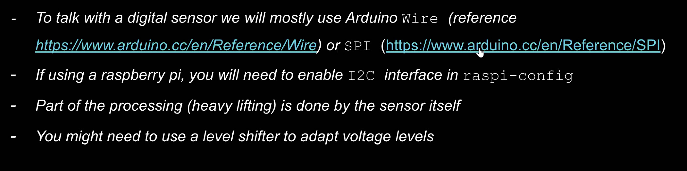

---
hide:
    - toc
---

# Fab Academy

**Fab Academy**

##Electronic Production

**How to design your own PCB?**

Pcb = FR4 + Copper (epoxy resin and glass fabric) especially telecommunication usage

Fabrication method
1-Etching
2-Milling
3-Faber Laser
4-Vinyl Cut

Milling CNC = SRM-20 Cut  

Fixing the PCB on the milling machine with double sided tape was surprising. But, it’s essential to ensure that the board is firmly placed and securely sticked onto the cutting board. Next, the cutter must be accurately positioned. The cutter is guided to the left front corner, where the x and z zero points can be conveniently established.I can tell that it is more or less same as the CNC machine that we used last year. But, as the scale is really small it is hard to position exactly. To determine the y zero point, the cutter is moved as close to the material as possible. Subsequently, the screw is loosened to precisely position the cutter on the material, then tightened again. This establishes the x/y/z zero point, which can be recorded in the program. The cutter is then slightly raised, and the small CNC mill ready to begin.

Endmills are so fragile, if you accidentally drop it of your hand, it will be broken. It is essential to be careful during the process of installing it to the milling CNC. I asked to Josep how it is possible that it can work to cut the copper while it is so fragile. He told me that while it is turning with a high speed the centrifuge affect makes it solid.

To cut the circuit we used modsproject.org to prepare the file the milling machine software. It basically takes a PNG of the circuit and given a few baseline parameters like mill size, origin location.

Keeps the white cut the blacks!

Individual Task;

  <iframe loading="lazy" style="position: absolute; width: 100%; height: 100%; top: 0; left: 0; border: none; padding: 0;margin: 0;"
    src="https:&#x2F;&#x2F;www.canva.com&#x2F;design&#x2F;DAGD_WZl8sg&#x2F;-XT6HwQBEiz17pCCW-cuWA&#x2F;view?embed" allowfullscreen="allowfullscreen" allow="fullscreen">
  </iframe>

<a href="https:&#x2F;&#x2F;www.canva.com&#x2F;design&#x2F;DAGD_WZl8sg&#x2F;-XT6HwQBEiz17pCCW-cuWA&#x2F;view?utm_content=DAGD_WZl8sg&amp;utm_campaign=designshare&amp;utm_medium=embeds&amp;utm_source=link" target="_blank" rel="noopener">Necessary adjustments and parameters to use the www.modsproject.org for cutting designing the PCB</a> by caglaralkan

**How to cut the coppersheet into the circuit?**

For this task is designing our own PCB and solder some electronic components on it. We opted for FR-1 PCBs. They were selected because they offer several advantages: they are non-toxic, possess good mechanical strength, are flame-retardant (a desirable feature, unless you're cooking), and are cost-effective. During the milling process, the top layer of copper is removed from areas not intended for the circuit, essentially focusing on the negative or background sections of the circuit design. To ensure proper connectivity, all designated connection points are encircled by a non-conductive material, creating a barrier between the circuitry and any remaining surface metal on the board. As a result, there may be residual copper in areas not directly involved in the circuit, but these areas remain disconnected from the circuit itself.

  <iframe loading="lazy" style="position: absolute; width: 100%; height: 100%; top: 0; left: 0; border: none; padding: 0;margin: 0;"
    src="https:&#x2F;&#x2F;www.canva.com&#x2F;design&#x2F;DAGD_qiOMuc&#x2F;wDnfrKkBNcjxue61iyHqow&#x2F;view?embed" allowfullscreen="allowfullscreen" allow="fullscreen">
  </iframe>

<a href="https:&#x2F;&#x2F;www.canva.com&#x2F;design&#x2F;DAGD_qiOMuc&#x2F;wDnfrKkBNcjxue61iyHqow&#x2F;view?utm_content=DAGD_qiOMuc&amp;utm_campaign=designshare&amp;utm_medium=embeds&amp;utm_source=link" target="_blank" rel="noopener">Select the end mill and install it to the Mini CNC</a> by caglaralkan

It is essential to change and decide the speed of the end mill of Roland SRM-20

**How to solder the electronic components to the circuit?**

As I have shaky hands thanks to Adai to help me for soldering.

  <iframe loading="lazy" style="position: absolute; width: 100%; height: 100%; top: 0; left: 0; border: none; padding: 0;margin: 0;"
    src="https:&#x2F;&#x2F;www.canva.com&#x2F;design&#x2F;DAGD_mj8a4I&#x2F;28JTi0bzQfsR6-qkvLHMVA&#x2F;view?embed" allowfullscreen="allowfullscreen" allow="fullscreen">
  </iframe>

<a href="https:&#x2F;&#x2F;www.canva.com&#x2F;design&#x2F;DAGD_mj8a4I&#x2F;28JTi0bzQfsR6-qkvLHMVA&#x2F;view?utm_content=DAGD_mj8a4I&amp;utm_campaign=designshare&amp;utm_medium=embeds&amp;utm_source=link" target="_blank" rel="noopener">Set up for soldering</a> by caglaralkan

Soldering Tips:

From small to bigger components and inner to outer pieces.

Class Task;

https://academany.fabcloud.io/fabacademy/2024/labs/barcelona/students/group-assignment/assignments/week04/
##Input Devices

Input devices class is mainly about sensors, gathering data through them and convert these data into information and built systems through the sensors, computers and actuators.

We discovered about;

**What is a sensor?**
**Sensor types!**
**How to Choose a Sensor?**
**Sensing techniques!**

Why do we need sensors?

We need sensors to monitoring something (generally we create systems with sensors and computers/microcontrollers and we measure and gather data by sensors and transform them into information and  through computers and microcontrollers)

System — Sensor — Computer

We need sensors to control something

Sensor — Computer — Actuator

How we gather information by sensors?

By a DISTANCE SENSOR we can measure the WATER LEVEL in a water tank = TANK HEIGHT - SENSOR READING
LIGHT SENSOR

By a LIGHT SENSOR we can measure the HORIZONTAL SPEED = (PULSES/min) /4 * WHEEL _RADIUS

There are static and dynamic sensors…

**How sensors works?**

**How to control environment/machines/systems by sensors!**

-Pull-up Resistors
-Debouncing;Pushbuttons often generate spurious open/close transitions when pressed, due to mechanical and physical issues: these transitions may be read as multiple presses in a very short time fooling the
program.
-Reading Pulses;Reads a pulse (either HIGH or LOW) on a pin. For example, if value is HIGH, pulseIn () waits for the pin to go from LOW to HIGH, starts timing, then waits for the pin to go LOW and stops timing. Returns the length of the pulse in microseconds or gives up and
returns 0 if no complete pulse was received within the timeout.

**Analog inputs - Digital Outputs**

ADC (Analog to Digital Converter) 10 bits. The resolution of an ADC is measured in bits, a one bit resolution AC is capable of delivering 21
different values (0 and 1). The Arduino UNO has a 10 bit integrated ADC that means it can deliver 210
values from 0 to 1023.

Voltage diveders are essential for the livespan of sensors.

**Digital Sensors**

Level Shifter; As digital devices get smaller and faster, once ubiquitous 5 V logic has given way to ever lower-voltage standards like 3.3 V, 2.5 V, and even 1.8 V, "leading to an ecosystem of components that need a little help talking to each other. For example, a 5 V part might fail to read a 3.3 V signal as high, and a 3.3 V part might be damaged by a 5 V signal.

**Heavy Lifting**

Energy consumption - who provides it?

Computing power

Computing power (post) and because of that, data storage

**What are the voltage levels?**
* Do not kill your sensor!
* Are both voltages (in & out) the same?  Is that good?
* Are they different? Can it be solved with a voltage divider (analog or digital input) or a level shifter (digital sensor)?

**The three rules of every project**
* Always look for existing solutions first (look for well documented sensors)
* The simpler is the better
* Do not forget about software - (use libraries, specially for digital sensors)

  <iframe loading="lazy" style="position: absolute; width: 100%; height: 100%; top: 0; left: 0; border: none; padding: 0;margin: 0;"
    src="https:&#x2F;&#x2F;www.canva.com&#x2F;design&#x2F;DAGHrVbh9xQ&#x2F;nU81JakXuJ8HASDUZ0Hfww&#x2F;view?embed" allowfullscreen="allowfullscreen" allow="fullscreen">
  </iframe>

<a href="https:&#x2F;&#x2F;www.canva.com&#x2F;design&#x2F;DAGHrVbh9xQ&#x2F;nU81JakXuJ8HASDUZ0Hfww&#x2F;view?utm_content=DAGHrVbh9xQ&amp;utm_campaign=designshare&amp;utm_medium=embeds&amp;utm_source=link" target="_blank" rel="noopener">Inspiring project that uses sensors!</a> by caglaralkan

**Assignment - Data Capturing and Storing**

I decided to build a circuit using an LDR sensor to gather data on light levels around Poblenou.

After constructing the LDR sensor circuit, I adjusted the resistor to 1K ohms to obtain appropriate readings, allowing for distinct measurements of indoor and outdoor brightness(the other resistor did not give me the precise result-especially for the artificial and natural light difference, so it is essential to know the right resistor to use the sensors efficiantly). The next step was to retrieve data from the LDR sensor. Initially, I attempted to use Bluetooth to connect to my mobile phone, intending to carry the sensor to various locations. However, the process was too complicated, and I was unsuccessful. Eventually, I decided to use Wi-Fi in and around the main IAAC building.

To store the data, I downloaded Arduspreadsheets and logged the LDR data in a .csv file. I used If This Then That (IFTTT) to connect to Webhooks and publish the data over Wi-Fi. Afterward, I was able to connect the ESP32 to a phone hotspot, making the device portable. The LDR sensor transmitted the detected light values every six-ten seconds.

  <iframe loading="lazy" style="position: absolute; width: 100%; height: 100%; top: 0; left: 0; border: none; padding: 0;margin: 0;"
    src="https:&#x2F;&#x2F;www.canva.com&#x2F;design&#x2F;DAGHrv1phf0&#x2F;fIvHyHzmOkTBmmNJ3onEfQ&#x2F;view?embed" allowfullscreen="allowfullscreen" allow="fullscreen">
  </iframe>

<a href="https:&#x2F;&#x2F;www.canva.com&#x2F;design&#x2F;DAGHrv1phf0&#x2F;fIvHyHzmOkTBmmNJ3onEfQ&#x2F;view?utm_content=DAGHrv1phf0&amp;utm_campaign=designshare&amp;utm_medium=embeds&amp;utm_source=link" target="_blank" rel="noopener">Capturing the Data of Brightness Level and Storing the Data in Spreadsheets</a> by caglaralkan

**Tips**

Tutorial for publishing sensor readings to Google using IFTTT:

https://randomnerdtutorials.com/esp32-esp8266-publish-sensor-readings-to-google-sheets/

Arduino Serial to Spreadsheet:

https://circuitjournal.com/arduino-serial-to-spreadsheet

##Networking

Class notes;

First serial communication,

Define a speed first to communicate with devices,

My board says hello to my computer, so it is essiatial to enable the communication module usb cdc on boot,

İt is important when you connect the Arduino tx rx and ground,

Communication of 2 boards;

Then I2C(Inter-integrated Circuit);

Rather than master slave we use parent and children

We need library include called wire

Coding:
Wire.begin() ; means parent
Wire.begin(9) ; means child
Define the child and parent address

“A network is a group of computers connected among themselves through communication lines.”
“A protocol is the set of rules that specify message formats and procedures that allow machines and programs to exchange information.”

Depending on the needs deciding the type of the network (Nano, Ban, Pan, Lan, Can, Ran, Wan…) an also consider Power Consumption,
Range, Bandwidth, Existing networks/Adhoc?, Mobility
RX/TX ; the most common way of serial communication, requires only two wires except of a common ground

Most important topic is the speed; the communication needs to be done after agreeing on the speed from the both ends.

For Todays exercise open the Arduino, and as always it takes sometime to update the Arduino software.

From Tools section select “Arduino Rons on Core 1”
Then enable “USB CDC On Boot”
Start with the Library and choose “Hello” and start with the “Serial.begin (115200)” define speed
Check it under on the serial monitor

The I2C (Inter-Integrated Circuit) protocol facilitates communication between multiple subordinate circuits and one or more central circuits, designed for short-distance communication within a device. I2C is highly efficient as it supports multiple central and subordinate circuits without increasing the number of required wires. Furthermore, only the central circuits can actively control the data line, preventing subordinate circuits from interfering when another device is transmitting. To achieve this communication, a specialized protocol called SPI (Serial Peripheral Interface) is used. With just two wires, you can communicate with over 1,000 devices. The function Wire.begin(); indicates the central circuit if the brackets are empty, and a subordinate circuit if a number like 9 is specified within the brackets.

Even if this year communication and network session with Josep is more intense than the last year with Victor, my main focus is to understand the coding language as I already have the network class with Victor. So, it was a good opportunity to learn about coding as I do not have a full understanding in this subject.

Code Development and Assignment;

  <iframe loading="lazy" style="position: absolute; width: 100%; height: 100%; top: 0; left: 0; border: none; padding: 0;margin: 0;"
    src="https:&#x2F;&#x2F;www.canva.com&#x2F;design&#x2F;DAGFfXp27nE&#x2F;eMA1z6r7kOobpx1WyNB9Vg&#x2F;view?embed" allowfullscreen="allowfullscreen" allow="fullscreen">
  </iframe>

<a href="https:&#x2F;&#x2F;www.canva.com&#x2F;design&#x2F;DAGFfXp27nE&#x2F;eMA1z6r7kOobpx1WyNB9Vg&#x2F;view?utm_content=DAGFfXp27nE&amp;utm_campaign=designshare&amp;utm_medium=embeds&amp;utm_source=link" target="_blank" rel="noopener">Networking Session</a> by caglaralkan
