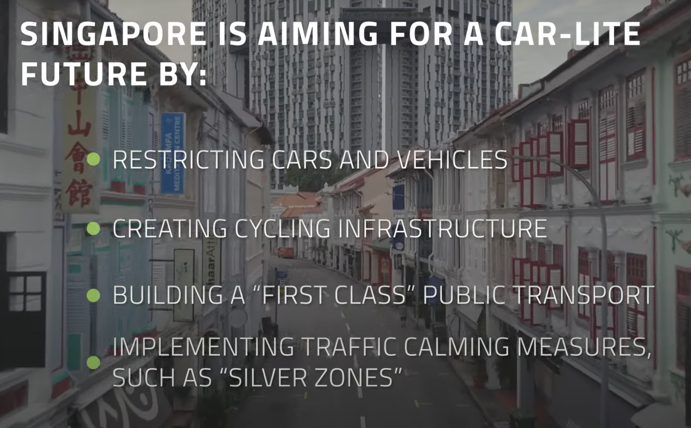

---
hide:
    - toc
---

# Urban Shift

**Extreme Weather:** floods/ drought…
Vs
**Urban Mobility:** all types of transportation and related problems/demands/necessities

**Micromobility:** refers to a range of small, lightweight vehicles operating at speeds typically below 25 km/h (15 mph) and driven by users personally. Micromobility devices include bicycles, e-bikes, electric scooters, electric skateboards, shared bicycle fleets, and electric pedal assisted (pedelec) bicycles.[1][2]

**Intermobility:** (usually uncountable, plural intermobilities)
1. The capacity of things to move among each other. the intermobility of fluid particle

Congestion Cost Strategies
* HOT Lanes (Partial Facility Pricing)
* Express Toll Lanes (Partial Facility Pricing)
* Pricing on Entire Roadway Facilities.
* Zone-Based Pricing, including Cordon and Area Pricing.
* Regionwide Pricing.

https://www.youtube.com/watch?v=CkLcHxmHqfI

**Intermodal Hubs/Apps:**

What is the intermodal meaning?

Intermodal shipping refers to moving freight by two or more modes of transportation. By loading cargo into intermodal containers, shipments can move seamlessly between trucks, trains and cargo ships. Intermodal shipments typically fall into one of two categories: international intermodal or domestic intermodal.

https://www.youtube.com/watch?v=2JcHMhtH6_s

**First Mile/ Last Mile Problem:**

Commonly referred to as the "First Mile/Last Mile Problem" or "Last Mile Problem", is a problem that faces public transit, especially in the United States. Just think of the following scenario. Would you walk over a mile to catch the bus to get to work? Or would you rather just drive your automobile to work? Well it might be easier to drive, but also for many, that might not be the case.

In many American cities some public transit routes may be inefficient and infrequent. However, people still use these routes for transit needs. But not all live near a transit stop and have to get to the transit stop sometimes from more than half a mile.

This is called the first mile/last mile problem. Majority of people are comfortable walking a certain distance to a transit stop. However typically, with increased distance from the transit stop,  problems arise when a potential rider is further than a “comfortable distance” to the necessary fixed-route stop. This is what the problem is.

So what are some solutions to this issue? Well rerouting transit stops to cater transit rider needs can be done, providing newer express transit routes is another method, implementing micromobility solutions such as ebikes, escooters to be used by riders to get to transit stops. Microtransit pooling services could be another solution. Land use solutions such as transit oriented development can be a great solution.

While each solution comes with some challenges, the first/last mile issue is one that is quite prominent in many American cities. The solutions to fix this issue are present, but will require the due diligence of local governments and transportation agencies to take the lead. In doing so will lead to more people favoring alternative transportation choices away from automobiles.

**Multimodal Mobility:**

Multimodal mobility is characterized by a combination of different transportation modes often in a single trip. In order for multimodal transportation to work an extensive use of mobility intelligence and data needs to go into planning an appropriate infrastructure, including public transportation, e-scooter/e-bike stations, shared mobility solutions and more

https://otonomo.io/blog/smart-cities-mobility-intelligence/

**Burden of a Vehicle Ownership:**

https://www.vox.com/23753949/cars-cost-ownership-economy-repossession

**Corporate Mobility:**

In principle, corporate mobility is a mirror of public mobility in cities and municipalities, with car and bicycle transport, public transport or even ride sharing offers.

**MaaS:**

Mobility as a Service?
Mobility as a Service (MaaS) integrates various forms of transport and transport-related services into a single, comprehensive, and on-demand mobility service. MaaS offers end-users the added value of accessing mobility through a single application and a single payment channel (instead of multiple ticketing and payment operations). To meet a customer’s request, a MaaS operator hosts a diverse menu of transport options, including (but not limited to) public transport, active modes such as walking and cycling, ride/ car/bike-sharing, taxi, and car rental or lease, or a combination thereof. MaaS aims to be the best value proposition for users, societies, and the environment. 

A successful MaaS service also brings new business models and ways to organise and operate the various transport options, with advantages for transport operators including access to improved user and demand information and new opportunities to serve an unmet need. MaaS aims to provide an alternative to using the private car that may be as convenient, more sustainable, help reduce congestion and constraints in transport capacity and be even cheaper.

https://www.youtube.com/watch?v=UMkHtaA472Y

https://www.youtube.com/watch?v=_nqKb1W9-eY

**Urban Mobility;** to create liveable urban spaces/ Urban Travel Patterns
* 		engaging cities and citizens
* 		putting new mobility solutions into practice
*     reclaiming public space for public use

**Successful Projects**
*     DHL BOXes and secondary DHL offices
*     Snapp Iran
*     Freight Farms Why Shipping Container Farming?
*     Pabbler Book Your Luggage for Pabbler!

https://www.wsj.com/articles/transportation-startup-via-makes-100-million-bet-on-mapping-company-11615336201

**Stated Problems;**

*     Safety problem in public transportation vehicles because of the changing demographic structure of cities.
*     Mobility of goods; amazon or other online shoping channels made so much in efficient delivery structure.
*     First and Last mile mobility should be considered and integrated into public transportation systems.

##What does mobility mean?

Stress/Delay/Congestion?  
Unsafety/Unhaealthy?
Freedom/Flexibility/Accessibility?

https://youtu.be/VSArNbPL-UU?si=Q2FKUbd85m8yvDC7

https://youtu.be/_HnLhmXSpUs?si=4Rvq490Gg3l6ovKY

https://youtu.be/YHSu4f4fcSI?si=Gufft5clFS0m8gOM
A new perception to reinvent the wheel and alternative ways of Urban mobility

**Maybe we need to think on patterns of mobility;**
5 days a week for going office
4 days a week for gym
5 days a week for going to school for kids
2 days a week for supermarket
2 days a week for socializing
1 days a week for forest hiking or seaside visit…

Distance? 1km, 3-5km, under 10km, over 10k

Is there a better way to go around in the cities than driving your personal car?

**What does that mean to have your own car? Independence?**

https://youtu.be/rlf-bJZa2-8?si=TG6_YGKPVLryXS4d
https://www.youtube.com/watch?v=GSQSBoHmG8s

**Key words;**

Mobility of goods! Integrating mobility (transportation) of goods to public systems

Elderly integration to smart systems. Most of the new methods of mobility exclude elderly!

Have you ever misses any opportunity because of traffic? A Flight, A job interview?

Carpooling! Car-sharing! Why it is not as efficient as AirBnb? Including individuals to the system?
Regulations? Safety?

Burden of vehicle ownership? What does that mean to have a car now? What it used to be? Parking? Taxes? Regulations? Responsibleities? Advantages disadvantages?

**Mobility of goods;**

The sight of double-parked vehicles loading and unloading goods is common.

Solving a problem and make money with that solution to the problem.

Next-day deliveries are now a common demand, food deliveries have skyrocketed, and home-working has brought changing needs. On current trends, demand for last-mile deliveries is expected to grow by up to 78% by 2030. 

43% of consumers are more likely to choose retailers that offer more sustainable delivery options.9

In our model, if all customers within 1 kilometer of a fulfilment centre were to collect their deliveries on foot, 14% of London’s deliveries would have a zero- emission last mile.

**Existing innovations;**

Cainiao SmartLogistics Network — which is Alibaba Group’s logistics unit—is locating 30,000 new postal stations in convenient spots across 100 cities
in China. The posts support easy, contactless mailing and parcel collection, have services for consumers to track their packages in real time, and use autonomous vehicles to bring parcels to the door step.

##Changing the Team to Safe Biking for Seniors

  <iframe loading="lazy" style="position: absolute; width: 100%; height: 100%; top: 0; left: 0; border: none; padding: 0;margin: 0;"
    src="https:&#x2F;&#x2F;www.canva.com&#x2F;design&#x2F;DAGAdTzf8Zg&#x2F;sb1S8eDN_zgaei2VdEmQpQ&#x2F;view?embed" allowfullscreen="allowfullscreen" allow="fullscreen">
  </iframe>

<a href="https:&#x2F;&#x2F;www.canva.com&#x2F;design&#x2F;DAGAdTzf8Zg&#x2F;sb1S8eDN_zgaei2VdEmQpQ&#x2F;view?utm_content=DAGAdTzf8Zg&amp;utm_campaign=designshare&amp;utm_medium=embeds&amp;utm_source=link" target="_blank" rel="noopener">Despite these benefits, there is still potential to increase the number and proportion of older adults cycling. According to a study, 6% of overall urban transportation globally is currently carried out by bicycle, but this percentage could be increased</a> by caglaralkan
